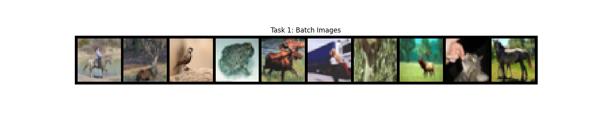
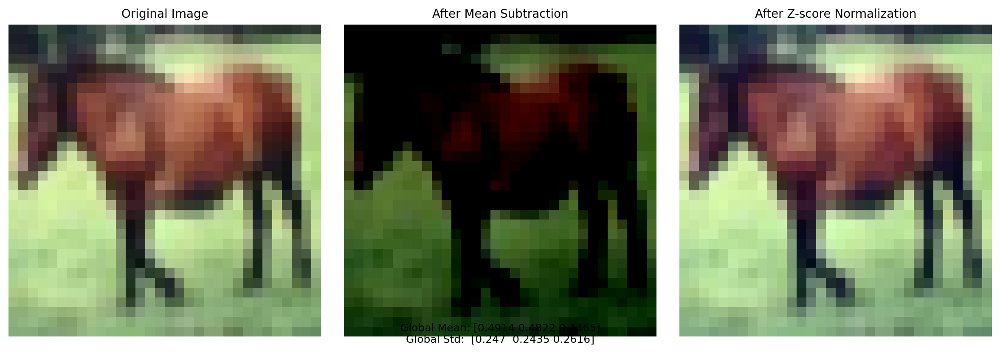
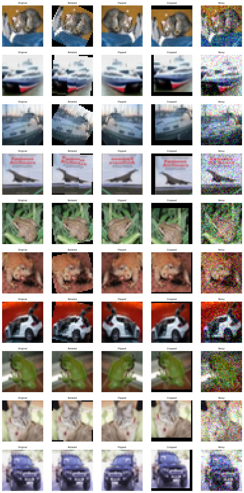

# 实验报告：CIFAR10数据集处理与增强

---

## 一、实验目的
1. 掌握使用PyTorch加载CIFAR10数据集的方法
2. 理解数据预处理中均值归一化与Z-score标准化
3. 学习常见数据增强技术的实现与应用

---

## 二、实验过程
1. **环境配置**：使用PyTorch框架进行数据操作，Matplotlib进行可视化
2. **数据集加载**：通过`torchvision.datasets.CIFAR10`加载训练集与测试集
3. **数据预处理**：
   - 统一图像尺寸
   - 计算全局RGB通道均值与标准差）
   - 实现均值减法与Z-score标准化
4. **数据增强**：对指定图像应用旋转、水平翻转、随机裁剪（带填充）和高斯噪声
5. **可视化**：对比展示原始图像、预处理结果及增强效果

---

## 三、实验内容

### 任务1：数据集读取与可视化
- **实现方法**：
  1. 使用`transforms.Resize(32)+CenterCrop(32)`统一图像尺寸
  2. 通过`DataLoader`加载批次数据
  3. 使用`torchvision.utils.make_grid`拼接前10张图像

- **关键代码**：
  ```python
  transform = transforms.Compose([
      transforms.ToTensor(),
      transforms.Resize(32),
      transforms.CenterCrop(32)
  ])
  trainloader = DataLoader(trainset, batch_size=64, shuffle=True)
  ```

### 任务2：数据归一化处理
- **计算全局统计量**：
  ```python
  def compute_global_stats(loader):
      sum_rgb = sum_sq_rgb = torch.zeros(3)
      total_pixels = 0
      for images, _ in loader:
          # 累加各通道像素值与平方值
          ...
      return global_mean, global_std
  ```
- **处理流程**：
1. 原始图像 → 2. 均值减法 → 3. Z-score标准化
- **可视化恢复**：
  ```python
  def denormalize_for_display(tensor):
      return tensor * std + mean  # 逆变换公式
  ```

### 任务3：数据增强实践
- **增强方法**：
  | 操作          | 参数设置                  |
  |---------------|---------------------------|
  | 旋转          | RandomRotation        |
  | 水平翻转      | p=1           |
  | 随机裁剪      | 32×32，padding=4          |
  | 高斯噪声      | 标准差0.1                 |

---

## 四、实验结果

### 任务1：批次数据可视化



### 任务2：归一化处理对比

- **统计量计算结果**：
  ```
  Global Mean (R, G, B): [0.4914 0.4822 0.4465]
  Global Std  (R, G, B): [0.247 0.2435 0.2616]
  ```

### 任务3：数据增强效果

- 成功实现四种增强效果
---

## 五、实验总结

### 主要收获
1. 掌握了PyTorch数据加载流程与预处理方法
2. 实现了标准化
3. 实现了对图像的不同数据增强技术


### 难点与解决
1. **统计量计算效率**：通过逐批次累加代替全量数据加载，降低内存消耗
2. **归一化图像显示**：采用min-max缩放恢复可视范围

---

## 附录：实验源代码

```python
import torch
import torchvision
import torchvision.transforms as transforms
import matplotlib.pyplot as plt
import numpy as np
from torchvision.datasets import CIFAR10

# 定义图像变换（统一大小）
transform = transforms.Compose([
    transforms.ToTensor(),
    transforms.Resize(32),
    transforms.CenterCrop(32)
])

# 加载CIFAR10数据集
trainset = torchvision.datasets.CIFAR10(
    root='./data', 
    train=True,
    download=True,
    transform=transform
)
trainloader = torch.utils.data.DataLoader(
    trainset, 
    batch_size=64,
    shuffle=True
)

# 获取一个批次数据并显示
images, labels = next(iter(trainloader))
grid = torchvision.utils.make_grid(images[:10], nrow=10, padding=2)

plt.figure(figsize=(15, 3))
plt.imshow(grid.permute(1, 2, 0).numpy())
plt.axis('off')
plt.title('Task 1: Batch Images')
plt.show()


def compute_global_stats(loader):
    """
    精确计算数据集的全局均值和标准差
    返回形状为 (3,) 的均值张量和标准差张量 (对应RGB三通道)
    """
    # 初始化累加器
    sum_rgb = torch.zeros(3)      # 各通道像素总和
    sum_sq_rgb = torch.zeros(3)   # 各通道像素平方总和
    total_pixels = 0              # 总像素数
    
    for images, _ in trainloader:  # 遍历所有批次
        # 输入形状: [B, C, H, W] → [B, C, H*W]
        b, c, h, w = images.shape
        images_flat = images.view(b, c, -1)  # 展平空间维度
        
        # 累加各通道像素总和 (dim=2: 对每个通道的所有像素求和)
        sum_rgb += images_flat.sum(dim=2).sum(dim=0)  # → [C]
        
        # 累加各通道像素平方总和
        sum_sq_rgb += (images_flat ** 2).sum(dim=2).sum(dim=0)
        
        # 更新总像素数 (每个批次的像素数 = B * H * W)
        total_pixels += b * h * w

    # 计算全局均值
    global_mean = sum_rgb / total_pixels  # [C]
    
    # 计算全局标准差 (使用总体方差公式)
    global_std = torch.sqrt(
        (sum_sq_rgb / total_pixels) - (global_mean ** 2)
    )
    
    return global_mean, global_std

# 执行计算
global_mean, global_std = compute_global_stats(trainloader)
print(f"Global Mean (R, G, B): {global_mean.numpy().round(4)}")
print(f"Global Std  (R, G, B): {global_std.numpy().round(4)}")

# 3. 处理指定图像
selected_index = 7  # 选择第7张

# 获取原始图像张量 (未经归一化)
original_img, _ = trainset[selected_index]  # 形状 [C, H, W]

# 减去均值处理
minus_mean_img = original_img - global_mean.view(3, 1, 1)

# Z-score归一化处理
normalized_img = minus_mean_img / global_std.view(3, 1, 1)

# 4. 可视化对比
def denormalize_for_display(tensor, mean, std):
    """将归一化后的张量恢复到可显示范围 (0-1)"""
    tensor = tensor.clone()
    for c in range(3):
        tensor[c] = tensor[c] * std[c] + mean[c]
    return tensor.clamp(0, 1)

# 创建对比图
fig, axes = plt.subplots(1, 3, figsize=(12, 4))
titles = ['Original Image', 'After Mean Subtraction', 'After Z-score Normalization']
images = [original_img, minus_mean_img, normalized_img]

for ax, title, img in zip(axes, titles, images):
    # 转换张量格式: [C, H, W] → [H, W, C]
    np_img = img.numpy().transpose(1, 2, 0)
    
    # 对于归一化后的图像需要调整显示范围
    if title == 'After Z-score Normalization':
        np_img = (np_img - np_img.min()) / (np_img.max() - np_img.min())
    
    ax.imshow(np_img)
    ax.set_title(title, fontsize=10)
    ax.axis('off')

# 添加统计信息标注
stats_text = (
    f"Global Mean: {global_mean.numpy().round(4)}\n"
    f"Global Std:  {global_std.numpy().round(4)}"
)
plt.figtext(0.5, 0.02, stats_text, ha='center', fontsize=9)

plt.tight_layout()
plt.savefig('task2_comparison.png', dpi=200, bbox_inches='tight')
plt.show()


# 定义图像变换操作
transform_original = transforms.Compose([
    transforms.ToTensor()
])

# 定义不同的图像变换
transform_rotate = transforms.Compose([
    transforms.RandomRotation(30),
    transforms.ToTensor()
])

transform_flip = transforms.Compose([
    transforms.RandomHorizontalFlip(p=1),
    transforms.ToTensor()
])

transform_crop = transforms.Compose([
    transforms.RandomCrop(32, padding=4),
    transforms.ToTensor()
])

def add_noise(tensor):
    noise = torch.randn(tensor.size()) * 0.1
    return torch.clamp(tensor + noise, 0, 1)

# 加载原始PIL格式数据集
testset = CIFAR10(root='./data', 
                train=False, 
                download=True,
                transform=None)  # 保持原始PIL格式

# 选择指定索引的10张图片
selected_indices = list(range(10))

# 创建大图画布
fig, axs = plt.subplots(10, 5, figsize=(15, 30))
plt.subplots_adjust(wspace=0.1, hspace=0.2)

# 处理并绘制每个图像
for row in range(10):
    # 获取原始PIL图像
    pil_img = testset[selected_indices[row]][0]
    
    # 原始图像（转换为Tensor）
    original_tensor = transform_original(pil_img)
    
    # 应用各种增强
    rotated_tensor = transform_rotate(pil_img)
    flipped_tensor = transform_flip(pil_img)
    cropped_tensor = transform_crop(pil_img)
    noisy_tensor = add_noise(original_tensor.clone())
    
    # 转换为显示格式
    displays = [
        original_tensor.numpy().transpose(1, 2, 0),
        rotated_tensor.numpy().transpose(1, 2, 0),
        flipped_tensor.numpy().transpose(1, 2, 0),
        cropped_tensor.numpy().transpose(1, 2, 0),
        noisy_tensor.numpy().transpose(1, 2, 0)
    ]
    
    # 绘制结果
    titles = ['Original', 'Rotated', 'Flipped', 'Cropped', 'Noisy']
    for col in range(5):
        axs[row, col].imshow(displays[col])
        axs[row, col].set_title(titles[col], fontsize=8)
        axs[row, col].axis('off')

plt.savefig('cifar10_augmentations.png', bbox_inches='tight', dpi=200)
plt.show()
```
