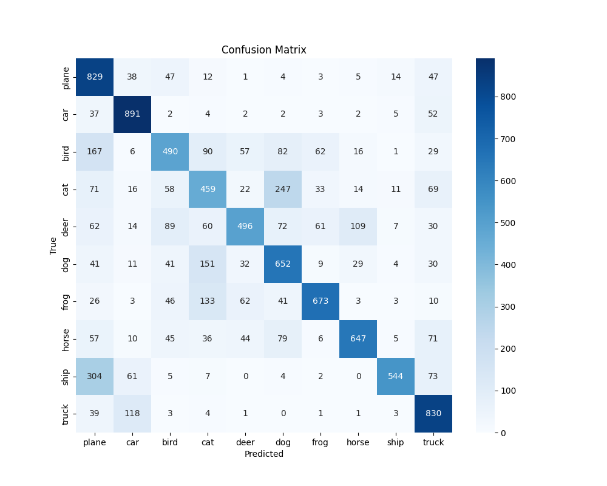
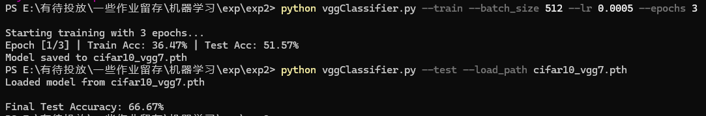
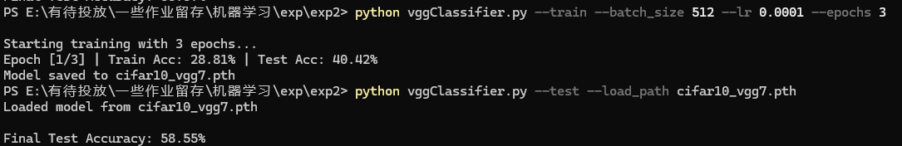
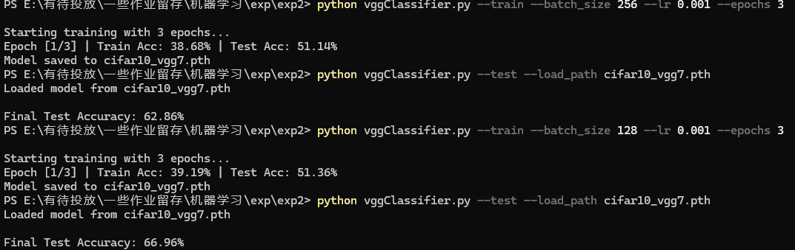
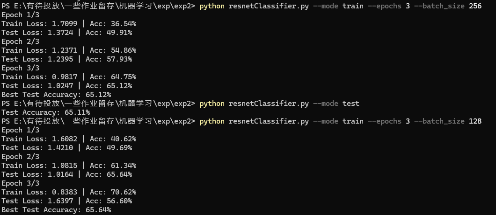
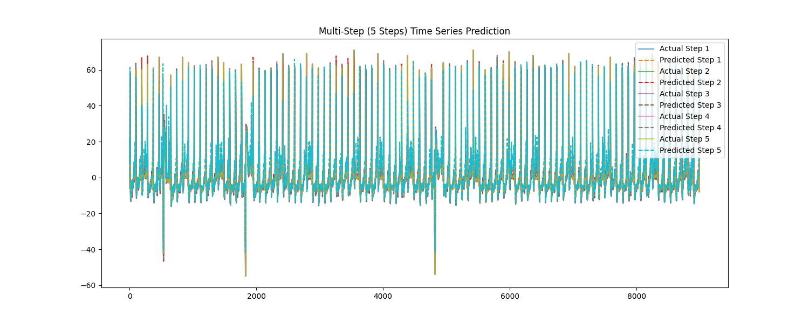
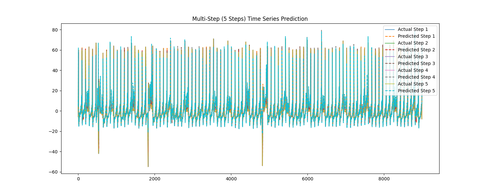

## 一、实验目的

1. 掌握深度学习在图像分类和时序预测中的基本建模方法；
2. 学会使用多种深度学习模型（如 CNN、MLP、LSTM、GRU 等）；
3. 理解模型结构、超参数（学习率、batch 大小、优化器等）对训练和测试效果的影响；
4. 掌握多步时序预测的原理与实践；
5. 掌握实验对比与可视化分析方法。

## 二、实验过程
修改示例代码，训练模型，测试模型。

## 三、实验内容

- 深度学习框架：PyTorch 2.x  
- 数据可视化：Matplotlib / Seaborn  

### 实验任务一：图像分类

#### 1. 使用的数据集

- 数据集名称：CIFAR-10  

#### 2. 模型选择

| 模型编号 | 模型名称 | 
|----------|----------|
| Model A  | VGG | 
| Model B  | ResNet模型 | 

#### 3. 参数配置

| 参数          | 值（VGG） | 值（ResNet模型） |
|---------------|---------------|---------------|
| 学习率        | 0.001          | /        |
| 批大小        | 512            | 512          |
| 优化器        | Adam          | SGD,momentum=0.9          |
| Epoch 数量    | 3            | 3            |

### 实验任务二：时序数据预测

### 1. 使用的数据集

- 数据集名称：`UCR_ECG1_10000_11800_12100.txt`）

### 2. 预测任务设置
 
- 多步预测目标：预测未来五步

### 3. 模型对比

| 模型编号 | 模型名称 | 网络结构简述 |
|----------|----------|------------------------------|
| Model A  | LSTM     | LSTM(64, 2 层) → FC(5)       |
| Model B  | GRU      | GRU(64, 2 层) → FC(5)        |

### 4. 超参数配置

| 参数          | 值（Model A） | 值（Model B） |
|---------------|---------------|---------------|
| 学习率        | 0.001         | 0.0005        |
| 批大小        | 32            | 32            |
| 优化器        | Adam          | Adam          |
| Epoch 数量    | 5            | 5            |
| 预测步长      | 5             | 5             |
| 滑动窗口大小  | 30            | 20            |

## 四、实验结果

### 任务一实验结果

#### Accuracy
| 参数          | 值（VGG） | 值（ResNet模型） |
|---------------|---------------|---------------|
| Accuracy        | 64.64%       | 57.52%        |

图为VGG的学习率为0.001，batch为512,训练三轮的混淆矩阵

#### 更改参数
保持Epoch数量和批大小不变，改变vggClassifier的学习率，测试结果为
| 学习率          | Accuracy | 
|---------------|---------------|
| 0.001        |    64.64%      | 
| 0.0005        |    66.67%         |
| 0.0001        |      58.85%    |

保持Epoch数量和学习率不变，改变vggClassifier的批大小，测试结果为
| batch_size         | Accuracy | 
|---------------|---------------|
| 512        |    64.64%      | 
| 256        |    62.86%         |
| 128        |      66.96%    |

保持Epoch数量不变，改变vggClassifier的批大小，测试结果为
| batch_size         | Accuracy | 
|---------------|---------------|
| 512        |    57.52%      | 
| 256        |    65.12%         |
| 128        |      65.64%    |

### 任务二实验结果

#### 多步预测图示

LSTM

GRU

#### 测试 MSE（均方误差）

| 模型名称 | Test MSE |
|----------|----------|
| LSTM     | 10.6880   |
| GRU      | 15.1801   |

#### 更改参数
保持其他参数不变，修改LSTM的滑动窗口大小
| 滑动窗口大小          | MSE | 
|---------------|---------------|
| 30        |    10.6880     | 
|20       |    15.8873        |
| 10        |      17.5447    |

保持其他参数不变，修改GRU的滑动窗口大小
| 滑动窗口大小          | MSE | 
|---------------|---------------|
| 30        |    26.8271     | 
|20       |    15.8873        |
| 10        |      21.3722    |

## 五、总结

### VGG部分
####  1. **Epoch数少导致模型尚未充分收敛**
- **训练轮次少（Epoch=3）**，模型还在初步学习阶段，很多参数还没调整到最优，训练曲线可能都没稳定。

####  2. **学习率的影响有限是因为模型还没学到多少**
- 从结果看，**学习率为0.0005时效果最好（66.67%）**，0.001略低，0.0001更低。
- 这说明：
  - 学习率太大会导致模型更新不稳定（如0.001稍逊）；
  - 学习率太小，模型几乎学不到东西（0.0001训练太慢）；
  - 但因为Epoch太少，即便调整学习率，也没有足够轮次让它展现出更显著差异。

####  3. **批大小（batch size）的影响**
- 最好的是 **batch_size=128（66.96%）**，这说明：
  - 小批次（比如128）能提供更频繁的参数更新，有助于模型快速适应数据，提升早期准确率；
  - 批次太大（如512），更新频率低，可能难以在短时间内收敛；
- 但整体来看差距也不是特别大（差异小于5%），依旧和Epoch太少有关。

#### 总结：
 **Epoch太少，训练还未收敛，因此无论调整学习率还是批大小，对最终准确率的影响都比较有限，模型整体还处于“没学明白”的阶段。**

### ResNet部分
 **批大小（batch size）的影响**
- 最好的是 **batch_size=128（65.64%）**，这说明：
  - 小批次（比如128）能提供更频繁的参数更新，有助于模型快速适应数据，提升早期准确率；
- 但整体来看差距也不是特别大（差异小于5%），依旧和Epoch太少有关。

#### LSTM结果分析

**观察：**
- MSE随着窗口增大明显下降，窗口=30时误差最小。
- 说明 **LSTM更擅长利用较长时间依赖**，给它更多的历史信息（窗口大），它就能更好地建模未来趋势，误差也就更低。
- **窗口太小（如10）** 时，信息不足，预测不准。

####  GRU结果分析

**观察：**
- 不像LSTM那样线性改善，**GRU在窗口=20时效果最好**。
- **窗口=30反而效果最差（MSE最大）**。
- 说明：GRU可能在较短窗口时就能很好地捕捉关键信息，窗口过大可能引入噪声或冗余信息，反而拉高误差。

#### 为什么不同模型对窗口大小反应不同？

| 模型 | 特点 | 对窗口的反应 |
|------|------|---------------|
| LSTM | 有专门的“记忆单元”（cell state）擅长捕捉长期依赖 | 喜欢长窗口，越长信息越全 |
| GRU  | 结构更简单，更新门和重置门合并，响应更快 | 喜欢中等长度窗口，太长可能引入噪声 |

#### Epoch太少的影响
- 当前结果是训练不充分下的初步趋势；
- 如果Epoch多一点，模型会更稳定，可能：
  - LSTM继续提升；
  - GRU在窗口=20时更稳定，但窗口=30时的MSE可能略微下降；

