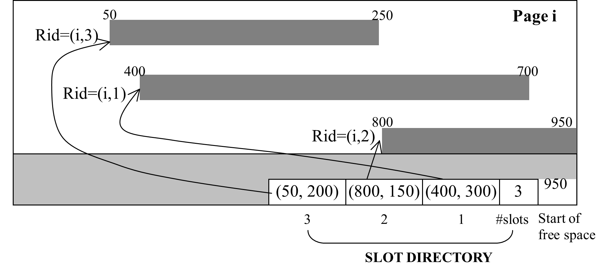
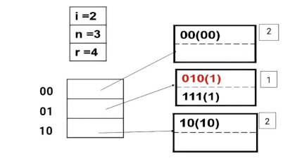

# 1

**题目：**  [磁盘和访问时间]
考虑一个磁盘，扇区大小为 512 字节，每磁道 63 个扇区，每盘面 16,383 条磁道，8 个双面盘片（即 16 个盘面）。盘片以 7,200 rpm（每分钟转数）旋转。平均寻道时间为 9 毫秒，而磁道到磁道的寻道时间为 1 毫秒。假设选择的页面大小为 4096 字节。假设一个包含 1,000,000 条记录（每条 256 字节）的文件要存储在此类磁盘上。不允许任何记录跨越两个页面（在计算中将这些数字用于适当的位置）。
1)磁盘的容量是多少？
2)如果文件在磁盘上顺序排列，需要多少柱面？

**解答：** 磁盘容量
容量计算公式：
盘面数 × 磁道数/盘面 × 扇区数/磁道 × 字节数/扇区
代入数值：
16盘面 × 16,383磁道/盘面 × 63扇区/磁道 × 512字节/扇区
= 16 × 16,383 × 63 × 512
= 8,455,200,768 字节 ≈ 8.46 GB

所需柱面数

每条记录256字节，页面大小4096字节，每页存放16条记录。
总记录数1,000,000 → 需62,500页。
每页占8扇区（4096 ÷ 512），总扇区数：62,500 × 8 = 500,000扇区。
每柱面扇区数：16盘面 × 63扇区/磁道 = 1,008扇区/柱面。

柱面数：500,000 ÷ 1,008 ≈ 496.03 → 497个柱面。


# 2

**题目：** [磁盘页面布局]
下图显示了一个包含变长记录的页面。页面大小为 1KB（1024 字节）。它按顺序包含 3 条记录、一些可用空间和一个槽目录。每条记录都有其记录 ID，格式为 Rid=(page id, slot number)，以及其在该页面中的起始和结束地址，如图所示。

现在需要将一条大小为 200 字节的新记录插入此页面。对此页面应用我们在课堂上学到的记录插入算法（如果需要，带页面紧凑）。显示插入新记录后槽目录的内容。假设只有该页可用，没有其他临时空间可用于操作。


- 当前空闲空间：950~1024 = 74字节（不足200字节）
- 但页面有碎片，需紧凑（compact）页面。

#### **紧凑后记录顺序（假设按槽号升序排列）**

- 槽3：(i,3) 0~200（200字节）
- 槽1：(i,1) 200~500（300字节）
- 槽2：(i,2) 500~650（200字节）

### **插入新记录**

- 新记录大小：200字节
- 插入到空闲区的起始位置：650~850

### **更新槽目录**

| 槽号 | 起始 | 结束 | 大小 |
|------|------|------|------|
| 4    | 650  | 850  | 200  |
| 3    | 0    | 200  | 200  |
| 2    | 500  | 650  | 150  |
| 1    | 200  | 500  | 300  |

- 空闲空间起始地址：850

槽目录为
```
[(650,200),(0,200),(500,150),(200,300)],4,850
```

# 3

**题目：** 为以下键值集构建一个 B+ 树：
(24, 29, 2, 17, 5, 19, 3, 18, 7, 11, 37, 15, 23, 31)
假设树最初是空的，并且按升序添加值。在以下情况下构建 B+ 树：每个节点可容纳的指针数量如下：
a. 四个
b. 六个
c. 八个

按升序插入键值：2,3,5,7,11,15,17,18,19,23,24,29,31,37

#### **a. 每个节点最多4个指针（每个节点最多3个键）**
插入过程及最终结构：
1. **插入2,3,5**  
   - 叶子节点满（3键），分裂为两个叶子节点，中间键3上升到父节点。
   - 根节点：`[3]`  
     - 左叶子：`[2]`  
     - 右叶子：`[3,5]`

2. **插入7**  
   - 右叶子变为`[3,5,7]`，分裂为`[3]`和`[5,7]`，中间键5上升到根节点。
   - 根节点：`[3,5]`  
     - 叶子1：`[2]`  
     - 叶子2：`[3]`  
     - 叶子3：`[5,7]`

3. **插入11**  
   - 叶子3变为`[5,7,11]`，分裂为`[5]`和`[7,11]`，中间键7上升到根节点。
   - 根节点：`[3,5,7]`（已满，需分裂）  
     - 分裂后新根为`[5]`，左子节点`[3]`，右子节点`[7]`  
     - 叶子分布：  
       - `[2]`, `[3]`, `[5]`, `[7,11]`

4. **插入15,17,18**  
   - `[7,11]` → `[7,11,15]` → 分裂为`[7]`和`[11,15]`，中间键11上升到父节点（右子节点`[7]`变为`[7,11]`）。  
   - 根节点`[5]`的右子节点更新为`[7,11]`，并分裂为`[7]`和`[11]`，根节点变为`[5,7]`。  
   - 继续插入17,18到`[11,15]` → `[11,15,17,18]`（满，分裂为`[11,15]`和`[17,18]`，中间键17上升到父节点）。  
   - 父节点`[7,11]`变为`[7,11,17]`（满，分裂为`[7]`和`[11,17]`，中间键11上升到根节点）。  
   - 根节点`[5,7]`更新为`[5,7,11]`（满，分裂为`[5]`和`[7,11]`，新根为`[7]`）。

5. **最终结构**  
   ```
   Root: [7]
   ├── [5]
   │   ├── [3]
   │   │   ├── [2]
   │   │   ├── [3]
   │   │   └── [5]
   │   └── [7]
   │       ├── [7]
   │       └── [11,15]
   └── [11,17]
       ├── [17,18]
       ├── [19,23]
       └── [24,29,31,37]
   ```


#### **b. 每个节点最多6个指针（每个节点最多5个键）**
插入过程及最终结构：
1. **插入2,3,5,7,11**  
   - 叶子节点满（5键），分裂为`[2,3]`和`[5,7,11]`，中间键5上升到根节点。

2. **插入15,17,18,19,23**  
   - `[5,7,11]` → `[5,7,11,15,17,18,19,23]`（满，分裂为`[5,7,11]`和`[15,17,18,19,23]`，中间键15上升到根节点）。  
   - 根节点变为`[5,15]`。

3. **插入24,29,31,37**  
   - `[15,17,18,19,23]` → 插入后分裂为`[15,17,18]`和`[19,23,24,29,31,37]`，中间键19上升到根节点。  
   - 根节点`[5,15,19]`（未满）。

4. **最终结构**  
   ```
   Root: [5,15,19]
   ├── [2,3,5]
   ├── [7,11,15]
   ├── [17,18,19]
   └── [23,24,29,31,37]
   ```


#### **c. 每个节点最多8个指针（每个节点最多7个键）**
插入过程及最终结构：
1. **插入所有键**  
   - 叶子节点可容纳7个键，但插入14个键后需要分裂一次：  
     - 第8个键插入时分裂为`[2,3,5,7,11,15,17]`和`[18,19,23,24,29,31,37]`，中间键18上升到根节点。

2. **最终结构**  
   ```
   Root: [18]
   ├── [2,3,5,7,11,15,17]
   └── [18,19,23,24,29,31,37]
   ```


# 4

**题目：** 对于练习 3 中的每个 B+ 树，显示执行以下系列操作后树的形式：
a. 插入 9。
b. 插入 10。
c. 插入 8。
d. 删除 24。
e. 删除 37。


#### **a. 每个节点最多4个指针（每个节点最多3个键）**
**初始结构**：
```
Root: [7]
├── [5]
│   ├── [3]
│   │   ├── [2]
│   │   ├── [3]
│   │   └── [5]
│   └── [7]
│       ├── [7]
│       └── [11,15]
└── [11,17]
    ├── [17,18]
    ├── [19,23]
    └── [24,29,31,37]
```

**操作过程**：
1. **插入9**  
   - 插入到叶子节点 `[7]` → 变为 `[7,9]`（无需分裂）。


2. **插入10**  
   - 插入到叶子节点 `[7,9]` → 变为 `[7,9,10]`（满，分裂为 `[7]` 和 `[9,10]`，中间键 `9` 上升到父节点 `[7]`）。
   - 父节点 `[7]` 变为 `[7,9]`（需分裂，新根为 `[7]`，左子树 `[5]`，右子树 `[9]`）。

3. **插入8**  
   - 插入到叶子节点 `[7]` → 变为 `[7,8]`（无需分裂）。

4. **删除24**  
   - 从叶子节点 `[24,29,31,37]` 删除24 → 变为 `[29,31,37]`（无需合并）。

5. **删除37**  
   - 从叶子节点 `[29,31,37]` 删除37 → 变为 `[29,31]`（仍满足最小键数）。

**最终结构**：
```
Root: [7]
├── [5]
│   ├── [3]
│   │   ├── [2]
│   │   ├── [3]
│   │   └── [5]
│   └── [7]
│       ├── [7,8]
│       └── [9,10]
└── [9]
    ├── [11,15]
    └── [17,18]
        ├── [19,23]
        └── [29,31]
```


#### **b. 每个节点最多6个指针（每个节点最多5个键）**
**初始结构**：
```
Root: [5,15,19]
├── [2,3,5]
├── [7,11,15]
├── [17,18,19]
└── [23,24,29,31,37]
```

**操作过程**：
1. **插入9**  
   - 插入到叶子节点 `[7,11,15]` → 变为 `[7,9,11,15]`（无需分裂）。

2. **插入10**  
   - 插入到叶子节点 `[7,9,11,15]` → 变为 `[7,9,10,11,15]`（满，分裂为 `[7,9]` 和 `[10,11,15]`，中间键 `10` 上升到父节点）。
   - 父节点 `[5,15,19]` 插入10后变为 `[5,10,15,19]`（需分裂为 `[5,10]` 和 `[15,19]`，新根为 `[10]`）。

3. **插入8**  
   - 插入到叶子节点 `[7,9]` → 变为 `[7,8,9]`（无需分裂）。

4. **删除24**  
   - 从叶子节点 `[23,24,29,31,37]` 删除24 → 变为 `[23,29,31,37]`（无需合并）。

5. **删除37**  
   - 从叶子节点 `[23,29,31,37]` 删除37 → 变为 `[23,29,31]`（仍满足最小键数）。

**最终结构**：
```
Root: [10]
├── [5]
│   ├── [2,3,5]
│   └── [7,8,9]
└── [15,19]
    ├── [10,11,15]
    ├── [17,18,19]
    └── [23,29,31]
```

#### **c. 每个节点最多8个指针（每个节点最多7个键）**
**初始结构**：
```
Root: [18]
├── [2,3,5,7,11,15,17]
└── [18,19,23,24,29,31,37]
```

**操作过程**：
1. **插入9**  
   - 插入到左叶子节点 `[2,3,5,7,11,15,17]` → 变为 `[2,3,5,7,9,11,15,17]`（满，分裂为 `[2,3,5,7]` 和 `[9,11,15,17]`，中间键 `9` 上升到根节点）。
   - 根节点更新为 `[9,18]`。

2. **插入10**  
   - 插入到叶子节点 `[9,11,15,17]` → 变为 `[9,10,11,15,17]`（无需分裂）。

3. **插入8**  
   - 插入到叶子节点 `[2,3,5,7]` → 变为 `[2,3,5,7,8]`（无需分裂）。

4. **删除24**  
   - 从叶子节点 `[18,19,23,24,29,31,37]` 删除24 → 变为 `[18,19,23,29,31,37]`（无需合并）。

5. **删除37**  
   - 从叶子节点 `[18,19,23,29,31,37]` 删除37 → 变为 `[18,19,23,29,31]`（仍满足最小键数）。

**最终结构**：
```
Root: [9,18]
├── [2,3,5,7,8]
├── [9,10,11,15,17]
└── [18,19,23,29,31]
```


# 5

**题目：** 假设我们对包含以下搜索键值的记录文件使用可扩展哈希：
24, 29, 2, 17, 5, 19, 3, 18, 7, 11, 37, 5, 23, 31
如果哈希函数是 h(x)=xmod16 并且桶可以容纳三个记录，请显示此文件的可扩展哈希结构。

**解答：** 

- **全局深度（global depth）**：目录的位数，初始为1。
- **局部深度（local depth）**：桶的位数，初始为1。
- **目录**：指向桶的指针数组，大小为2^全局深度。
- **桶溢出**：当桶满时，若局部深度 < 全局深度，则分裂桶；否则扩展目录（全局深度+1）。


### 初始状态
- 全局深度 = 1，目录有2个指针（0, 1），都指向同一个桶。

### 插入顺序

#### 1. 插入24（24 mod 16 = 8，二进制1000，低1位为0）
- 目录[0]：24

#### 2. 插入29（29 mod 16 = 13，二进制1101，低1位为1）
- 目录[1]：29

#### 3. 插入2（2 mod 16 = 2，二进制0010，低1位为0）
- 目录[0]：24, 2

#### 4. 插入17（17 mod 16 = 1，二进制0001，低1位为1）
- 目录[1]：29, 17

#### 5. 插入5（5 mod 16 = 5，二进制0101，低1位为1）
- 目录[1]：29, 17, 5

#### 6. 插入19（19 mod 16 = 3，二进制0011，低1位为1）
- 目录[1]已满，需分裂

##### 桶分裂（目录[1]，局部深度=1，等于全局深度=1，需扩展目录）
- 全局深度=2，目录变为4个指针（00, 01, 10, 11）
- 重新分配目录指针
  - 目录[0]（00）：24, 2
  - 目录[1]（01）：29, 17, 5, 19（需分裂）

对目录[1]（01）分裂，按低2位分配：
- 29（1101，01），17（0001，01），5（0101，01），19（0011，11）

- 目录[1]（01）：29, 17, 5
- 目录[3]（11）：19

#### 7. 插入3（3 mod 16 = 3，二进制0011，低2位为11）
- 目录[3]：19, 3

#### 8. 插入18（18 mod 16 = 2，二进制0010，低2位为10）
- 目录[2]：18

#### 9. 插入7（7 mod 16 = 7，二进制0111，低2位为11）
- 目录[3]：19, 3, 7

#### 10. 插入11（11 mod 16 = 11，二进制1011，低2位为11）
- 目录[3]已满，需分裂

##### 桶分裂（目录[3]，局部深度=2，等于全局深度=2，需扩展目录）
- 全局深度=3，目录变为8个指针（000~111）
- 重新分配目录指针

目录[3]（011）分裂，按低3位分配：
- 19（011），3（011），7（111），11（011）

- 目录[3]（011）：19, 3, 11
- 目录[7]（111）：7

#### 11. 插入37（37 mod 16 = 5，二进制0101，低3位为101）
- 目录[5]：空，插入37

#### 12. 插入5（5 mod 16 = 5，二进制0101，低3位为101）
- 目录[5]：37, 5

#### 13. 插入23（23 mod 16 = 7，二进制0111，低3位为111）
- 目录[7]：7, 23

#### 14. 插入31（31 mod 16 = 15，二进制1111，低3位为111）
- 目录[7]：7, 23, 31

### 目录（全局深度=3）


| 目录索引 | 二进制 | 桶内容         |
|----------|--------|----------------|
| 0        | 000    | 24, 2          |
| 1        | 001    | 29, 17, 5      |
| 2        | 010    | 18             |
| 3        | 011    | 19, 3, 11      |
| 4        | 100    | 空             |
| 5        | 101    | 37, 5          |
| 6        | 110    | 空             |
| 7        | 111    | 7, 23, 31      |


全局深度: 3


# 6

**题目：** 显示练习 5 的可扩展哈希结构在执行以下每个步骤后如何变化：
a. 删除 11。
b. 删除 31。
c. 插入 1。
d. 插入 15。


| 目录索引 | 二进制 | 桶内容         |
|----------|--------|----------------|
| 0        | 000    | 24, 2          |
| 1        | 001    | 29, 17, 5      |
| 2        | 010    | 18             |
| 3        | 011    | 19, 3, 11      |
| 4        | 100    | 空             |
| 5        | 101    | 37, 5          |
| 6        | 110    | 空             |
| 7        | 111    | 7, 23, 31      |


## a. 删除 11

- 11 的哈希值：11 mod 16 = 11，二进制 1011，低3位为 011
- 目录[3]（011）桶：19, 3, 11
- 删除 11 后，目录[3]：19, 3

**变化后：**

| 目录索引 | 二进制 | 桶内容         |
|----------|--------|----------------|
| 0        | 000    | 24, 2          |
| 1        | 001    | 29, 17, 5      |
| 2        | 010    | 18             |
| 3        | 011    | 19, 3          |
| 4        | 100    | 空             |
| 5        | 101    | 37, 5          |
| 6        | 110    | 空             |
| 7        | 111    | 7, 23, 31      |


## b. 删除 31

- 31 的哈希值：31 mod 16 = 15，二进制 1111，低3位为 111
- 目录[7]（111）桶：7, 23, 31
- 删除 31 后，目录[7]：7, 23

**变化后：**

| 目录索引 | 二进制 | 桶内容         |
|----------|--------|----------------|
| 0        | 000    | 24, 2          |
| 1        | 001    | 29, 17, 5      |
| 2        | 010    | 18             |
| 3        | 011    | 19, 3          |
| 4        | 100    | 空             |
| 5        | 101    | 37, 5          |
| 6        | 110    | 空             |
| 7        | 111    | 7, 23          |


## c. 插入 1

- 1 的哈希值：1 mod 16 = 1，二进制 0001，低3位为 001
- 目录[1]（001）桶：29, 17, 5（已满，3条）

需要分裂
- 目录[1]（001）桶局部深度=3，等于全局深度=3，需扩展目录（全局深度+1=4），目录变为16项。
- 目录[1]（0001）分裂，原桶内容：29, 17, 5，加上新插入的1，共4条。
- 按低4位分配：

  - 29（0001 1101）低4位1101 = 13
  - 17（0001 0001）低4位0001 = 1
  - 5（0000 0101）低4位0101 = 5
  - 1（0000 0001）低4位0001 = 1

- 新桶分配：
  - 目录[1]（0001）：17, 1
  - 目录[13]（1101）：29
  - 目录[5]（0101）：5, 37（原有37）

**变化后：**

| 目录索引 | 二进制 | 桶内容         |
|----------|--------|----------------|
| 0        | 0000   | 24, 2          |
| 1        | 0001   | 17, 1          |
| 2        | 0010   | 18             |
| 3        | 0011   | 19, 3          |
| 4        | 0100   | 空             |
| 5        | 0101   | 5, 37          |
| 6        | 0110   | 空             |
| 7        | 0111   | 7, 23          |
| 8        | 1000   | 24, 2          |
| 9        | 1001   | 17, 1          |
| 10       | 1010   | 18             |
| 11       | 1011   | 19, 3          |
| 12       | 1100   | 空             |
| 13       | 1101   | 29             |
| 14       | 1110   | 空             |
| 15       | 1111   | 7, 23          |

> 目录[1]和[9]指向同一个桶（17, 1），目录[5]和[13]分别指向（5, 37）和（29）。


## d. 插入 15

- 15 的哈希值：15 mod 16 = 15，二进制 1111，低4位为 1111
- 目录[15]（1111）：7, 23（未满）
- 插入后，目录[15]：7, 23, 15

**变化后：**

| 目录索引 | 二进制 | 桶内容         |
|----------|--------|----------------|
| 0        | 0000   | 24, 2          |
| 1        | 0001   | 17, 1          |
| 2        | 0010   | 18             |
| 3        | 0011   | 19, 3          |
| 4        | 0100   | 空             |
| 5        | 0101   | 5, 37          |
| 6        | 0110   | 空             |
| 7        | 0111   | 7, 23          |
| 8        | 1000   | 24, 2          |
| 9        | 1001   | 17, 1          |
| 10       | 1010   | 18             |
| 11       | 1011   | 19, 3          |
| 12       | 1100   | 空             |
| 13       | 1101   | 29             |
| 14       | 1110   | 空             |
| 15       | 1111   | 7, 23, 15      |


# 7


**题目：** 下图为插入关键字0000、0101、1111、1010后的线性散列索引结构，其中：i-当前使用的散列函数的位数，n-当前的桶数，r-当前散列表中的记录总数，要求 r<=1.6n。
试按顺序分别给出插入以下关键字后的线性散列索引结构。
a) 0111    b) 0110    c) 1001    d) 1101    e) 1100    f) 1101



i=2,n=3,r=4


00[] --->[00(00)] [2]
         [      ]

01[]---> [010(1)] [1]
         [111(1)] 

10[]---> [10(10)] [2]
         [      ]


## a) 插入0111
插入后n=5 > 3*1.6,
令r=4
加入桶11，由01桶分裂得到

00[] --->[00(00)] [2]
         [      ]

01[]---> [01(01)] [1]
         [      ] 

10[]---> [10(10)] [2]
         [      ]

11[]---> [01(11)] [2]
         [11(11)]

## b) 插入0110

插入后n=5 > 3*1.6,
令r=4
加入桶11，由01桶分裂得到

00[] --->[00(00)] [2]
         [      ]

01[]---> [01(01)] [2]
         [      ] 

10[]---> [10(10)] [2]
         [01(10)]

11[]---> [11(11)] [2]
         [      ]

## c) 插入1001


插入后n=5 > 3*1.6,
令r=4
加入桶11，由01桶分裂得到

00[] --->[00(00)] [2]
         [      ]

01[]---> [01(01)] [2]
         [      ] 

10[]---> [10(10)] [2]
         [10(01)]

11[]---> [11(11)] [2]
         [      ]

## d) 插入1101


插入后n=5 > 3*1.6,
令r=4
加入桶11，由01桶分裂得到

00[] --->[00(00)] [2]
         [      ]

01[]---> [01(01)] [2]
         [11(01)] 

10[]---> [10(10)] [2]
         [      ]

11[]---> [11(11)] [2]
         [      ]

## e) 1100    

00[] --->[00(00)] [2]
         [11(00)]

01[]---> [01(01)] [2]
         [      ] 

10[]---> [10(10)] [2]
         [      ]

11[]---> [11(11)] [2]
         [      ]


## f) 1101

00[] --->[00(00)] [2]
         [      ]

01[]---> [01(01)] [2]
         [11(01)] 

10[]---> [10(10)] [2]
         [      ]

11[]---> [11(11)] [2]
         [      ]