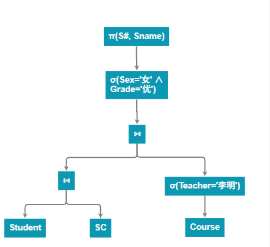
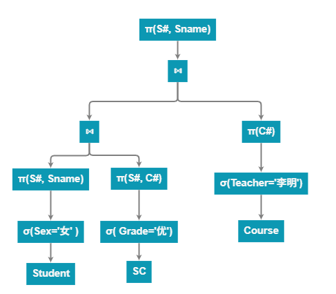

## 例7-1
设有$Student$(学生)，$Course$(课程)，$SC$(学生选课)3个关系，关系模式如下（具有下划线的属性是关系的主键，且 $S\#$,$C\#$都是关系$SC$上的外键）：
$Student(\underline{S\#},Sname,Sex,Class)$
$Course(\underline{C\#},Cname,Teacher)$
$SC(\underline{S\#,C\#},Grade)$

## 7.3习题 
在例7-1中查询语句为:找出选修李明老师所教课程并且成绩为优的女生学号和姓名。
(1)试写出该查询相应的关系代数表达式。
(2)画出表达式的语法树并对其进行优化。
## 7.3解答
**查询要求**：选修李明老师所教课程且成绩为优的女生学号和姓名。

#### **(1) 关系代数表达式**  
$$
\pi_{S\#, Sname} \Big(  
  \sigma_{Sex='女' \ \land \ Grade='优'} \Big(  
    Student \Join SC \Join \sigma_{Teacher='李明'}(Course)  
  \Big)  
\Big)  
$$
  
1. 从 `Course` 中筛选 `Teacher='李明'` 的课程：$\sigma_{Teacher='李明'}(Course)$  
2. 将结果与 `SC` 自然连接：$SC \Join \sigma_{Teacher='李明'}(Course)$  
3. 进一步与 `Student` 自然连接：$Student \Join \Big( SC \Join \sigma_{Teacher='李明'}(Course) \Big)$  
4. 筛选女生且成绩为优：$\sigma_{Sex='女' \ \land \ Grade='优'}$  
5. 投影学号和姓名：$\pi_{S\#, Sname}$  

#### **(2) 语法树及优化**  
**原始语法树**：  

**优化后语法树**：  

**优化策略**：  
- **尽早选择**：将 $\sigma_{Sex='女'}$ 和 $\sigma_{Grade='优'}$ 下推到连接前，减少中间结果大小。  
- **投影下推**：尽量将投影操作下推。  

## 7.4习题 
在例7-1 中,关系$Course$在$Cname$属性上有有序索引，$Teacher$属性上有无序索引。实现下列选择运算的较优化方法是什么?
(1) $\sigma_{Teacher = '李明'}(E) $。
(2) $\sigma_{Cname = '数据库系统' \ \ and \ \ Teacher = '李明'}(E) $。
(3) $\sigma_{Cname = '数据库系统' \ \ or \ \ Teacher = '李明'}(E) $。
## 7.4解答  
- `Cname` 属性：有序索引（B+树）  
- `Teacher` 属性：无序索引（哈希）  

**(1) $\sigma_{Teacher='李明'}(E)$**  
- **优化方法**：使用 `Teacher` 属性的哈希索引直接定位到 `Teacher='李明'` 的元组。  
- **理由**：哈希索引适合等值查询，时间复杂度为 $O(1)$。  

**(2) $\sigma_{Cname='数据库系统' \ \land \ Teacher='李明'}(E)$**  
- **优化方法**：  
  1. 使用 `Teacher` 的哈希索引快速找到 `Teacher='李明'` 的元组集合 $A$。  
  2. 在集合 $A$ 中，利用 `Cname` 的有序索引二分查找 `Cname='数据库系统'`。  
- **理由**：哈希索引缩小范围后，有序索引可高效完成二次筛选。  

**(3) $\sigma_{Cname='数据库系统' \ \lor \ Teacher='李明'}(E)$**  
- **优化方法**：  
  1. 分别使用 `Cname` 的有序索引和 `Teacher` 的哈希索引，获取满足 `Cname='数据库系统'` 的集合 $B$ 和 `Teacher='李明'` 的集合 $C$。  
  2. 对 $B$ 和 $C$ 取并集。  
- **理由**：OR 条件需独立利用索引后合并结果，避免了全表扫描。  

## 7.5习题 
在习题7.3中,关系$Course$有20 000个元组，块因子为20;关系$SC$有400个元组,块因子为10; 假设内存被划分为6块,关系$Course$和$SC$的连接属性有序存储。对于$Course \Join SC$ 运算，试分析下列两种方法所需访问的物理块数。
(1)用嵌套循环连接算法。
(2)用排序归并连接算法。
## 7.5解答
 
#### **(1) 嵌套循环连接算法**  
外层关系被分成若干组，每组最多包含 $K$ 块。组数为：
\[
\text{组数} = \lceil B_{\text{outer}} / K \rceil = \lceil 40 / 5 \rceil = 8
\]
由于 $40$ 可被 $5$ 整除，外层关系被均匀分为 8 组，每组 5 块。

嵌套循环连接的 I/O 成本包括：
1. 读取外层关系一次：$B_{\text{outer}} = 40$ 块访问。
2. 对于每个外层组，扫描整个内层关系一次：由于有 8 组，内层关系被扫描 8 次，每次 $B_{\text{inner}} = 1,000$ 块访问，因此内层访问总数为 $8 \times 1,000 = 8,000$ 块访问。

总物理块访问数为：
\[
\text{总 I/O} = B_{\text{outer}} + (\text{组数}) \times B_{\text{inner}} = 40 + 8 \times 1000 = 40 + 8000 = 8040
\]

#### **(2) 排序归并连接算法**  
由于连接属性已有序，无需排序：  
- 总块访问数 = $B_{Course} + B_{SC} = 1000 + 40 = 1040$ 块  

