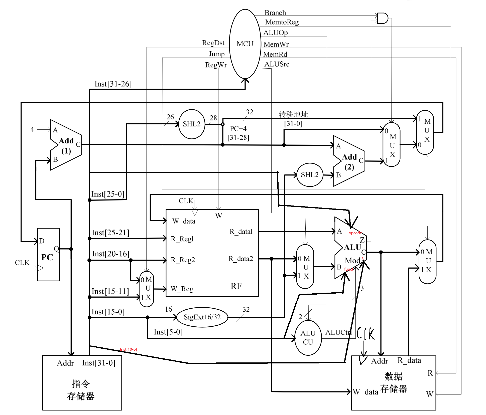
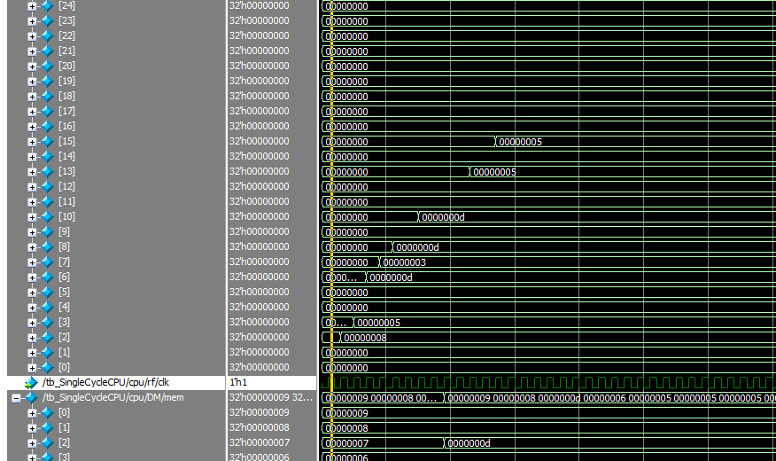
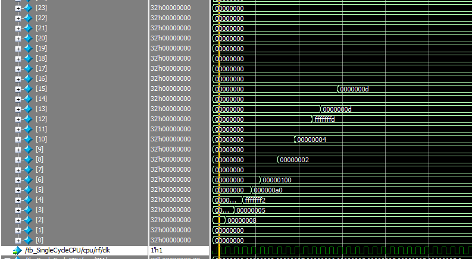
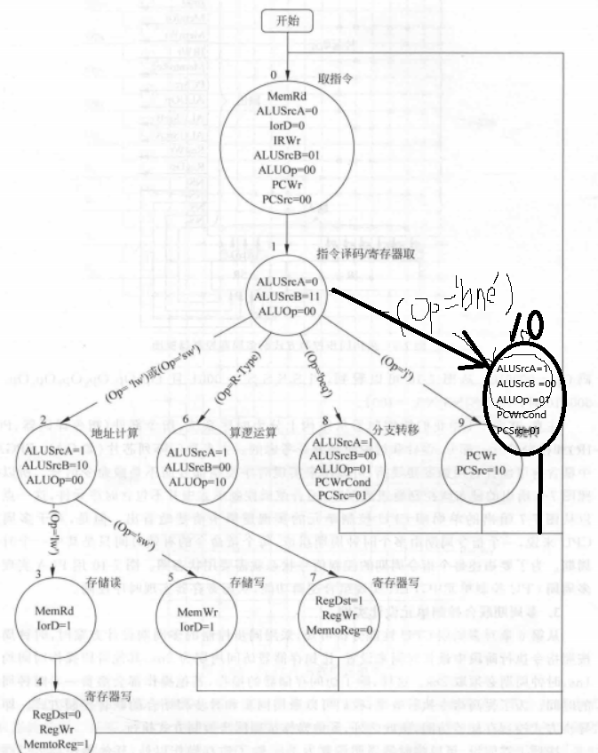
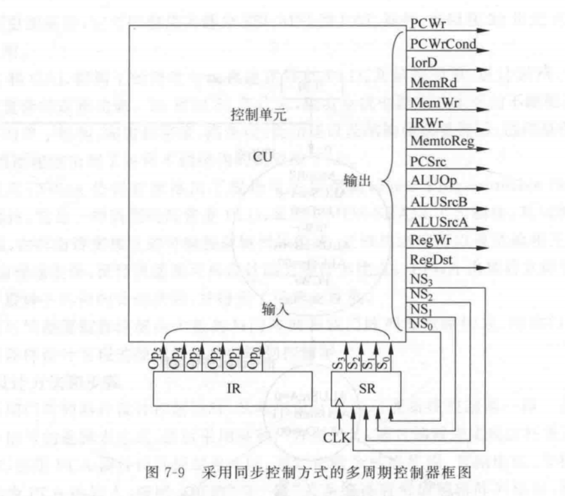
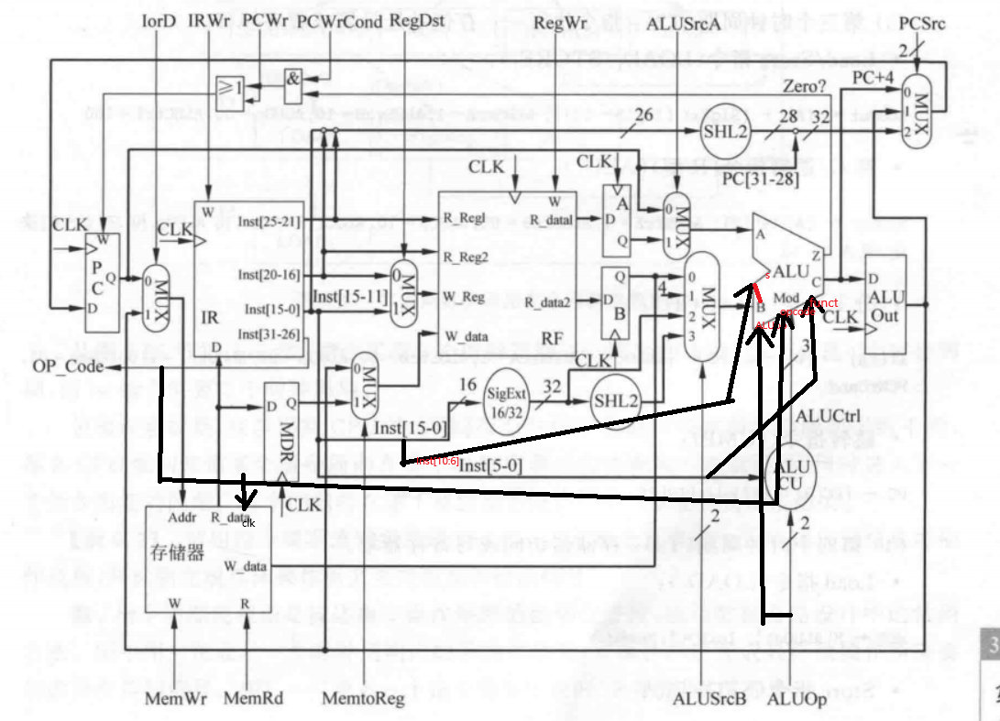
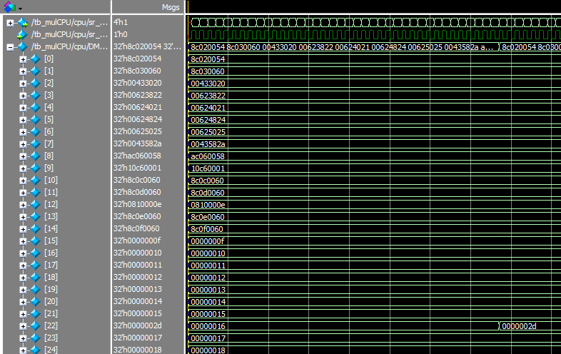
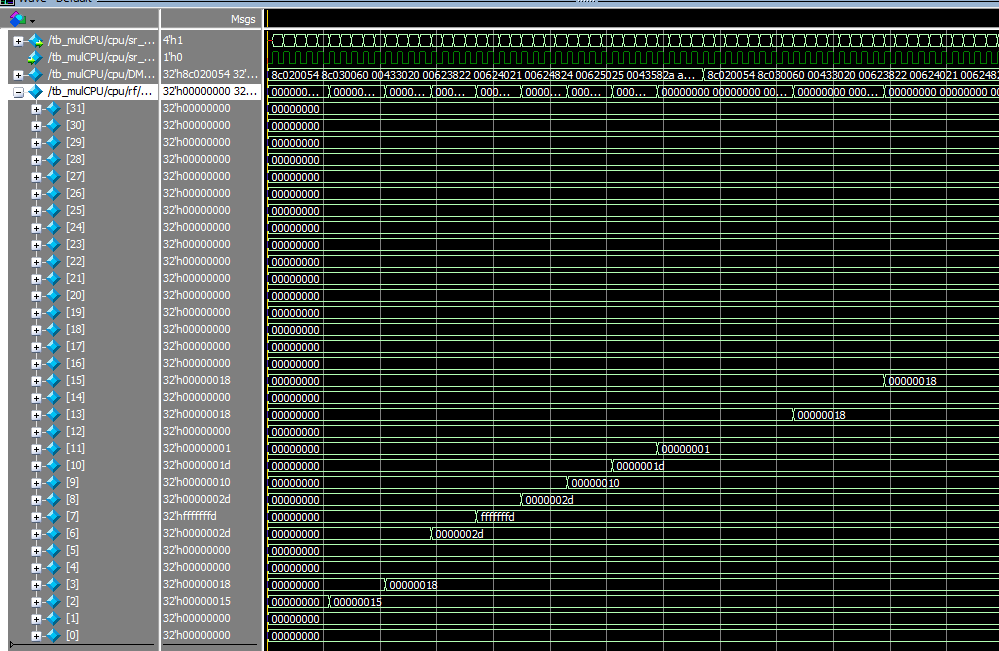
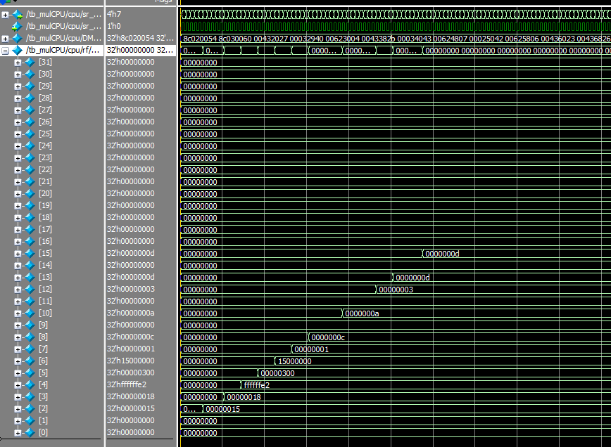

# 仿真 CPU 实验报告

## 实验目标
仿真单周期CPU，多周期CPU的实现，并尽可能地加入指令。

## 指令集实现(单、多相同)

在本次实验中，单周期、多周期CPU，均完成了基础的十条指令，并在此基础上多完成了十条R型指令和一条bne指令，共二十一条指令。

### 支持的指令列表(单、多相同)


| 指令 | 命令码 (Opcode) | 功能 |
|------|----------------|------|
| lw   | `100011`       | 加载字 |
| add   | `000000` (R型) | 符号加 |
| sub  | `000000` (R型)  | 符号减 |
| addu  | `000000` (R型) | 无符号加 |
| and  | `000000` (R型) |  与 |
| or  | `000000` (R型) | 或 |
| slt  | `000000` (R型) | 小于置 1(有符号) |
| sw  | `101011`  | 存储字 |
| beq  | `000100`  | 相等时转移 |
| j  | `000010` (R型) | 跳转 |
| nor  | `000000` (R型) | 或非 |
| sll  | `000000` (R型) | 逻辑左移 |
| sllv  | `000000` (R型) | 逻辑可变左移 |
| sltu  | `000000` (R型) | 小于置 1(无符号) |
| sra  | `000000` (R型) | 算术右移 |
| srav  | `000000` (R型) | 算术可变右移 |
| srl | `000000` (R型) | 逻辑右移 |
| srlv  | `000000` (R型) | 逻辑可变右移 |
| subu  | `000000` (R型) | 无符号减 |
| xor  | `000000` (R型) | 异或 |
| bne  | `000101` (R型) | 不等于时转移 |

值得注意的是，对于基础的十条指令，无论是单周期还是多周期，都是完全地按照了课本上的ALUop真值表实现的，而新增的十一条指令的实现细节，会在下面的部件实现中给出。
ALUop真值表如下：

| ALUOp | funct | ALUCtrl |
|------|----------------|------|
| `00`   | `X`       | `100`(add) |
| `01`   | `X`  | `110`(sub) |
| `1X`  | `100000`   |` 100`(add) |
| `1X`  | `100001`  | `101`(addu) |
| `1X`  | `100010`  |  `110`(sub) |
| `1X`  | `100100`  | `000`(and) |
| `1X`  | `100101`  | `001`(or) |
| `1X`  | `101010`  | `011`(slt) |


## 单周期部件说明

### 单周期主要部件列表
实验中实现的部件包括：

| 部件名称      | 
|---------------|
| PC (程序计数器) |
| Adder (加法器) |
| IM (指令存储器) | 
| MCU (控制单元) |
| ALU (算术逻辑单元) |
| RF (寄存器堆) |
| DataMemory (数据存储器) | 
| MUX2to1_5b (五位二路选择器) |
| MUX2to1_32b (三十二位二路选择器) |
| SHL2_26 (二十六位左移二位器) |
| SHL2_32 (三十二位左移二位器) |
| SigExt16_32 (十六位符号拓展三十二位器) |
| ALUCU (ALU控制单元) |


### 单周期部件详细说明

#### PC (程序计数器)
- **接口**：
  - 输入：
    - `clk` (时钟信号)
    - `rst` (复位信号)
    - `IPC` (下一条指令地址)
  - 输出：
    - `OPC` (当前指令地址)
- **功能**：维护当前的指令地址，每个时钟周期递增或复位。
- **代码实现**：
```verilog
module PC( clk, rst, IPC, OPC );

  input              clk;
  input              rst;
  input       [31:0] IPC;
  output reg  [31:0] OPC;

  always @(posedge clk, posedge rst)
    if (rst) 
      OPC <= 32'h0000_0000;
    else
      OPC <= IPC;
    
endmodule
```
- **原理**：tb文件中会在开始发送一个复位信号，使得OPC(当前输出的PC值，即当前指令地址)初始为0。当clk跳动，从IPC，即根据一系列控制信号、操作后得到的下一个周期的PC输入到当前指令地址，即指令地址更新。

#### Adder (加法器)
- **接口**：
  - 输入：
    - `A` (32 位输入)
    - `B` (32 位输入)
  - 输出：
    - `Sum` (32 位和)
- **功能**：计算两个 32 位输入的加和，用于 PC 更新或其他运算。
- **代码实现**：
```verilog
module Adder ( A, B, Sum);

    input [31:0] A;   // 输入端口A
    input [31:0] B;  // 输入端口B
    output [31:0] Sum; // 输出端口Sum

    assign Sum = A + B; 
endmodule
```
- **原理**：简单的组合逻辑。

#### IM (指令存储器)
- **接口**：
  - 输入：
    - `Addr` (指令地址)
    - `Inst` (指令)
  - 输出：
    - `Inst` (指令)
- **功能**：存储指令，根据指令地址取出指令。
- **代码实现**：
```verilog
module IM (Addr, Inst);
    input [31:0] Addr;  
    output [31:0] Inst;

    // 一个大小为1024个32位字的存储器
    reg [31:0] memory [0:1023];

    assign Inst = memory[Addr[11:2]];  

    initial begin
        memory[0] = 32'h8c020001; // lw $2, 1($0) 
        memory[1] = 32'h8c030004; // lw $3, 4($0) 
        memory[2] = 32'h00432027; // nor $4,$2,$3
        memory[3] = 32'h00032940; // sll $5,$3,5
        memory[4] = 32'h00623004; // sllv $6,$2,$3
        memory[5] = 32'h0043382b; // sltu $7,$2,$3
        memory[6] = 32'h00034043; // sra $8,$3,1
        memory[7] = 32'h00624807; // srav $9,$2,$3
        memory[8] = 32'h00025042; // srl $10,$2,1
        memory[9] = 32'h00625806; // srlv $11,$2,$3
        memory[10] = 32'h00436023; // subu $12,$2,$3
        memory[11] = 32'h00436826; // xor $13,$2,$3
        memory[12] = 32'h14430001; // bne $2,$3,label
        memory[13] = 32'h00437026; // xor $14,$2,$3
        memory[14] = 32'h00437826; // label:xor $15,$2,$3
        memory[15] = 32'h00000000; // nop
    end

endmodule
```
- **原理**：内部写了一个数组，其中指令地址在数组里的地址取[11:2]，这是为了使得PC+4能够正常的转移到下一个地址，否则将会跳转到下四个位置的数组存放的指令处。

#### MCU (控制单元)  

- **接口**：  
  - **输入**：  
    - `opcode` (操作码)：6 位，用于指令分类。  
    - `clk` (时钟信号)：用于同步控制信号的更新。  
  - **输出**：  
    - `RegDst`：寄存器目标选择信号。  
    - `RegW`：寄存器写使能信号。  
    - `ALUSrc`：ALU 第二操作数选择信号。  
    - `MemR`：数据存储器读使能信号。  
    - `MemW`：数据存储器写使能信号。  
    - `MemtoReg`：控制写回寄存器的数据来源。  
    - `Branch`：条件分支使能信号。  
    - `Jump`：跳转使能信号。  
    - `ALUOp`：ALU 操作码，控制运算逻辑。  

- **功能**：根据 `opcode` 指定的指令类型，生成相应的控制信号，用于指挥各部件协同完成指令的执行。  
- **代码实现**：  
```verilog
module MCU(
    input [5:0] opcode,   // Inst[31:26]
    input clk,             // 时钟信号
    output reg RegDst,
    output reg RegW,
    output reg ALUSrc,
    output reg MemR,
    output reg MemW,
    output reg MemtoReg,
    output reg Branch,
    output reg Jump,
    output reg [1:0] ALUOp
);

    always @(*) begin
        case (opcode)
            6'b000000: begin  // R型指令
                RegDst = 1;
                RegW = 1;
                ALUSrc = 0;
                MemR = 0;
                MemW = 0;
                MemtoReg = 0;
                Branch = 0;
                Jump = 0;
                ALUOp = 2'b10;  
            end
            6'b100011: begin  // lw
                RegDst = 0;
                RegW = 1;
                ALUSrc = 1;
                MemR = 1;
                MemW = 0;
                MemtoReg = 1;
                Branch = 0;
                Jump = 0;
                ALUOp = 2'b00; 
            end
            6'b101011: begin  // sw
                RegDst = 1'bx;
                RegW = 0;
                ALUSrc = 1;
                MemR = 0;
                MemW = 1;
                MemtoReg = 1'bx;
                Branch = 0;
                Jump = 0;
                ALUOp = 2'b00;  
            end
            6'b000100: begin  // beq
                RegDst = 1'bx;
                RegW = 0;
                ALUSrc = 0;
                MemR = 0;
                MemW = 0;
                MemtoReg = 1'bx;
                Branch = 1;
                Jump = 0;
                ALUOp = 2'b01; 
            end
            6'b000010: begin  // j
                RegDst = 1'bx;
                RegW = 0;
                ALUSrc = 1'bx;
                MemR = 0;
                MemW = 0;
                MemtoReg = 1'bx;
                Branch = 0;
                Jump = 1;
                ALUOp = 2'bxx; 
            end
            6'b000101: begin  // bne
                RegDst = 1'bx;
                RegW = 0;
                ALUSrc = 0;
                MemR = 0;
                MemW = 0;
                MemtoReg = 1'bx;
                Branch = 1;
                Jump = 0;
                ALUOp = 2'b01;  
            end
            default: begin
                // 默认设置
                RegDst = 0;
                RegW = 0;
                ALUSrc = 0;
                MemR = 0;
                MemW = 0;
                MemtoReg = 0;
                Branch = 0;
                Jump = 0;
                ALUOp = 2'b00;
            end
        endcase
    end
endmodule
```
- **原理**：根据指令的[31:26]位给出的opcode来确定输出的控制信号。控制信号表除bne外均由课本给出。发现实现中，bne的控制信号可以与beq相同，再发现指令是bne后反转z信号(ALU结果是否为0)即可实现，后续有细节补充。

#### MUX2to1_5b (5位2选1多路复用器)  

- **接口**：  
  - **输入**：  
    - `A` (5 位输入)：输入信号 A。  
    - `B` (5 位输入)：输入信号 B。  
    - `sel` (选择信号)：控制输出选择。  
  - **输出**：  
    - `Y` (5 位输出)：选择结果输出信号。  

- **功能**：实现 5 位信号的 2 选 1 多路复用。根据选择信号 `sel`，决定输出信号 `Y` 是来自输入 `A` 还是输入 `B`。  

- **代码实现**：  
```verilog
module MUX2to1_5b (
    input [4:0] A,        // 输入A
    input [4:0] B,        // 输入B
    input sel,             // 选择信号
    output reg [4:0] Y    // 输出
);

    always @(*) begin
        if (sel)           // 如果选择信号为 1，则选择输入 B
            Y = B;
        else               // 否则选择输入 A
            Y = A;
    end

endmodule
```
- **原理**：若输入的sel是1，将Y赋为B，反之赋为A。

#### MUX2to1_32b (32位2选1多路复用器)

- **接口**：
  - **输入**：
    - `A` (32 位输入)：输入信号 A。
    - `B` (32 位输入)：输入信号 B。
    - `sel` (选择信号)：控制输出选择。
  - **输出**：
    - `Y` (32 位输出)：选择结果输出信号。

- **功能**：实现 32 位信号的 2 选 1 多路复用。根据选择信号 `sel`，决定输出信号 `Y` 是来自输入 `A` 还是输入 `B`。

- **代码实现**：
```verilog
module MUX2to1_32b (
    input [31:0] A,        // 输入A
    input [31:0] B,        // 输入B
    input sel,             // 选择信号
    output reg [31:0] Y    // 输出
);

    always @(*) begin
        if (sel)           // 如果选择信号为 1，则选择输入 B
            Y = B;
        else               // 否则选择输入 A
            Y = A;
    end

endmodule
```
- **原理**：与五位相似。

#### SHL2_26 (26位左移2位模块)

- **接口**：
  - **输入**：
    - `in` (26 位输入)：待左移的信号。
  - **输出**：
    - `out` (28 位输出)：左移 2 位后的信号，低位补零。

- **功能**：将 26 位输入信号左移 2 位，输出结果为 28 位，高 26 位保持输入信号的原始数据，低 2 位补 0。

- **代码实现**：
```verilog
module SHL2_26 (
    input [25:0] in,     // 26 位输入
    output [27:0] out    // 28 位输出
);

    assign out = {in, 2'b00}; // 将输入值左移 2 位，补 0

endmodule
```
- **原理**：将输入值左移两位补零再输出。

#### SHL2_32 (32位左移2位模块)

- **接口**：
  - **输入**：
    - `in` (32 位输入)：待左移的信号。
  - **输出**：
    - `out` (32 位输出)：左移 2 位后的信号。

- **功能**：将 32 位输入信号左移 2 位，保持位宽不变，低位补零。

- **代码实现**：
```verilog
module SHL2_32 (
    input [31:0] in,     // 32 位输入
    output [31:0] out    // 32 位输出
);

    assign out = in << 2; 

endmodule
```
- **原理**：将输入值左移两位输出。

#### RF (寄存器堆)

- **接口**：
  - **输入**：
    - `W_data` (32 位)：写入数据。
    - `R_Reg1` (5 位)：读端口 1 的寄存器地址。
    - `R_Reg2` (5 位)：读端口 2 的寄存器地址。
    - `W_Reg` (5 位)：写入寄存器地址。
    - `W` (1 位)：写使能信号。
    - `clk` (1 位)：时钟信号。
  - **输出**：
    - `R_data1` (32 位)：读端口 1 的输出数据。
    - `R_data2` (32 位)：读端口 2 的输出数据。

- **功能**：实现一个支持双端口读、单端口写的寄存器文件，用于存储和提供 32 个 32 位寄存器的数据。

- **代码实现**：
```verilog
module RF (
    input [31:0] W_data,    // 写入数据
    input [4:0] R_Reg1,      // 读端口1的寄存器地址
    input [4:0] R_Reg2,      // 读端口2的寄存器地址
    input [4:0] W_Reg,       // 写入寄存器地址
    input W,                 // 写使能
    input clk,               // 时钟信号
    output [31:0] R_data1,   // 读端口1的数据
    output [31:0] R_data2    // 读端口2的数据
);

    // 定义一个 32 个 32 位寄存器的寄存器堆
    reg [31:0] reg_file [31:0];
    integer i;
    initial begin
        for (i = 0; i < 32; i = i + 1) begin
            reg_file[i] = 32'b0;
        end
    end

    // 读端口1，读取对应寄存器的内容
    assign R_data1 = (R_Reg1 != 5'b0) ? reg_file[R_Reg1] : 32'b0;  // 如果 R_Reg1 不是寄存器 0，读取相应的寄存器数据，寄存器 0 永远为 0

    // 读端口2，读取对应寄存器的内容
    assign R_data2 = (R_Reg2 != 5'b0) ? reg_file[R_Reg2] : 32'b0;  // 如果 R_Reg2 不是寄存器 0，读取相应的寄存器数据，寄存器 0 永远为 0

    always @(posedge clk) begin
        if (W && W_Reg != 5'b0) begin
            reg_file[W_Reg] <= W_data;  // 如果 W 使能且 W_Reg 不是寄存器 0，则写入数据
        end
    end

endmodule
```
- **原理**：关于写功能：当写使能有效时，准备写入。即将`W_data`读入的内容写到`W_Reg`给出的寄存器号对应的寄存器。注意：1.零号寄存器的内容一直为0，不得写入；2.寄存器写必须是clk同步的。 关于读功能：持续根据读端口给出的寄存器地址来读出数据输出，用组合逻辑完成。关于初始：将寄存器所有内容置零。

#### SigExt16_32 (16 位到 32 位符号扩展器)

- **接口**：
  - **输入**：
    - `in` (16 位)：需要进行符号扩展的输入数据。
  - **输出**：
    - `out` (32 位)：符号扩展后的 32 位输出数据。

- **功能**：将一个 16 位输入按照最高位（符号位）扩展成 32 位，以支持有符号数据的扩展操作。

- **代码实现**：
```verilog
module SigExt16_32 (
    input [15:0] in,      // 16 位输入
    output [31:0] out     // 32 位输出
);

    // 符号扩展：将 16 位输入符号扩展为 32 位
    assign out = { {16{in[15]}}, in };  // 通过扩展符号位来实现

endmodule
```
- **原理**：in为16位，因此in[15]即符号位。通过拓展该位即可实现16位到32位的符号拓展。

#### ALUCU (算术逻辑单元控制单元)

- **接口**：
  - **输入**：
    - `funct` (6 位)：指令功能字段，用于区分不同的 R 型操作。
    - `ALUOp` (2 位)：ALU 操作码，由主控制单元提供，指示操作类型。
  - **输出**：
    - `ALUCtrl` (3 位)：控制 ALU 执行特定操作的信号。

- **功能**：根据 `ALUOp` 和 `funct` 的值生成控制信号 `ALUCtrl`，以指示 ALU 执行特定的算术或逻辑操作。

- **代码实现**：
```verilog
module ALUCU (
    input [5:0] funct,      
    input [1:0] ALUOp,      
    output reg [2:0] ALUCtrl 
);

    always @(*) begin
        case (ALUOp)
            2'b00: ALUCtrl = 3'b100;  // 加法（例如用于 LW/SW 指令）
            2'b01: ALUCtrl = 3'b110;  // 减法（例如用于 BEQ 指令）
            2'b10: begin              // R 型指令
                case (funct)
                    6'b100000: ALUCtrl = 3'b100; // 加法
                    6'b100001: ALUCtrl = 3'b101; // 加法无符号
                    6'b100010: ALUCtrl = 3'b110; // 减法
                    6'b100100: ALUCtrl = 3'b000; // AND
                    6'b100101: ALUCtrl = 3'b001; // OR
                    6'b101010: ALUCtrl = 3'b011; // SLT (Set on Less Than)
                    default:   ALUCtrl = 3'bxxx; // 不支持的操作
                endcase
            end
            2'b11: begin              // 其他指令（备用）
                case (funct)
                    6'b100000: ALUCtrl = 3'b100; // 加法
                    6'b100001: ALUCtrl = 3'b101; // 加法无符号
                    6'b100010: ALUCtrl = 3'b110; // 减法
                    6'b100100: ALUCtrl = 3'b000; // AND
                    6'b100101: ALUCtrl = 3'b001; // OR
                    6'b101010: ALUCtrl = 3'b011; // SLT
                    default:   ALUCtrl = 3'bxxx; // 不支持的操作
                endcase
            end
            default: ALUCtrl = 3'bxxx; // 默认值
        endcase
    end

endmodule
```
- **原理**：根据课本给出的ALUOp真值表实现。通过输入的ALUop信号，输入的指令的funct段，确定对应的ALUctrl信号。

#### ALU (算术逻辑单元)

- **接口**：
  - 输入：
    - `opcode` (6 位操作码)
    - `funct` (6 位功能码)
    - `s` (5 位移位量)
    - `A` (32 位输入 A)
    - `B` (32 位输入 B)
    - `ALUCtrl` (3 位 ALU 控制信号)
  - 输出：
    - `Z` (1 位零标志)
    - `C` (32 位运算结果)
    - `Exception` (异常标志)

- **功能**：执行一系列的算术与逻辑运算，如加法、减法、按位与、按位或、移位等，计算结果存储在输出 `C` 中，同时根据运算结果更新零标志 `Z` 和异常标志 `Exception`。

- **代码实现**：

```verilog
module ALU (
    input [5:0] opcode, 
    input [5:0] funct,
    input [4:0] s, 
    input [31:0] A,        // 32 位输入 A
    input [31:0] B,        // 32 位输入 B
    input [2:0] ALUCtrl,   // 3 位 ALU 控制信号
    output reg Z,          // 1 位零标志 Z
    output reg [31:0] C,   
    output reg Exception
);

    initial begin
        Exception = 0;
    end

    always @( * ) begin
        case (ALUCtrl)
            3'b100: begin // 加法
                C = A + B; 
                if ((A[31] == B[31]) && (C[31] != A[31])) begin
                     Exception = 1; 
                end
            end
            3'b101: begin // 无符号加法 (addu)
                C = A + B;
            end
            3'b110: begin // 减法
                C = B - A;
                if ((A[31] == B[31]) && (C[31] != A[31])) begin
                    Exception = 1; 
                end
            end
            3'b000: begin // AND
                C = A & B;
            end
            3'b001: begin // OR
                C = A | B;
            end
            3'b011: begin // 小于比较 (SLT)
                if ($signed(A) < $signed(B))
                    C = 32'b1;  // A < B 时，结果为 1
                else
                    C = 32'b0;  // 否则为 0
            end
            default: begin
                C = 32'b0;  // 如果不支持的操作，默认输出 0
            end
        endcase

        case (funct)
                    6'b100111: begin//NOR
                        C = ~(A | B);
                    end
                    6'b000100: begin//SLLV
                        C = B << A;
                    end
                    6'b000111: begin//SRAV
                        C = B >>> A;
                    end
                    6'b000110: begin//SRLV
                        C = B >> A;
                    end
                    6'b100011: begin//SUBU
                        C = B - A;
                    end
                    6'b100110: begin//XOR
                        C = A ^ B;
                    end
                    6'b101011: begin//SLTU
                        if (A < B)
                            C = 32'b1;  // A < B 时，结果为 1
                        else
                            C = 32'b0;  // 否则为 0
                    end
                    6'b000000: begin//SLL
                        C = B << s;
                    end
                    6'b000011: begin//SRA
                        C = B >>> s;
                    end
                    6'b000010: begin//SRL
                        C = B >> s;
                    end
        endcase

        if (C == 32'b0)
            Z = 1'b1;  // 如果结果为 0，设置 Z 为 1
        else
            Z = 1'b0;  // 否则，Z 为 0
        
        if (opcode == 6'b000101) begin
            if (C == 32'b0)
                Z = 1'b0;  // 如果结果为 0，设置 Z 为 1
            else
                Z = 1'b1;  // 否则，Z 为 0
        end
    end
endmodule
```
- **原理**：对于基础十条指令，ALU严格按照课本上的ALUop真值表等，得到正确的ALUctrl信号，进行正确的操作。但为了增加新的十条R型指令，三位的ALUctrl信号是不够用的。因此，在课本ALU的基础上，引入了三个新信号。一个是指令的opcode，一个是位移量s，对应指令的[10:6]段，还有一个即R型指令的funct字段。funct是为了使得ALU操作不仅依赖于ALUctrl，通过引入funct，可以通过对funct的直接判断，使得ALU操作个数不被ALUctrl位数限制。此外，加入了一个新的一位输出信号，Exception。这是由于addu，subu等操作，会产生溢出等异常。在仿真中，若发生信号，我们将exception置为1。引入opcode则是为了实现bne指令。当alu发现指令是bne时，alu将反转通过结果得知的z信号，因为beq指令中，正是通过对z信号是否为0来判断是否相等，若等就跳，若不等就不跳(可在连接图中直观发现)。因此，我们只需在bne指令时，反转z信号，其余控制信号不变，就可完成相反的效果，实现bne指令。其余指令实现：简单的一些算术逻辑运算，根据定义来。


#### DataMemory (数据存储器模块)

- **接口**：
  - 输入：
    - `clk` (时钟信号)
    - `Addr` (32 位地址输入)
    - `W_data` (32 位写入数据)
    - `R` (读使能信号)
    - `W` (写使能信号)
  - 输出：
    - `R_data` (32 位读出数据)

- **功能**：实现一个 32KB 的数据存储器，支持通过地址读取或写入数据。读写操作由 `R` 和 `W` 信号控制。当 `W` 有效时，写入数据；当 `R` 有效时，读取数据。

- **代码实现**：

```verilog
module DataMemory (
    input clk,              // 时钟信号
    input [31:0] Addr,      // 32 位地址输入
    input [31:0] W_data,    // 32 位写入数据
    input R,                // 读使能信号
    input W,                // 写使能信号
    output reg [31:0] R_data // 32 位读出数据
);

    // 定义一个 32KB 的数据存储器，假设 32 位地址可以访问的存储单元
    reg [31:0] mem [0:1023];  // 1024 个 32 位宽的数据单元（总共 32KB）
    initial begin
        mem[0] = 32'h00000009;  
        mem[1] = 32'h00000008;  
        mem[2] = 32'h00000007;  
        mem[3] = 32'h00000006;  
        mem[4] = 32'h00000005;  
        mem[5] = 32'h00000005; 
        mem[6] = 32'h00000005;  
        mem[7] = 32'h00000005; 
        mem[8] = 32'h00000005; 
        mem[9] = 32'h00000005; 
    end

    always @(posedge clk) begin
        if (W) begin
            mem[Addr] <= W_data;  // 写数据到存储器
        end
    end
    
    always @(*) begin
        if (R) begin
            R_data <= mem[Addr];  // 读取数据
        end
    end

endmodule
```
- **原理**：整体思路其实与寄存器堆非常相似。但有一点本应不同：为什么DM的写操作被设计成了与clk信号同步的操作?在实际测试中，发现如果不与clk信号同步，DM的写会有一些奇怪的问题。例如，在Addr=2时写入，如果使用组合逻辑操作写入，将会把[1],[0]也写入！而监测addr信号，却从来没有置为0或1。如果addr=18，则会写入[11],[9]。因此不得不将DM设计成与时钟同步的写，发现问题解决了，十分成功。

## 单周期部件连接情况
- **代码实现**：
```verilog
module SingleCycleCPU(clk ,rst);

    input clk;
    input rst;

    // 声明信号
    wire [31:0] OPC, MUX_3PC_32b, Inst, add1_PC, add2_PC,MUX_2PC_32b,Inst_shl2_32;
    wire RegDst, RegW, ALUSrc, MemR, MemW, MemtoReg, Branch, Jump;
    wire [1:0] ALUOp;
    wire [2:0] ALUCtrl;
    wire [4:0] W_Reg;
    wire [27:0] Inst_shl2_26;
    wire [31:0] Inst_sigext, ALU_B, R_data1, R_data2,C;
    wire Z;
    wire [31:0] W_data, R_data;

    // PC模块实例
    PC pc_inst (
        .clk(clk),         // 时钟信号
        .rst(rst),         // 复位信号
        .IPC(MUX_3PC_32b),     // 加法器输出连接到IPC
        .OPC(OPC)          // 程序计数器输出
    );

    // Adder模块实例
    Adder adder_1 (
        .A(32'h4),           // 连接PC模块的输出
        .B(OPC),      // 假设我们要加4，用于计算下一条指令的地址
        .Sum(add1_PC)      // 加法器输出连接到PC模块的IPC
    );

    IM im_inst (
        .Addr(OPC),
        .Inst(Inst)
    );

    MCU mcu (
        .opcode(Inst[31:26]),  // 从指令中提取操作码
        .clk(clk),
        .RegDst(RegDst),
        .RegW(RegW),
        .ALUSrc(ALUSrc),
        .MemR(MemR),
        .MemW(MemW),
        .MemtoReg(MemtoReg),
        .Branch(Branch),
        .Jump(Jump),
        .ALUOp(ALUOp)
    );

    MUX2to1_5b MUX_5b (
        .A(Inst[20:16]),
        .B(Inst[15:11]),
        .sel(RegDst),
        .Y(W_Reg)
    );

    SHL2_26 shl2_1 (
        .in(Inst[25:0]),
        .out(Inst_shl2_26)
    );

    RF rf (
        .W_data(W_data),    
        .R_Reg1(Inst[25:21]),    
        .R_Reg2(Inst[20:16]),    
        .W_Reg(W_Reg),     
        .W(RegW),             
        .clk(clk),       
        .R_data1(R_data1),  
        .R_data2(R_data2)
    );

    SigExt16_32 sigext16_32(
        .in(Inst[15:0]),      
        .out(Inst_sigext)     
    );

    MUX2to1_32b MUX_1_32b (
        .A(R_data2),
        .B(Inst_sigext),
        .sel(ALUSrc),
        .Y(ALU_B)
    );

    ALUCU alucu (
        .funct(Inst[5:0]),      
        .ALUOp(ALUOp),      
        .ALUCtrl(ALUCtrl)
    );

    SHL2_32 shl2_2 (
        .in(Inst_sigext),
        .out(Inst_shl2_32)
    );

    Adder adder_2 (
        .A(add1_PC), 
        .B(Inst_shl2_32), 
        .Sum(add2_PC) 
    );

    MUX2to1_32b MUX_2_32b (
        .A(add1_PC),
        .B(add2_PC),
        .sel(Z & Branch),
        .Y(MUX_2PC_32b)
    );


    MUX2to1_32b MUX_3_32b (
        .A(MUX_2PC_32b),
        .B({add1_PC[31:28], Inst_shl2_26} - 32'h00400000 ),
        .sel(Jump),
        .Y(MUX_3PC_32b)
    );

    ALU alu (
        .opcode(Inst[31:26]),
        .funct(Inst[5:0]), 
        .s(Inst[10:6]),
        .A(R_data1),            
        .B(ALU_B),             
        .ALUCtrl(ALUCtrl),   
        .Z(Z),           
        .C(C)        
    );

    DataMemory DM (
        .clk(clk),              // 时钟信号
        .Addr(C),            // 地址输入
        .W_data(R_data2),        // 写入数据
        .R(MemR),                  // 读取使能信号
        .W(MemW),                  // 写入使能信号
        .R_data(R_data)         // 读取的数据输出
    );

    MUX2to1_32b MUX_4_32b (
        .A(C),
        .B(R_data),
        .sel(MemtoReg),
        .Y(W_data)
    );


endmodule    
```
- 值得一提的是:在MUX_3_32b中，我将B口输入信号 - 32'h00400000。看似是非常不符合规范和仿真目标的，但这实际上是有原因的。因为本次仿真要实现的是MIPS指令集，而MIPS默认的指令起始地址是32'h00400000。在实际的仿真实验中，完全没有必要预留如此大的空间，在仿真实验中这是无效的。因此，为了套用MIPS指令集，可以直接使用根据MIPS指令集生成的跳转指令(j)指令，做出了这个改动。这样的改动并不影响仿真实现。
  
- **单周期数据通路图**：


## 单周期仿真测试

- **测试用指令**：
```txt
        //基础十条测试
        memory[0] = 32'h8c020001; // lw $2, 1($0) 
        memory[1] = 32'h8c030004; // lw $3, 4($0) 
        memory[2] = 32'h00433020; // add $6, $2, $3 - $6 = $2 + $3
        memory[3] = 32'h00623822; // sub $7,$3,$2
        memory[4] = 32'h00624021; // addu $8,$3,$2
        memory[5] = 32'h00624824; // and $9,$3,$2
        memory[6] = 32'h00625025; // or $10,$3,$2
        memory[7] = 32'h0043582a; // slt $11,$2,$3
        memory[8] = 32'hac060002; // sw,$6,2($0)
        memory[9] = 32'h10c60001; // beq $6,$6,label
        memory[10] = 32'h8c0c0004; // lw,$12,4($0)
        memory[11] = 32'h8c0d0004; // label:lw,$13,4($0)
        memory[12] = 32'h0810000e; // j label2
        memory[13] = 32'h8c0e0004; // lw,$14,4($0)
        memory[14] = 32'h8c0f0004; // label2: lw,$15,4($0)
        memory[15] = 32'h00000000; // nop
         //增加的十一条测试
        memory[0] = 32'h8c020001; // lw $2, 1($0) 
        memory[1] = 32'h8c030004; // lw $3, 4($0) 
        memory[2] = 32'h00432027; // nor $4,$2,$3
        memory[3] = 32'h00032940; // sll $5,$3,5
        memory[4] = 32'h00623004; // sllv $6,$2,$3
        memory[5] = 32'h0043382b; // sltu $7,$2,$3
        memory[6] = 32'h00034043; // sra $8,$3,1
        memory[7] = 32'h00624807; // srav $9,$2,$3
        memory[8] = 32'h00025042; // srl $10,$2,1
        memory[9] = 32'h00625806; // srlv $11,$2,$3
        memory[10] = 32'h00436023; // subu $12,$2,$3
        memory[11] = 32'h00436826; // xor $13,$2,$3
        memory[12] = 32'h14430001; // bne $2,$3,label
        memory[13] = 32'h00437026; // xor $14,$2,$3
        memory[14] = 32'h00437826; // label:xor $15,$2,$3
        memory[15] = 32'h00000000; // nop
```

- **tb文件**：
```verilog
module tb_SingleCycleCPU;

    // 定义信号
    reg clk;
    reg rst;

    // 实例化单周期CPU模块
    SingleCycleCPU cpu (
        .clk(clk),
        .rst(rst)
    );

    // 时钟生成器
    always begin
        #5 clk = ~clk;  // 每 5 单位时间反转时钟
    end

    // 初始化信号
    initial begin
        // 初始化时钟和复位
        clk = 0;
        rst = 0;

        #5 rst = 1;  // 延时 10 单位时间后复位信号清零
        #10 rst = 0;
        // 模拟结束时
        #1000 $finish;  // 模拟运行 100 单位时间后结束
    end

endmodule
```
- **运行结果**：
单周期测试1

单周期测试2


- **测试结果分析** :
通过对clk，Inst，OPC等信号的检查，发现跳转指令均正常实现，通过对rf与dm的数据检查，发现R型指令均成功实现，lw，sw指令成功实现。此外，通过对rf中某些位的检测，发现一些指令未成功执行，被跳过，也证实了跳转指令的成功实现。综上，运行成功。


## 多周期部件说明

### 多周期主要部件列表
实验中实现的部件包括：

| 部件名称      | 
|---------------|
| PC (程序计数器) |
| MDR (存储器数据寄存器)|
| IR (指令寄存器) | 
| RF (寄存器堆) |
| MUX2to1_5b (五位二路选择器) |
| MUX2to1_32b (三十二位二路选择器) |
| DataMemory (数据存储器)|
| Mux4to1(四路选择器) |
| Mux3to1(三路选择器)|
| ALU (算术逻辑单元)|
| ALUCU (ALU控制单元)|
| SHL2_26 (26位移位器)|
| SR (状态寄存器)|
| CU (控制单元)|


### 多周期部件详细说明

#### PC (程序计数器)

- **接口**：
  - 输入：
    - `clk` (时钟信号)
    - `rst` (复位信号)
    - `W` (写使能信号)
    - `IPC` (下一条指令地址)
  - 输出：
    - `OPC` (当前指令地址)

- **功能**：维护当前的指令地址。每个时钟周期，根据写使能信号 `W` 决定是否更新当前指令地址。如果 `rst` 信号有效，则复位 `OPC` 为 0。

- **代码实现**：

```verilog
module PC(
    input              clk,
    input              rst,
    input              W,
    input       [31:0] IPC,
    output reg  [31:0] OPC
);
    always @(posedge clk, posedge rst) begin
        if (rst) begin
            OPC <= 32'h00000000;  // 复位时，OPC 置为 0
        end else if(W) begin
            OPC <= IPC;           // 写使能有效时，更新 OPC 为 IPC
        end
    end        
endmodule

```
- **原理**：tb文件中会在开始发送一个复位信号，使得OPC(当前输出的PC值，即当前指令地址)初始为0。当clk跳动，且有PC写信号，则从IPC，即根据一系列控制信号、操作后得到的下一个周期的PC输入到当前指令地址，即指令地址更新。

#### DataMemory (数据存储器模块)

- **接口**：
  - 输入：
    - `clk` (时钟信号)
    - `Addr` (32 位地址输入)
    - `W_data` (32 位写入数据)
    - `R` (读使能信号)
    - `W` (写使能信号)
  - 输出：
    - `R_data` (32 位读出数据)

- **功能**：实现一个 32KB 的数据存储器，支持按字对齐的地址访问，存储器初始包含指令和数据，支持读写操作。

- **代码实现**：

```verilog
module DataMemory (
    input clk,              // 时钟信号
    input [31:0] Addr,      // 32 位地址输入
    input [31:0] W_data,    // 32 位写入数据
    input R,                // 读使能信号
    input W,                // 写使能信号
    output reg [31:0] R_data // 32 位读出数据
);

    // 定义一个 32KB 的数据存储器，假设 32 位地址可以访问的存储单元
    reg [31:0] mem [0:1023];  // 1024 个 32 位宽的数据单元（总共 32KB），地址为 4n 的存储单元对应 `mem[n]`
    initial begin
        // 初始化部分指令和数据
        mem[0] = 32'h8c020054; // lw $2, 84($0)
        mem[1] = 32'h8c030060; // lw $3, 96($0)
        mem[2] = 32'h00433020; // add $6, $2, $3 - $6 = $2 + $3
        mem[3] = 32'h00623822; // sub $7, $3, $2
        mem[4] = 32'h00624021; // addu $8, $3, $2
        mem[5] = 32'h00624824; // and $9, $3, $2
        mem[6] = 32'h00625025; // or $10, $3, $2
        mem[7] = 32'h0043582a; // slt $11, $2, $3
        mem[8] = 32'hac060058; // sw $6, 88($0)
        mem[9] = 32'h10c60001; // beq $6, $6, label
        mem[10] = 32'h8c0c0060; // lw $12, 96($0)
        mem[11] = 32'h8c0d0060; // label: lw $13, 96($0)
        mem[12] = 32'h0810000e; // j label2
        mem[13] = 32'h8c0e0060; // lw $14, 96($0)
        mem[14] = 32'h8c0f0060; // label2: lw $15, 96($0)
        mem[15] = 32'd15;  // 数据赋值
        mem[16] = 32'd16;
        mem[17] = 32'd17;
        mem[18] = 32'd18;
        mem[19] = 32'd19;
        mem[20] = 32'd20;
        mem[21] = 32'd21;
        mem[22] = 32'd22;
        mem[23] = 32'd23;
        mem[24] = 32'd24;
        mem[25] = 32'd25;
        mem[26] = 32'd26;
        mem[27] = 32'd27;
        mem[28] = 32'd28;
        mem[29] = 32'd29;
        mem[30] = 32'd30;
        mem[31] = 32'd31;
        mem[32] = 32'd32;
        mem[33] = 32'd33;
        mem[34] = 32'd34;
        mem[35] = 32'd35;
        mem[36] = 32'd36;
        mem[37] = 32'd37;
        mem[38] = 32'd38;
        mem[39] = 32'd39;
        mem[40] = 32'd40;
    end

    always @( * ) begin
        if (R) begin
            R_data <= mem[Addr >> 2]; // 按字对齐读取数据
        end
    end
    
    always @(posedge clk) begin
        if (W) begin
            mem[Addr >> 2] <= W_data; // 按字对齐写入数据
        end
    end

endmodule
```
- **原理**：与单周期不同的是，多周期中，指令和数据都存放在了数据存储器中。这是因为多周期的特性：没有冗余部件。在我的设计中,我将指令段放在了最前面。当有R信号，读。当有W信号，则写入`W_data`输入的内容。其中，读仍然是组合逻辑，而写才是时钟同步。将Addr >> 2的原因，也是为了严格按照PC + 4的要求。其实实现的就是一个32位字地址寻址的一个地址空间。

#### IR (指令寄存器模块)

- **接口**：
  - 输入：
    - `clk` (时钟信号)
    - `D` (32 位指令输入)
    - `W` (写使能信号)
  - 输出：
    - `Inst_2521` (指令的 [25:21] 位字段)
    - `Inst_2016` (指令的 [20:16] 位字段)
    - `Inst_150` (指令的 [15:0] 位字段)
    - `Inst_3126` (指令的 [31:26] 位字段)
    - `Inst` (完整的 32 位指令)

- **功能**：从输入指令中提取指定的字段并存储，支持写使能控制。

- **代码实现**：

```verilog
module IR (
    input clk,
    input [31:0] D,  
    input W,
    output reg [4:0] Inst_2521,
    output reg [4:0] Inst_2016,
    output reg [16:0] Inst_150,
    output reg [5:0] Inst_3126,
    output reg [31:0] Inst
);

    always @(posedge clk) begin
        if (W) begin
            Inst_2521 <= D[25:21];    // 提取指令的 [25:21] 位字段
            Inst_2016 <= D[20:16];    // 提取指令的 [20:16] 位字段
            Inst_150  <= D[15:0];     // 提取指令的 [15:0] 位字段
            Inst_3126 <= D[31:26];    // 提取指令的 [31:26] 位字段
            Inst <= D[31:0];          // 存储完整的 32 位指令
        end
    end
endmodule
```
- **原理**：模块通过 D 输入接收一条 32 位指令。使用 W 写使能信号控制字段的更新，仅在 W 有效时更新输出。输出字段根据位范围从输入指令中提取，分别输出到各个端口。

#### MUX2to1_32b (32位2选1多路复用器)

- **接口**：
  - **输入**：
    - `A` (32 位输入)：输入信号 A。
    - `B` (32 位输入)：输入信号 B。
    - `sel` (选择信号)：控制输出选择。
  - **输出**：
    - `Y` (32 位输出)：选择结果输出信号。

- **功能**：实现 32 位信号的 2 选 1 多路复用。根据选择信号 `sel`，决定输出信号 `Y` 是来自输入 `A` 还是输入 `B`。

- **代码实现**：
```verilog
module MUX2to1_32b (
    input [31:0] A,        // 输入A
    input [31:0] B,        // 输入B
    input sel,             // 选择信号
    output reg [31:0] Y    // 输出
);

    always @(*) begin
        if (sel)           // 如果选择信号为 1，则选择输入 B
            Y = B;
        else               // 否则选择输入 A
            Y = A;
    end

endmodule
```
- **原理**：与单周期仿真CPU相同。

#### SHL2_26 (26位左移2位模块)

- **接口**：
  - **输入**：
    - `in` (26 位输入)：待左移的信号。
  - **输出**：
    - `out` (28 位输出)：左移 2 位后的信号，低位补零。

- **功能**：将 26 位输入信号左移 2 位，输出结果为 28 位，高 26 位保持输入信号的原始数据，低 2 位补 0。

- **代码实现**：
```verilog
module SHL2_26 (
    input [25:0] in,     // 26 位输入
    output [27:0] out    // 28 位输出
);

    assign out = {in, 2'b00}; // 将输入值左移 2 位，补 0

endmodule
```
- **原理**：将输入值左移两位补零再输出。

#### MDR (数据寄存器模块)

- **接口**：
  - 输入：
    - `clk` (时钟信号)
    - `D` (32 位数据输入)
  - 输出：
    - `Q` (32 位数据输出)

- **功能**：在时钟信号的上升沿，将输入数据 `D` 保存到输出 `Q` 中。

- **代码实现**：

```verilog
module MDR (
    input clk,
    input [31:0] D,  
    output reg [31:0] Q
);

    always @(posedge clk) begin
        Q <= D;         // 将输入数据 D 保存到输出 Q
    end
endmodule
```
- **原理**：在时钟信号 `clk` 的上升沿，输入数据 `D` 被存储到`Q`中，并输出。

#### MUX2to1_5b (5位2选1多路复用器)  

- **接口**：  
  - **输入**：  
    - `A` (5 位输入)：输入信号 A。  
    - `B` (5 位输入)：输入信号 B。  
    - `sel` (选择信号)：控制输出选择。  
  - **输出**：  
    - `Y` (5 位输出)：选择结果输出信号。  

- **功能**：实现 5 位信号的 2 选 1 多路复用。根据选择信号 `sel`，决定输出信号 `Y` 是来自输入 `A` 还是输入 `B`。  

- **代码实现**：  
```verilog
module MUX2to1_5b (
    input [4:0] A,        // 输入A
    input [4:0] B,        // 输入B
    input sel,             // 选择信号
    output reg [4:0] Y    // 输出
);

    always @(*) begin
        if (sel)           // 如果选择信号为 1，则选择输入 B
            Y = B;
        else               // 否则选择输入 A
            Y = A;
    end

endmodule
```
- **原理**：与单周期相同。

#### RF (寄存器堆)

- **接口**：
  - **输入**：
    - `W_data` (32 位)：写入数据。
    - `R_Reg1` (5 位)：读端口 1 的寄存器地址。
    - `R_Reg2` (5 位)：读端口 2 的寄存器地址。
    - `W_Reg` (5 位)：写入寄存器地址。
    - `W` (1 位)：写使能信号。
    - `clk` (1 位)：时钟信号。
  - **输出**：
    - `R_data1` (32 位)：读端口 1 的输出数据。
    - `R_data2` (32 位)：读端口 2 的输出数据。

- **功能**：实现一个支持双端口读、单端口写的寄存器文件，用于存储和提供 32 个 32 位寄存器的数据。

- **代码实现**：
```verilog
module RF (
    input [31:0] W_data,    // 写入数据
    input [4:0] R_Reg1,      // 读端口1的寄存器地址
    input [4:0] R_Reg2,      // 读端口2的寄存器地址
    input [4:0] W_Reg,       // 写入寄存器地址
    input W,                 // 写使能
    input clk,               // 时钟信号
    output [31:0] R_data1,   // 读端口1的数据
    output [31:0] R_data2    // 读端口2的数据
);

    // 定义一个 32 个 32 位寄存器的寄存器堆
    reg [31:0] reg_file [31:0];
    integer i;
    initial begin
        for (i = 0; i < 32; i = i + 1) begin
            reg_file[i] = 32'b0;
        end
    end

    // 读端口1，读取对应寄存器的内容
    assign R_data1 = (R_Reg1 != 5'b0) ? reg_file[R_Reg1] : 32'b0;  // 如果 R_Reg1 不是寄存器 0，读取相应的寄存器数据，寄存器 0 永远为 0

    // 读端口2，读取对应寄存器的内容
    assign R_data2 = (R_Reg2 != 5'b0) ? reg_file[R_Reg2] : 32'b0;  // 如果 R_Reg2 不是寄存器 0，读取相应的寄存器数据，寄存器 0 永远为 0

    always @(posedge clk) begin
        if (W && W_Reg != 5'b0) begin
            reg_file[W_Reg] <= W_data;  // 如果 W 使能且 W_Reg 不是寄存器 0，则写入数据
        end
    end

endmodule
```
- **原理**：与单周期相同。

#### SigExt16_32 (16 位到 32 位符号扩展器)

- **接口**：
  - **输入**：
    - `in` (16 位)：需要进行符号扩展的输入数据。
  - **输出**：
    - `out` (32 位)：符号扩展后的 32 位输出数据。

- **功能**：将一个 16 位输入按照最高位（符号位）扩展成 32 位，以支持有符号数据的扩展操作。

- **代码实现**：
```verilog
module SigExt16_32 (
    input [15:0] in,      // 16 位输入
    output [31:0] out     // 32 位输出
);

    // 符号扩展：将 16 位输入符号扩展为 32 位
    assign out = { {16{in[15]}}, in };  // 通过扩展符号位来实现

endmodule
```
- **原理**：与单周期相同。

#### SHL2_32 (32位左移2位模块)

- **接口**：
  - **输入**：
    - `in` (32 位输入)：待左移的信号。
  - **输出**：
    - `out` (32 位输出)：左移 2 位后的信号。

- **功能**：将 32 位输入信号左移 2 位，保持位宽不变，低位补零。

- **代码实现**：
```verilog
module SHL2_32 (
    input [31:0] in,     // 32 位输入
    output [31:0] out    // 32 位输出
);

    assign out = in << 2; 

endmodule
```
- **原理**：与单周期相同。
  
#### Mux4to1 (4选1多路复用器)

- **接口**：
  - 输入：
    - `A` (32 位输入)
    - `B` (32 位输入)
    - `C` (32 位输入)
    - `D` (32 位输入)
    - `sel` (2 位选择信号)
  - 输出：
    - `Y` (32 位输出)

- **功能**：根据 2 位选择信号 `sel` 的值，从四个输入 `A`、`B`、`C` 和 `D` 中选择一个作为输出。

- **代码实现**：

```verilog
module Mux4to1 (
    input [31:0] A,     // 输入 A
    input [31:0] B,     // 输入 B
    input [31:0] C,     // 输入 C
    input [31:0] D,     // 输入 D
    input [1:0] sel,    // 2位选择信号
    output reg [31:0] Y // 输出
);

    always @(*) begin
        case(sel)
            2'b00: Y = A;  // 选择 A
            2'b01: Y = B;  // 选择 B
            2'b10: Y = C;  // 选择 C
            2'b11: Y = D;  // 选择 D
        endcase
    end

endmodule
```
- **原理**：根据sel信号0123来判断选择ABCD。
  
#### Mux3to1 (3选1多路复用器)

- **接口**：
  - 输入：
    - `A` (32 位输入)
    - `B` (32 位输入)
    - `C` (32 位输入)
    - `sel` (2 位选择信号)
  - 输出：
    - `Y` (32 位输出)

- **功能**：根据 2 位选择信号 `sel` 的值，从三个输入 `A`、`B` 和 `C` 中选择一个作为输出。其中选择 `C` 时，减去常数 `32'h00400000`，适配 MIPS 指令集的 text 段起始地址。

- **代码实现**：

```verilog
module Mux3to1 (
    input [31:0] A,     // 输入 A
    input [31:0] B,     // 输入 B
    input [31:0] C,     // 输入 C
    input [1:0] sel,    // 2位选择信号
    output reg [31:0] Y // 输出
);

    always @(*) begin
        case(sel)
            2'b00: Y = A;                      // 选择 A
            2'b01: Y = B;                      // 选择 B
            2'b10: Y = C - 32'h00400000;       // 选择 C，并减去 0x00400000
        endcase
    end

endmodule
```
- **原理**：根据sel信号012来判断选择ABC。C减去32'h00400000的原因：与单周期数据通路连接部分的理由相同。MIPS指令集默认的指令地址起始位是00300000，而我们设计的指令地址起始位则是00000000。为了使得仿真CPU可以直接使用根据MIPS指令集生成的指令，做出这一改动。事实证明，这改动是合理且成功的。


#### ALUCU (算术逻辑单元控制单元)

- **接口**：
  - **输入**：
    - `funct` (6 位)：指令功能字段，用于区分不同的 R 型操作。
    - `ALUOp` (2 位)：ALU 操作码，由主控制单元提供，指示操作类型。
  - **输出**：
    - `ALUCtrl` (3 位)：控制 ALU 执行特定操作的信号。

- **功能**：根据 `ALUOp` 和 `funct` 的值生成控制信号 `ALUCtrl`，以指示 ALU 执行特定的算术或逻辑操作。

- **代码实现**：
```verilog
module ALUCU (
    input [5:0] funct,      
    input [1:0] ALUOp,      
    output reg [2:0] ALUCtrl 
);

    always @(*) begin
        case (ALUOp)
            2'b00: ALUCtrl = 3'b100;  // 加法（例如用于 LW/SW 指令）
            2'b01: ALUCtrl = 3'b110;  // 减法（例如用于 BEQ 指令）
            2'b10: begin              // R 型指令
                case (funct)
                    6'b100000: ALUCtrl = 3'b100; // 加法
                    6'b100001: ALUCtrl = 3'b101; // 加法无符号
                    6'b100010: ALUCtrl = 3'b110; // 减法
                    6'b100100: ALUCtrl = 3'b000; // AND
                    6'b100101: ALUCtrl = 3'b001; // OR
                    6'b101010: ALUCtrl = 3'b011; // SLT (Set on Less Than)
                    default:   ALUCtrl = 3'bxxx; // 不支持的操作
                endcase
            end
            2'b11: begin              // 其他指令（备用）
                case (funct)
                    6'b100000: ALUCtrl = 3'b100; // 加法
                    6'b100001: ALUCtrl = 3'b101; // 加法无符号
                    6'b100010: ALUCtrl = 3'b110; // 减法
                    6'b100100: ALUCtrl = 3'b000; // AND
                    6'b100101: ALUCtrl = 3'b001; // OR
                    6'b101010: ALUCtrl = 3'b011; // SLT
                    default:   ALUCtrl = 3'bxxx; // 不支持的操作
                endcase
            end
            default: ALUCtrl = 3'bxxx; // 默认值
        endcase
    end

endmodule
```
- **原理**：与单周期相同。

#### ALU (算术逻辑单元)

- **接口**：
  - **输入**：
    - `ALUop` (2 位 ALU 操作模式信号)
    - `opcode` (6 位操作码)
    - `funct` (6 位功能码)
    - `s` (5 位移位量信号)
    - `A` (32 位操作数 A)
    - `B` (32 位操作数 B)
    - `ALUCtrl` (3 位 ALU 控制信号)
  - **输出**：
    - `Z` (1 位零标志，运算结果为 0 时置 1)
    - `C` (32 位运算结果)
    - `Exception` (1 位溢出异常标志)

- **功能**：
  根据 `ALUCtrl` 和 `funct` 信号，执行各种算术和逻辑运算，包括：
  - **基本操作**：
    - 加法、无符号加法、减法、按位与、按位或、小于比较。
  - **扩展操作**（主要针对 R 型指令）：
    - 按位 NOR、左逻辑移位、右算术移位、右逻辑移位、无符号减法、按位 XOR、小于无符号比较、基于移位量的移位操作。
  - **异常检测**：
    - 对于加法和减法，检测溢出异常，设置 `Exception` 标志。

- **代码实现**：

```verilog
module ALU (
    input [1:0] ALUop,
    input [5:0] opcode, 
    input [5:0] funct,
    input [4:0] s, 
    input [31:0] A,        // 32 位输入 A
    input [31:0] B,        // 32 位输入 B
    input [2:0] ALUCtrl,   // 3 位 ALU 控制信号
    output reg Z,          // 1 位零标志 Z
    output reg [31:0] C,    // 32 位输出 C（运算结果）
    output reg Exception
);

    initial begin 
        Exception = 0;
    end

    always @( * ) begin
        case (ALUCtrl)
            3'b100: begin // 加法
                C = A + B;
                if ((A[31] == B[31]) && (C[31] != A[31])) begin
                     Exception = 1; 
                end
            end
            3'b101: C = A + B;                      // 无符号加法
            3'b110: begin // 减法
                C = B - A;
                if ((A[31] == B[31]) && (C[31] != A[31])) begin
                    Exception = 1;
                end
            end
            3'b000: C = A & B;                      // 按位与
            3'b001: C = A | B;                      // 按位或
            3'b011: C = ($signed(A) < $signed(B)) ? 1 : 0; // 小于比较 (SLT)
            default: C = 0;                         // 默认值
        endcase

        if (ALUop != 2'b00 && ALUop != 2'b01) begin
            case (funct)
                6'b100111: C = ~(A | B);          // NOR
                6'b000100: C = B << A;           // SLLV
                6'b000111: C = B >>> A;          // SRAV
                6'b000110: C = B >> A;           // SRLV
                6'b100011: C = B - A;            // SUBU
                6'b100110: C = A ^ B;            // XOR
                6'b101011: C = (A < B) ? 1 : 0;  // SLTU
                6'b000000: C = B << s;           // SLL
                6'b000011: C = B >>> s;          // SRA
                6'b000010: C = B >> s;           // SRL
            endcase
        end

        Z = (C == 0) ? 1 : 0; // 设置零标志 Z

        if (opcode == 6'b000101) begin
            Z = (C == 0) ? 0 : 1; // BEQ 条件的零标志调整
        end
    end
endmodule
```
- **原理**：大多数设计与单周期相同，不同的是，在单周期的基础上，又接入了一个新信号，ALUop信号。接入的目的是什么？由于多周期指令所占周期长，而在最后和第一个周期中，指令也是被成功传输的。可是这个时候理应传入的是合适的PC信号，而不需要R型指令的这些操作。如果按照单周期的设计，则会出现严重错误，即正确的PC地址被覆写，导致程序无法继续。通过对ALUop的判断，能够判断出是否是R型指令，且处在指令周期的非PC写的部分，将R型操作限制在仅有R型指令发出的ALUop信号控制下才能发生，可以避免错误的PC覆写情况。事实证明改动是正确的。

### 控制器部件设计

#### SR (状态寄存器)

- **接口**：
  - **输入**：
    - `rst` (复位信号，高电平有效)
    - `clk` (时钟信号)
    - `next_state` (4 位输入，表示下一个状态)
  - **输出**：
    - `current_state` (4 位输出，表示当前状态)

- **功能**：
  - 在时钟的上升沿更新状态寄存器的值为 `next_state`。
  - 当复位信号 `rst` 为高电平时，将当前状态 `current_state` 重置为 `4'b0000`。

- **代码实现**：

```verilog
module SR (
    input rst,
    input clk,         
    input [3:0] next_state, 
    output reg [3:0] current_state 
);

    always @(posedge clk, posedge rst) begin
        if (rst) begin
            current_state <= 4'b0000; // 复位时将当前状态置为 0
        end else begin
            current_state <= next_state; // 正常情况下更新为下一状态
        end
    end

endmodule
```
- **原理**：利用时序逻辑和复位机制实现状态寄存器。在时钟的每个上升沿，根据 next_state 更新状态寄存器值。当复位信号有效时，当前状态被强制重置为初始状态。
- **状态转换图**


#### CU (控制单元)

- **接口**：
  - **输入**：
    - `OP_code` (6 位操作码，指令类型标识)
    - `SR_input` (4 位状态寄存器输入)
  - **输出**：
    - `SR_output` (4 位状态寄存器输出)
    - `PCWr` (程序计数器写使能)
    - `PCWrCond` (条件写使能)
    - `IorD` (内存地址选择)
    - `MemRd` (内存读使能)
    - `MemWr` (内存写使能)
    - `IRWr` (指令寄存器写使能)
    - `MemtoReg` (数据选择寄存器写回源)
    - `PCSrc` (程序计数器源选择，2 位)
    - `ALUOp` (ALU 操作码，2 位)
    - `ALUSrcB` (ALU 第二操作数选择，2 位)
    - `ALUSrcA` (ALU 第一操作数选择)
    - `RegWr` (寄存器写使能)
    - `RegDst` (目标寄存器选择)

- **功能**：
  - 根据输入的状态 `SR_input` 和指令操作码 `OP_code` 产生控制信号，控制数据路径的行为。
  - 更新状态寄存器 `SR_output` 的值以实现多周期操作。

- **代码实现**：

```verilog
module CU (
    input [5:0] OP_code,
    input [3:0] SR_input,
    output reg [3:0] SR_output,
    output reg PCWr,
    output reg PCWrCond,
    output reg IorD,
    output reg MemRd,
    output reg MemWr,
    output reg IRWr,
    output reg MemtoReg,
    output reg [1:0] PCSrc,
    output reg [1:0] ALUOp,
    output reg [1:0] ALUSrcB,
    output reg ALUSrcA,
    output reg RegWr,
    output reg RegDst
);

    always @(*) begin
        // 初始化所有控制信号为默认值
        PCWr = 0;
        PCWrCond = 0;
        IorD = 0;
        MemRd = 0;
        MemWr = 0;
        IRWr = 0;
        MemtoReg = 0;
        PCSrc = 2'b00;
        ALUOp = 2'b00;
        ALUSrcB = 2'b00;
        ALUSrcA = 0;
        RegWr = 0;
        RegDst = 0;

        // 根据状态和操作码设置控制信号和下一个状态
        case (SR_input)
            4'b0000: begin // 初始状态
                SR_output = 4'b0001;
                MemRd = 1;
                IRWr = 1;
                ALUSrcB = 2'b01;
                PCWr = 1;
            end
            4'b0001: begin // 解码
                case (OP_code)
                    6'b100011: SR_output = 4'b0010; // lw
                    6'b101011: SR_output = 4'b0010; // sw
                    6'b000000: SR_output = 4'b0110; // R 型指令
                    6'b000100: SR_output = 4'b1000; // beq
                    6'b000101: SR_output = 4'b1010; // bne
                    6'b000010: SR_output = 4'b1001; // j
                endcase
            end
            4'b0010: begin // lw 或 sw 地址计算
                ALUSrcA = 1;
                ALUSrcB = 2'b10;
                SR_output = (OP_code == 6'b100011) ? 4'b0011 : 4'b0101;
            end
            4'b0011: begin // lw 数据读取
                MemRd = 1;
                IorD = 1;
                SR_output = 4'b0100;
            end
            4'b0100: begin // lw 数据写回寄存器
                RegDst = 0;
                RegWr = 1;
                MemtoReg = 1;
                SR_output = 4'b0000;
            end
            4'b0101: begin // sw 数据写入内存
                MemWr = 1;
                IorD = 1;
                SR_output = 4'b0000;
            end
            4'b0110: begin // R 型指令执行
                ALUSrcA = 1;
                ALUSrcB = 2'b00;
                ALUOp = 2'b10;
                SR_output = 4'b0111;
            end
            4'b0111: begin // R 型指令写回寄存器
                RegDst = 1;
                RegWr = 1;
                MemtoReg = 0;
                SR_output = 4'b0000;
            end
            4'b1000: begin // beq 分支判断
                ALUSrcA = 1;
                ALUSrcB = 2'b00;
                ALUOp = 2'b01;
                PCWrCond = 1;
                PCSrc = 2'b01;
                SR_output = 4'b0000;
            end
            4'b1001: begin // j 跳转
                PCWr = 1;
                PCSrc = 2'b10;
                SR_output = 4'b0000;
            end
            4'b1010: begin // bne 分支判断
                ALUSrcA = 1;
                ALUSrcB = 2'b00;
                ALUOp = 2'b01;
                PCWrCond = 1;
                PCSrc = 2'b01;
                SR_output = 4'b0000;
            end
        endcase
    end

endmodule
```
- **原理**：条件转换图见上。通过SR_input得知当前状态，根据Opcode来选择分支，并完成相应信号输出。
- **控制单元图**


## 多周期部件连接情况
- **代码实现**：
```verilog
module mulCPU(clk ,rst);

    input clk;
    input rst;

    // 声明信号
    wire [31:0] OPC,Addr,R_data,Q,RF_W_data,R_data1,R_data2,Inst_sigext,Mux4to1_3,a_Q,b_Q,ALU_A,ALU_B,C,ALUout,IPC;
    wire IorD,MemWr,MemRd,IRWr,RegDst,MemtoReg,RegWr,ALUSrcA,Z,PCWrCond,PCWr;
    wire [5:0] OP_code;
    wire [4:0] Inst_2521,Inst_2016,W_Reg;
    wire [15:0] Inst_150;
    wire [1:0] ALUSrcB,ALUOp,PCSrc;
    wire [2:0] ALUCtrl;
    wire [27:0] Inst_shl2_26;
    wire [3:0] SR_input,SR_output;

    PC pc_inst (
        .clk(clk),         // 时钟信号
        .rst(rst),         // 复位信号
        .W( (Z & PCWrCond) | PCWr ),
        .IPC(IPC),     // 加法器输出连接到IPC
        .OPC(OPC)          // 程序计数器输出
    );

    MUX2to1_32b MUX2to1_32b_1 (
        .A(OPC),
        .B(ALUout),
        .sel(IorD),
        .Y(Addr)
    );

    DataMemory DM (
        .clk(clk),              // 时钟信号
        .Addr(Addr),            // 地址输入
        .W_data(b_Q),        // 写入数据
        .R(MemRd),                  // 读取使能信号
        .W(MemWr),                  // 写入使能信号
        .R_data(R_data)         // 读取的数据输出
    );

    IR ir (
        .clk(clk),
        .D(R_data), 
        .W(IRWr),
        .Inst_2521(Inst_2521),
        .Inst_2016(Inst_2016),
        .Inst_150(Inst_150),
        .Inst_3126(OP_code)
    );

    MDR mdr (
        .clk(clk),
        .D(R_data),
        .Q(Q)
    );

    MUX2to1_5b MUX_5b (
        .A(Inst_2016),
        .B(Inst_150[15:11]),
        .sel(RegDst),
        .Y(W_Reg)
    );

    MUX2to1_32b MUX2to1_32b_2 (
        .A(ALUout),
        .B(Q),
        .sel(MemtoReg),
        .Y(RF_W_data)
    );

    RF rf (
        .clk(clk), 
        .W_data(RF_W_data),    
        .R_Reg1(Inst_2521),    
        .R_Reg2(Inst_2016),    
        .W_Reg(W_Reg),     
        .W(RegWr),             
        .R_data1(R_data1),  
        .R_data2(R_data2)
    );

    SigExt16_32 sigext16_32(
        .in(Inst_150),      
        .out(Inst_sigext)     
    );
    
    SHL2_32 shl2_32_1 (
        .in(Inst_sigext),
        .out(Mux4to1_3)
    );

    MDR a (
        .clk(clk),
        .D(R_data1),
        .Q(a_Q)
    );

    MDR b (
        .clk(clk),
        .D(R_data2),
        .Q(b_Q)
    );

    Mux4to1 mux_inst (
        .A(b_Q),
        .B(4),
        .C(Inst_sigext),
        .D(Mux4to1_3),
        .sel(ALUSrcB),
        .Y(ALU_B)
    );

    MUX2to1_32b MUX2to1_32b_3 (
        .A(OPC),
        .B(a_Q),
        .sel(ALUSrcA),
        .Y(ALU_A)
    );

    ALU alu (
        .ALUop(ALUOp),
        .opcode(OP_code),
        .funct(Inst_150[5:0]), 
        .s(Inst_150[10:6]),
        .A(ALU_A),            
        .B(ALU_B),             
        .ALUCtrl(ALUCtrl),   
        .Z(Z),           
        .C(C)        
    );

    ALUCU alucu (
        .funct(Inst_150[5:0]),      
        .ALUOp(ALUOp),      
        .ALUCtrl(ALUCtrl)
    );

    MDR ALU_out (
        .clk(clk),
        .D(C),
        .Q(ALUout)
    );

    SHL2_26 shl2_1 (
        .in({Inst_2521, Inst_2016, Inst_150}),
        .out(Inst_shl2_26)
    );

    Mux3to1 Mux3to1_1 (
        .A(C),
        .B(ALUout),
        .C({OPC[31:28],Inst_shl2_26}),
        .sel(PCSrc),
        .Y(IPC)
    );

    CU cu_inst (
        .OP_code(OP_code),        // 将输入的操作码连接到CU
        .SR_input(SR_input),      // 将输入的状态连接到CU
        .SR_output(SR_output),    // 将CU的状态输出连接到SR_output
        .PCWr(PCWr),              // 连接CU的控制信号到输出端口
        .PCWrCond(PCWrCond),
        .IorD(IorD),
        .MemRd(MemRd),
        .MemWr(MemWr),
        .IRWr(IRWr),
        .MemtoReg(MemtoReg),
        .PCSrc(PCSrc),
        .ALUOp(ALUOp),
        .ALUSrcB(ALUSrcB),
        .ALUSrcA(ALUSrcA),
        .RegWr(RegWr),
        .RegDst(RegDst)
    );


    SR sr_inst (
        .rst(rst),
        .clk(clk),
        .next_state(SR_output),
        .current_state(SR_input)

    );

endmodule    
```
- **多周期数据通路图**：


## 多周期仿真测试

- **测试用指令**：
```txt
        //基础十条测试
        mem[0] = 32'h8c020054; // lw $2, 84($0) 
        mem[1] = 32'h8c030060; // lw $3, 96($0) 
        mem[2] = 32'h00433020; // add $6, $2, $3 - $6 = $2 + $3
        mem[3] = 32'h00623822; // sub $7,$3,$2
        mem[4] = 32'h00624021; // addu $8,$3,$2
        mem[5] = 32'h00624824; // and $9,$3,$2
        mem[6] = 32'h00625025; // or $10,$3,$2
        mem[7] = 32'h0043582a; // slt $11,$2,$3
        mem[8] = 32'hac060058; // sw,$6,88($0)
        mem[9] = 32'h10c60001; // beq $6,$6,label
        mem[10] = 32'h8c0c0060; // lw,$12,96($0)
        mem[11] = 32'h8c0d0060; // label:lw,$13,96($0)
        mem[12] = 32'h0810000e; // j label2
        mem[13] = 32'h8c0e0060; // lw,$14,96($0)
        mem[14] = 32'h8c0f0060; // label2: lw,$15,96($0)
        //增加的十一条测试
        mem[0] = 32'h8c020054; // lw $2, 84($0) 
        mem[1] = 32'h8c030060; // lw $3, 96($0) 
        mem[2] = 32'h00432027; // nor $4,$2,$3
        mem[3] = 32'h00032940; // sll $5,$3,5
        mem[4] = 32'h00623004; // sllv $6,$2,$3
        mem[5] = 32'h0043382b; // sltu $7,$2,$3
        mem[6] = 32'h00034043; // sra $8,$3,1
        mem[7] = 32'h00624807; // srav $9,$2,$3
        mem[8] = 32'h00025042; // srl $10,$2,1
        mem[9] = 32'h00625806; // srlv $11,$2,$3
        mem[10] = 32'h00436023; // subu $12,$2,$3
        mem[11] = 32'h00436826; // xor $13,$2,$3
        mem[12] = 32'h14430001; // bne $2,$3,label
        mem[13] = 32'h00437026; // xor $14,$2,$3
        mem[14] = 32'h00437826; // label:xor $15,$2,$3
```

- **tb文件**：
```verilog
module tb_mulCPU;

    // 定义信号
    reg clk;
    reg rst;

    // 实例化多周期CPU模块
    mulCPU cpu (
        .clk(clk),
        .rst(rst)
    );

    // 时钟生成器
    always begin
        #5 clk = ~clk;  // 每 5 单位时间反转时钟
    end

    // 初始化信号
    initial begin
        // 初始化时钟和复位
        clk = 0;
        rst = 0;

        #5 rst = 1;  // 延时 10 单位时间后复位信号清零
        #5 rst = 0;
        // 模拟结束时
        #1000 $finish;  // 模拟运行 100 单位时间后结束
    end

endmodule
```
- **运行结果**：
多周期测试1


多周期测试2


- **测试结果分析** :
通过对clk，Inst，OPC，SR的current_state等信号的检查，发现跳转指令均正常实现，通过对rf与dm的数据检查，发现R型指令均成功实现，lw，sw指令成功实现。此外，通过对rf中某些位的检测，发现一些指令未成功执行，被跳过，也证实了跳转指令的成功实现。综上，运行成功。