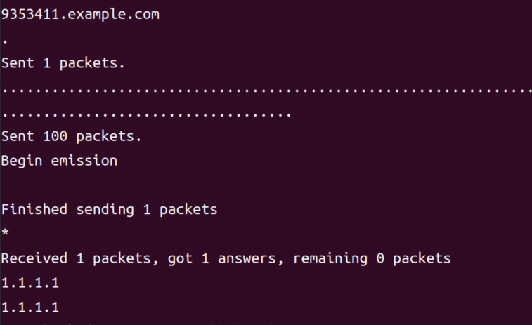

# 网络与信息安全课内实验 Host文件与DNS投毒

## 了解Hosts文件

### 实验环境
Ubuntu16.04
### 实验原理
hosts 文件是本地解析 DNS 的文件，它允许将特定的域名解析到指定的 IP 地址。将 `www.google.com` 映射到 127.0.0.1，使浏览器认为访问 `www.google.com` 实际上是在访问本地服务器。
而本地服务器运行了 Apache2，它在监听 127.0.0.1 的 HTTP 请求。当你在浏览器中访问 `www.google.com`，由于 hosts 文件的映射，DNS 查询返回 127.0.0.1，浏览器的请求被发送到本地服务器。本地的 Apache2 服务器接收到请求，并返回其默认页面。
通过修改 hosts 文件，将域名 `www.google.com` 解析到本地地址 127.0.0.1，而本地地址正运行着 Apache2 服务，默认显示的是其配置的默认页面。

### 实验过程
修改hosts文件，并安装apache2服务。

打开`www.google.com`后结果如图

### 实验困难及解决方式
无。

## 使用 dig 工具查看网站域名解析过程

### 实验环境
Ubuntu16.04
### 实验原理

#### DNS 解析原理

1. **DNS 请求的过程**：
   - 用户输入域名（如 `www.example.com`），操作系统首先检查本地缓存是否有解析结果。
   - 如果没有缓存，操作系统通过 DNS 服务器发起查询。

2. **递归查询**：
   - DNS 查询分为多个步骤：
     1. **根域名服务器**：指向顶级域名服务器（如 `.com`）。
     2. **顶级域名服务器**：指向目标域名的权威名称服务器。
     3. **权威名称服务器**：返回最终的 IP 地址。
   
3. **迭代查询**：
   - 客户端会自己查询每一级的 DNS 服务器。

#### dig 工具的工作原理

dig是用来查询 DNS 记录的工具，提供详细的 DNS 解析过程。

### 实验过程
查看dig命令用法

使用dig解析`www.baidu.com`：

使用dig +trace命令，查看`www.bilibili.com`完整的解析过程：
第一步，查询root根服务器

第二步，查询`.com`服务器

第三步，查询`bilibili.com`服务器

第四步，查询`www.bilibili.com`服务器地址

#### 使用dig+trace解析另一个域名，并写出每一步过程解释。

使用dig +trace命令，查看`www.4399.com`完整的解析过程：
第一步，查询root根服务器

第二步，查询`.com`服务器

第三步，查询`4399.com`服务器

第四步，查询`www.4399.com`服务器地址

### 实验困难及解决方式
无。

## dns投毒实验

### 实验环境
服务器端ubuntu16.04，攻击端22.04，测试机22.04
### 实验原理
1.伪造DNS响应‌：攻击者发送包含虚假域名-IP映射关系的欺骗性响应数据包给DNS服务器。这些数据包中包含虚假的IP地址，目的是替换掉真实的IP地址‌。
2.‌利用DNS缓存漏洞‌：在某些情况下，如果DNS服务器未严格验证响应来源，可能会接受并缓存这些虚假信息。当有合法客户端请求相应域名解析时，DNS服务器会返回攻击者设定的错误IP地址‌

### 实验过程
#### 配置服务器端
通过named.conf.options文件，实现修改DNS查询端口，以及关闭dnssec-validation服务。

创建两个文件

随后，重启bind9服务

在Ubuntu攻击端
此时，可以执行一下dig `www.example.com` ，可以看到返回的内容就是我们上述配置的内容

刷新DNS缓存，然后重启DNS服务器，将DNS数据导出并查看初始状态

#### 配置攻击端
先在服务端进行ip查询

进入Ubuntu客户端，打开sudo vim /etc/resolv.conf，将nameserver修改为Ubuntu服务端的的ip地址。

ubuntu服务端查看存储文件，可以看到是没有内容的

回到Ubuntu客户端，使用浏览器访问`www.weibo.com`

再回到Ubuntu服务端，重新使用rndc生成日志记录，可以看到已经产生记录

Ubuntu测试机上分别先后执行`dig www.google.com` 和dig `www.baidu.com`

此时Ubuntu攻击端显示如下

#### dns投毒攻击
开启wireshark进行抓包，攻击成功后

程序结束：

这时，我们输入rndc dumpdb –cache，然后查看server端的cache，发现已经被污染，再在服务端进行dig，确实域名解析到了1.1.1.1。

### 实验困难及解决方式

#### 攻击端无法运行攻击脚本
一开始选用16.04作为攻击端，Ubuntu版本过旧，默认最高python版本为2.7。通过特殊方法安装python3.5后，版本仍然不足够高来安装scapy包。最终解决方案是安装了一个ubuntu22.04的虚拟机来进行试验，重新配置攻击端。
#### 服务端wireshark找不到接口
发现是由于权限不够高导致的。使用sudo wireshark解决了问题。

## 使用nslookup工具对MX记录进行观测

### 实验环境
ubuntu 22.04
### 实验原理

#### **MX 记录概述**

- **MX（Mail Exchange）记录**：是 DNS 系统中专门用于指向邮件服务器的记录类型。当你发送电子邮件时，邮件客户端或邮件服务器会查询目标域名的 MX 记录，以便确定邮件应该发送到哪个邮件服务器。

- **功能**：MX 记录指定了一个域名的邮件交换服务器，并且通过优先级（优先级值越小，优先级越高）来确定哪个服务器应该先处理邮件。

#### **nslookup 工具概述**

nslookup 是一个用于查询 DNS 记录的命令行工具，可以帮助用户查看域名的相关信息，包括 A 记录、MX 记录、NS 记录等。通过 `nslookup` 查询 MX 记录，可以了解域名的邮件交换服务器及其优先级。

#### **MX 记录查询原理**

1. **MX 记录查询过程**：
   - **查询流程**：当使用 nslookup 查询一个域名的 MX 记录时，DNS 服务器会返回该域名的邮件服务器地址。MX 记录不仅包含邮件服务器的域名，还包括该服务器的优先级值。多个 MX 记录可能会返回不同的邮件服务器地址，每个服务器有不同的优先级，优先级较小的服务器通常会被优先使用。

2. **解析步骤**：
   - 当执行查询时，nslookup 首先会联系配置的 DNS 服务器，然后查询目标域名的 MX 记录。
   - 如果该域名有 MX 记录，DNS 服务器会返回所有相关的邮件服务器信息，并按优先级排序。

3. **DNS 解析器与邮件发送**：
   - 当发送邮件时，邮件服务器根据 MX 记录选择优先级最低的邮件服务器（即优先级数字最小的）进行联系。如果该服务器不可用，邮件服务器会选择下一个优先级较高的服务器。

### 实验过程
打开终端，查看nslookup命令使用方法：

进入交互模式：nslookup，设置资源记录类型为MX记录：

非交互模式进行查询：

此时通过向DNS服务器进行查询，可以知道163邮箱存储邮件的准确服务器地址。

### 实验困难及解决方式
无。

## 向SMTP服务器投递邮件实验

### 实验环境
Ubuntu 22.04
### 实验原理

#### **SMTP 协议简介**

- **SMTP（Simple Mail Transfer Protocol）** 是电子邮件发送的核心协议，用于在发件人客户端、发件人邮件服务器、收件人邮件服务器之间传输邮件。它定义了如何在邮件客户端和服务器之间建立通信并传输数据。

- **特点**：
  - 基于文本的协议，使用标准的命令和响应机制。
  - 工作在 TCP 25 或 587 端口（后者用于安全传输）。
  - 使用递归或中继方式将邮件从发送方传递到接收方服务器。

#### **SMTP 投递邮件的原理**

1. **建立连接**：
   - 发件人客户端（或本地邮件服务器）通过 TCP 协议连接到目标 SMTP 服务器。
   - 使用 SMTP 命令完成连接的握手过程。

2. **发送邮件**：
   - 使用一系列标准化的 SMTP 命令，与服务器交互以完成邮件的发送过程。

### 实验过程
选择邮箱并启用SMTP协议：
我选择了126邮箱为发送邮箱，163邮箱为接收邮箱，并到对应邮箱启用SMTP协议。

#### 尝试不使用任何邮件服务器账号，通过自己电脑直接向你所申请的163邮件服务器账号投递邮件，记录实验过程，要求收到邮件后显示发件人邮箱为：2223211946@oaurewouerw.com。

1) 使用nslookup工具对MX记录进行观测

2) 使用telnet直接连接目标邮件服务器
3) 向SMTP服务器表明身份： helo + <任意字符串>
4) 申明邮件发送方：mail from:<`2223211946@oaurewouerw.com`>
5) 申明邮件接收方：rcpt to:<接收邮箱>
6) 编辑发送信息：data+回车,data并回车之后，及发送的内容，可以申明subject，from，to等信息。输入“.”后回车，即发送邮件。

7) 邮箱收到邮件：

### 实验困难及解决方式

#### 发送邮件报554错误。
163等邮箱有垃圾邮件检测机制，如果被检测为垃圾邮件则无法发送。解决方法：上网搜索一篇英语小作文进行发送测试。
#### 发送邮件正常，但接受邮箱收不到邮件。
服务器响应缓慢，或者进入了接受邮箱的垃圾箱中。解决方法：反复刷新，检查垃圾箱。
#### 发送邮件正常，但接受邮箱收到的是空白邮件。
解决方法：在subject from to等信息后加一行换行即可正常发送内容。

