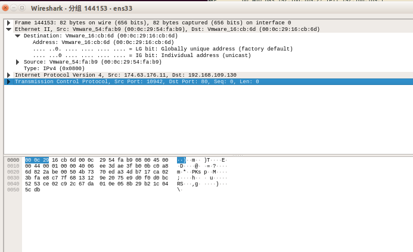
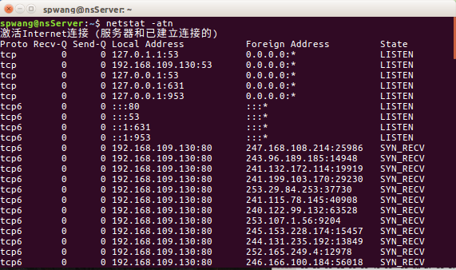
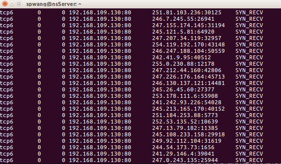

# 网络与信息安全课内实验 对DDos攻击的理解

### 实验目的
通过模拟 SYN-Flood 攻击，理解分布式拒绝服务攻击（DDoS）的一种经典形式，学习其攻击原理、数据包构造方式，以及使用网络抓包工具（如 Wireshark）进行流量分析的方法。

### 实验环境
服务端Ubuntu16.04 攻击端Ubuntu22.04

### 实验原理

##### (a) SYN-Flood 攻击
SYN-Flood 是一种利用 TCP 协议三次握手机制的拒绝服务攻击手段。攻击者通过发送大量伪造的 TCP SYN 请求，耗尽目标服务器的资源（如连接队列或内存），从而导致正常用户的服务请求无法得到处理。

##### (b) TCP 三次握手过程

客户端 -> 服务端: 发送 SYN 数据包，表示发起连接请求。
服务端 -> 客户端: 返回 SYN-ACK 数据包，表示确认连接。
客户端 -> 服务端: 返回 ACK 数据包，完成握手。
SYN-Flood 攻击的特点是，攻击者只发送第一步的 SYN 数据包，但不响应服务端的 SYN-ACK，导致服务端连接队列堆满。

##### (c) 攻击方法

利用伪造的源 IP 地址发送大量 SYN 数据包。
每个数据包的源 IP、端口号等随机化，模拟大规模分布式攻击。

### 实验过程
1) 在服务端安装apache2服务，并在攻击端输入服务端IP访问，确认安装成功。
2) 通过ifconfig命令，获取apache2服务端的IP地址192.168.109.130.
3) 在攻击端编写py程序
   ~~~
   from scapy.all import *

   send(IP(src=RandIP(),dst='192.168.109.130')/fuzz(TCP(dport=80,flags=0x002)),loop=1)
4) 在攻击端运行py程序，并在服务端运行wireshark，打开其中一个数据包观察
   
5) 在服务端运行 netstat -atn可以看到出现了很多syn请求。
   
   

### 结果分析

##### (a) py程序参数分析
1.IP(src=RandIP(), dst='192.168.109.130')
~~~
src=RandIP(): 生成随机伪造的源 IP 地址，用于模拟分布式攻击流量。
dst='192.168.109.130'：目标服务器的 IP 地址，指向 Apache 服务器。
~~~
2.TCP(dport=80, flags=0x002)
~~~
dport=80：指定目标端口，表示 HTTP 服务端口。
flags=0x002：设置 TCP 标志位为 SYN（0x002 表示 SYN），用于发送连接请求数据包。
~~~

##### (b) TCP协议参数分析
1) TCP 参数解释
Src Port (源端口)
值: 10942
含义: 发送端随机生成的源端口号, 用于标识特定的连接。此处为随机值，进一步伪造攻击。

1) Dst Port (目标端口)
值: 80
含义: 目标端口。此实验中，目标是运行 HTTP 服务的 Apache 服务器。

1) Seq (序列号)
值: 0
含义: TCP 连接的序列号，用于数据包重组。在 SYN 数据包中，因为没有实际数据传输，所以序列号通常设置为 0（或其他随机初始值）。

1) Len (长度)
值: 0
含义: 数据包 TCP 负载的长度。由于 SYN 数据包通常不包含负载，因此长度为 0。

### 实验小结

成功发送了大量伪造的 TCP SYN 数据包，服务器收到了大量未完成的连接请求。
使用 Wireshark 捕获并分析了攻击流量，验证了 SYN-Flood 攻击的特点。

