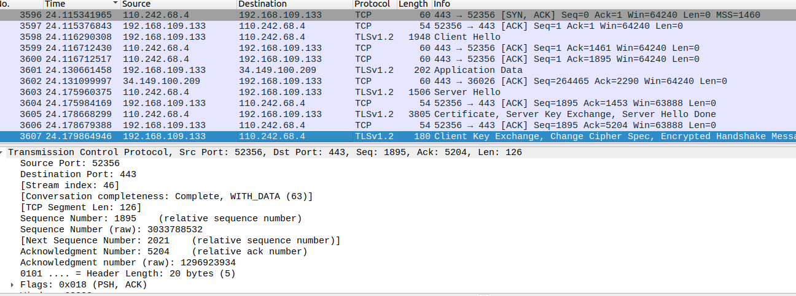

# 网安第三次实验报告

## 实验过程

### 对称加密算法的字符串的加解密


### 使用RSA的加解密 以及 数字签名


### 抓包观察 ssl 协议通信握手过程




## 问题分析

#### 1.回答AES加密中iv变量的作用。
iv的作用主要是为了增强加密算法的安全性。在使用块加密模式（如CBC模式）时，相同的明文块在相同的密钥下会产生相同的密文块，这可能会泄露关于明文结构的信息。通过引入一个随机的或伪随机的初始化向量（IV），可以确保即使明文块相同，密文块也会不同，因为每个加密过程都会从一个不同的起始点开始。
#### 2.思考问题：RSA【公钥加密，私钥解密】和【私钥加密，公钥解密】算法一样吗？为什么？
RSA的公钥加密、私钥解密 和 私钥加密、公钥解密使用的算法相同，这是因为RSA 算法中的公钥和私钥实际上是逆运算的关系。无论是公钥加密后私钥解密，还是私钥加密后公钥解密，本质上都是通过两个互为逆的指数运算（e=和 d）来还原信息。它们的数学本质相同
算法本质相同：
公钥和私钥实际上是逆运算的关系，本质是通过互逆的指数运算还原信息，数学本质相同。

使用方式不同：

公钥加密，私钥解密：
这是RSA加密最典型和常见的应用方式。发送者使用接收者的公钥对消息进行加密，然后接收者使用自己的私钥进行解密。这种方式确保了只有拥有私钥的接收者才能读取消息，从而保证了消息的机密性。
私钥加密，公钥解密：
这种方式并不常用于加密消息，而是用于数字签名。发送者使用自己的私钥对消息的摘要（或哈希值）进行加密（即签名），然后接收者使用发送者的公钥来验证签名的有效性。这种方式确保了消息是由声称的发送者发送的，并且消息在传输过程中没有被篡改，从而提供了消息的完整性和身份认证。
#### 3.书写数字签名的注释，每行都干了些什么？并任意举一个例子使得result=False。
``````
# 定义一个待签名的消息
n = b'This is a test message'
 
# 创建一个SHA哈希对象
h = SHA.new() 
 
# 更新哈希对象以包含待签名的消息
h.update(n)
 
# 打印哈希值和其长度（长度以位为单位，因为每个十六进制字符代表4位）
print('Hash:', h.hexdigest(), 'length:', len(h.hexdigest()) * 4) 
 
# 定义签名文件的名称
sign_txt = 'sign.txt'
 
# 打开私钥文件，读取私钥，并导入RSA密钥对象
with open('master-private.pem') as f:
    key = f.read()
    private_key = RSA.importKey(key)
 
# 使用SHA哈希对象创建一个新的哈希对象
hash_obj = SHA.new(n)
 
# 使用私钥创建一个新的PKCS#1 v1.5签名对象
signer = Signature_pkcs1_v1_5.new(private_key)
 
# 对哈希对象进行签名，并将签名结果进行Base64编码
d = base64.b64encode(signer.sign(hash_obj))
 
# 将编码后的签名写入文件
f = open(sign_txt, 'wb') 
f.write(d) 
f.close()
 
# 打开私钥文件，读取私钥，并导入RSA密钥对象
with open('master-private.pem') as f:  
    key = f.read()
    public_key = RSA.importKey(key)  # 导入私钥
 
# 打开签名文件
sign_file = open(sign_txt, 'r')

 
# 读取并解码签名
sign = base64.b64decode(sign_file.read())
 
# 再次对原始消息创建SHA哈希对象
h = SHA.new(n)
 
# 使用公钥创建一个新的PKCS#1 v1.5签名验证对象
verifier = Signature_pkcs1_v1_5.new(public_key)  
 
# 验证结果：如果签名有效，返回 True；如果无效，返回 False。

print('result:', verifier.verify(h, sign))
 
# 关闭签名文件
sign_file.close()
``````
举例：修改sign.txt的内容即可。
#### 4.详细分析ssl 协议通信握手过程。

握手协商阶段
1. 客户端发送ClientHello消息
客户端向服务器发送一个ClientHello消息，该消息包含客户端支持的SSL/TLS协议版本、加密算法列表、压缩方法列表、随机数（ClientHello.random）以及会话ID（如果客户端希望恢复之前的会话）。
2. 服务器响应ServerHello消息
服务器接收到ClientHello消息后，选择一个双方都支持的SSL/TLS协议版本、加密算法和压缩方法，并生成一个随机数（ServerHello.random）。然后，服务器将这些信息以及会话ID（如果会话可以恢复）包含在ServerHello消息中发送给客户端。
3. 服务器发送证书
服务器向客户端发送一个Certificate消息，该消息包含服务器的公钥证书。这个证书用于身份验证，确保服务器是合法的。
4. 服务器发送ServerKeyExchange
如果服务器选择的加密算法需要额外的密钥交换信息，服务器会发送一个ServerKeyExchange消息。这个消息通常包含服务器的公钥和/或用于生成会话密钥的其他参数。
5. 服务器发送ServerHelloDone消息
服务器发送一个ServerHelloDone消息，表示服务器已经完成了握手协商阶段的第一部分。此时，服务器等待客户端的响应。
6. 客户端验证证书并发送ClientKeyExchange消息
客户端验证服务器的公钥证书。如果验证成功，客户端生成一个预主密钥（pre-master secret），并使用服务器的公钥加密这个预主密钥。然后，客户端将加密后的预主密钥包含在ClientKeyExchange消息中发送给服务器。
7. 客户端发送CertificateVerify
如果服务器要求客户端进行身份验证，客户端会发送一个CertificateVerify消息。这个消息包含一个使用客户端私钥签名的会话信息。服务器可以使用客户端的公钥验证这个签名。
8. 客户端和服务器发送ChangeCipherSpec消息
客户端和服务器分别发送一个ChangeCipherSpec消息，表示它们已经准备好切换到之前协商好的加密算法和密钥。
9. 客户端和服务器发送Finished消息
客户端和服务器分别计算一个基于之前所有握手消息的MAC（消息认证码），并将这个MAC包含在Finished消息中发送给对方。这个步骤用于验证握手协商的正确性和完整性。


## 实验遇到的问题以及心得体会
通过这次实验，我对RSA加密算法中公钥用于加密、私钥用于解密的机制有了认识，同时也关注到了AES对称加密在效率上的表现。此外，我深刻体会到SSL/TLS协议在维护网络安全方面所扮演的关键角色。深化了我对加密技术的理解，认识到安全通信的复杂性和其不可忽视的重要性。