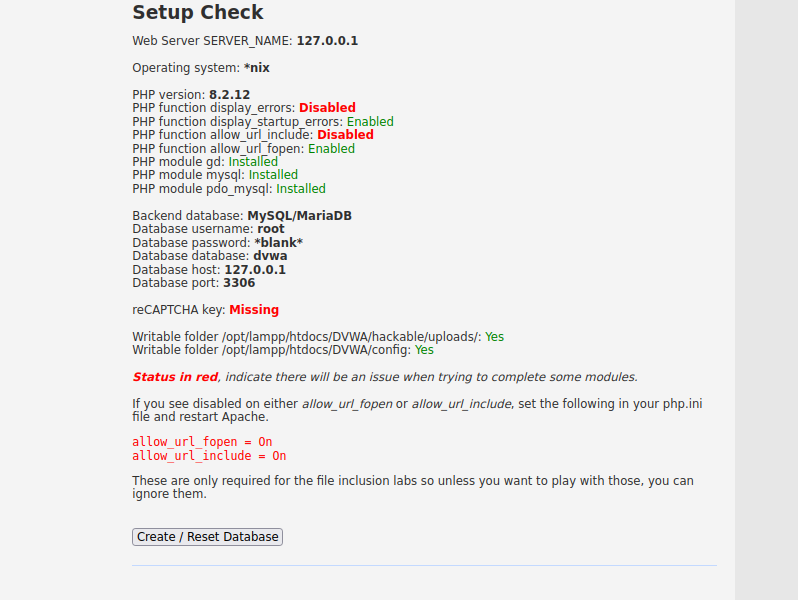
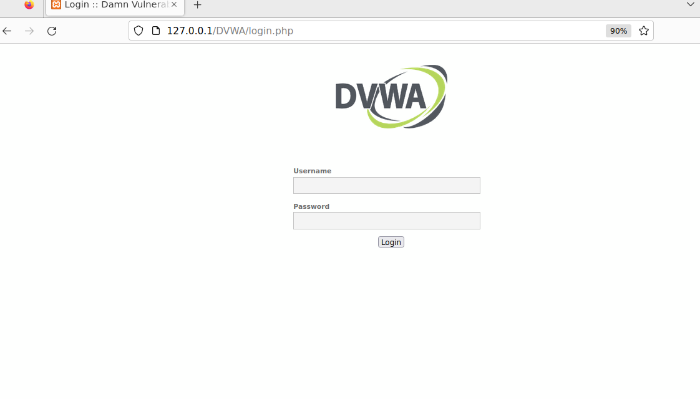
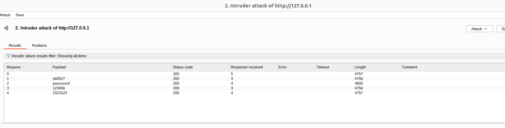
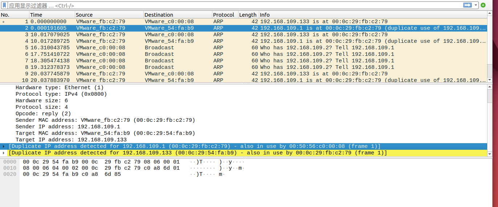

# 网络安全第四次实验

## 实验环境
Ubuntu 22.04

# 1 爆破登录

## 1.1 实验原理
暴力破解（Brute Force）是一种通过穷举所有可能的密码组合来尝试破解密码的方法。
字典攻击是暴力破解的一种优化方法，通过利用已经知晓的常见密码字典进行攻击，效率比完全暴力破解高很多。
在本次实验中，我们使用burp suite工具拦截包，搭建DVWA低安全等级靶场，暴力碰撞出密码。
## 1.2 实验过程

安装xmapp 8.2.12

运行xmapp

访问127.0.0.1，验证安装成功

获取最新DVWA并将相关文件移动到环境中，访问127.0.0.1/DVWA/login.php，出现错误

根据提示，将文件改名，并修改配置文件

访问 127.0.0.1/DVWA/setup.php,试图点击Create/Reset Database，跳转到127.0.0.1/DVWA/#空白页，不对！ 

发现修改allow_url_include 为On即可。重启apache服务，再次点击Create/Reset Database，跳转到登陆页面

输入admin，password成功登录.选择DVWA Security标签，将安全等级调整为low，提交。

下载安装启动burpsuite

访问127.0.0.1/DVWA/vulnerabilities/brute，打开Intercept，输入账号密码hello world，发现确实明文传送

选择send to intruder，构造爆破包，手动标记password位置，user改为正确的账号admin，在字典中加入password，和其他一些爆破用密码。

发现password返回的包长与其他密码不同，得到password为爆破成功密码，宣告爆破成功。


## 1.3 实验困难
##### 访问 127.0.0.1/DVWA/setup.php,试图点击Create/Reset Database，跳转到127.0.0.1/DVWA/#空白页
将其中所有的红色警告全部修正，全为绿色后，成功解决问题。
##### 在完成所有步骤后，发现password返回的包长与其他包没有区别！
反复检查后发现，构造的爆破包的安全等级写的是impossible，但是明明已经将安全等级更改为了low，并且刷新也显示为low。
怀疑是有关配置文件的写入权限不够。但是在setup.php那页上却没有相关警告。
搜索后发现,在config.inc.php中,有一项为默认安全等级,将其从impossible更改为low。
成功解决。


# 2 SQL注入

## 2.1 实验原理
在/DVWA/vulnerabilities/brute，用户名处输入admin’or’1’=’1，无论密码是多少都能成功登录。
代码中，SQL 查询是根据用户输入的 username 和 password 动态生成的：
$query = "SELECT * FROM `users` WHERE user='user' AND password='pass';";$
假设攻击者在用户名字段中输入了 admin' OR '1'='1，并在密码字段中留空，那么最终构建的 SQL 查询会是：
$SELECT * FROM `users` WHERE user='admin' AND password='md5('')' OR '1'='1';$
这意味着，只要数据库中存在一个用户名为 admin 的记录，查询就会返回该用户的所有信息，并允许登录。由于密码检查已经被绕过，攻击者可以成功登录。

## 2.2 实验过程

在 /DVWA/vulnerabilities/brute，用户名处输入 admin’ or ’1’=’1，无论密码是多少都能成功登录


## 2.3 实验困难
无。

# 3 中间人攻击

## 3.1 实验原理
在局域网中，主机通过 ARP 协议将目标 IP 地址解析成物理 MAC 地址。正常情况下，当一台主机要与另一台主机通信时，它会向网络广播 ARP 请求，询问目标 IP 地址对应的 MAC 地址。网络中的设备响应这个请求，并告诉请求者该 IP 地址的 MAC 地址。
在 ARP 欺骗攻击中，攻击者通过伪造 ARP 响应，使得目标主机将攻击者的 MAC 地址与网关（或其他目标主机）的 IP 地址关联起来。这样，其他主机就会错误地将数据包发送到攻击者的机器，而不是正确的网关或目标设备。

## 3.2 实验过程

受害者192.168.109.133攻击者192.168.109.135,可以相互ping通

攻击机安装Ettercap，driftnet，wireshark等，打开Ettercap
点击Accept按钮(即√)，点Scan for host(放大镜)，点Hosts List(列表按钮)打开。

将192.168.109.133加入到target2，192.168.109.1加入到target1，点MITM menu(地球按钮)，选ARP poisoning，勾选第一个选项并确定。

在受害者主机，arp-a查看arp缓存表。

发现已经攻击成功。在攻击者主机上打开wireshark抓包。

可以看到，攻击者发给受害者的arp包中，攻击者声称192.168.109.1具有00:0c:29:fb:c2:79这一MAC地址。
同时，黄色警告提示 [also in use by ...],这是因为我们进行的arp欺骗声明自己是网关192.168.109.1，导致arp广播与网关发生了冲突。
在攻击者主机打开driftnet。
在受害者主机安装smart https来强行访问http，打开http://www.xjtu.edu.cn,设置back to http。

发现driftnet成功嗅探到了图片，中间人攻击成功。


## 3.3 实验困难
##### firefox强制访问https
解决方案：安装插件smart https，来强行访问http。

# 4 漏洞防御方法

## 4.1 暴力登录

Web 应用可以采取一些防御措施：

##### 限制登录尝试次数
例如，限制每个IP在一定时间内的登录尝试次数。
##### 使用验证码
要求用户在登录时输入验证码，从而增加攻击的难度。
##### 使用强密码策略
要求用户使用较长、复杂的密码，增加暴力破解的难度。
##### 多因素认证
除了密码之外，使用二次认证（如短信验证码、应用生成的TOTP码等）来增加安全性。

## 4.2 SQL注入

##### 使用预处理语句
一种防止 SQL 注入的标准做法。无论用户输入什么内容，预处理语句都会确保它们被安全地处理。
例如，使用 mysqli 或 PDO 时可以使用预处理语句：
``````
$conn = new mysqli($servername, $username, $password, $dbname);
$stmt = $conn->prepare("SELECT * FROM users WHERE user = ? AND password = ?");
$stmt->bind_param("ss", $user, $pass);
$stmt->execute();
$result = $stmt->get_result();
``````

##### 输入验证和转义
如果使用传统的 SQL 查询方法，必须对用户输入的数据进行严格的验证和转义。例如，使用 mysqli_real_escape_string() 函数转义用户输入的字符串。

##### 使用更强的密码存储方式
避免使用 MD5 或其他不安全的哈希算法来存储密码。应使用 password_hash() 和 password_verify() 来更安全地处理用户密码。

## 4.3 ARP欺骗

##### 静态 ARP 表
为网络中的重要设备（如网关和服务器）设置静态 ARP 表，将 IP 地址与 MAC 地址绑定，防止设备更新 ARP 缓存。但是这种方法不适合大规模的网络环境，且不灵活。

##### 启用 ARP 检查
一些交换机支持 ARP 检查（ARP Inspection）功能，可以防止恶意的 ARP 响应包通过交换机，从而保护网络免受 ARP 欺骗攻击。

##### VPN 加密
通过使用 VPN（虚拟私人网络）加密网络流量，即使攻击者能够获取到数据流，也无法读取和篡改通信内容。

##### 使用 HTTPS 和其他安全协议
在传输敏感数据时，使用加密协议如 HTTPS 或 TLS，可以确保即使数据被中间人拦截，也无法被窃取或篡改。

##### 监控网络流量
定期监控和分析网络流量，检测异常的 ARP 请求和响应，及时发现可能的 ARP 欺骗行为。

##### 防火墙和入侵检测系统（IDS）
配置防火墙规则和入侵检测系统，防止异常的 ARP 流量或可疑的网络行为。