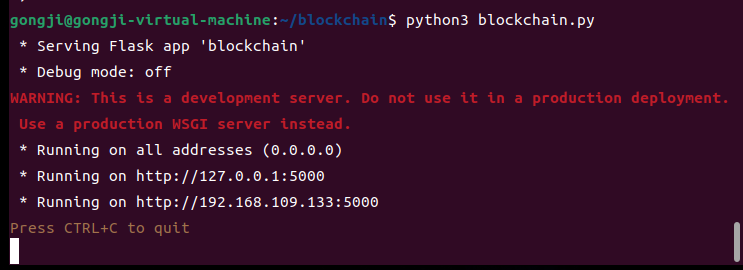
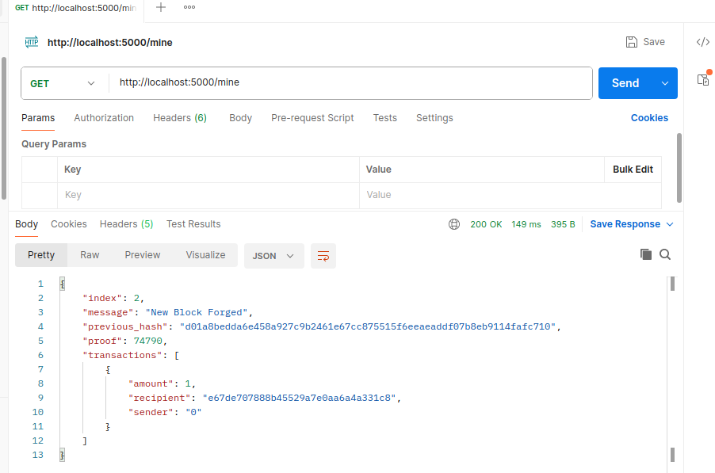
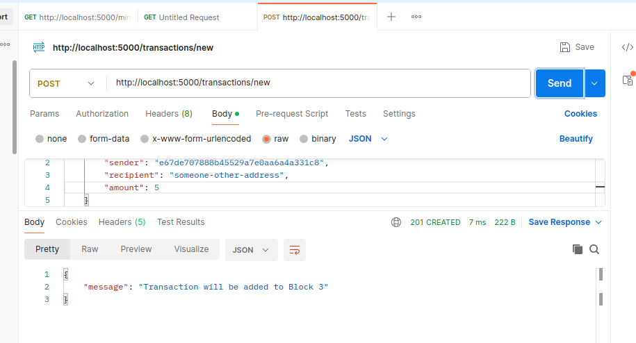
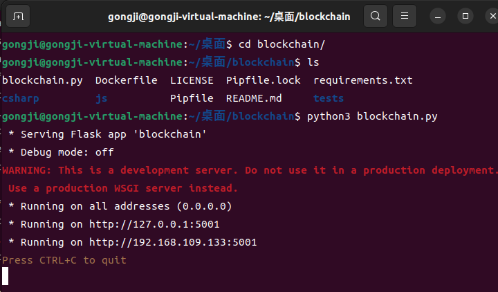
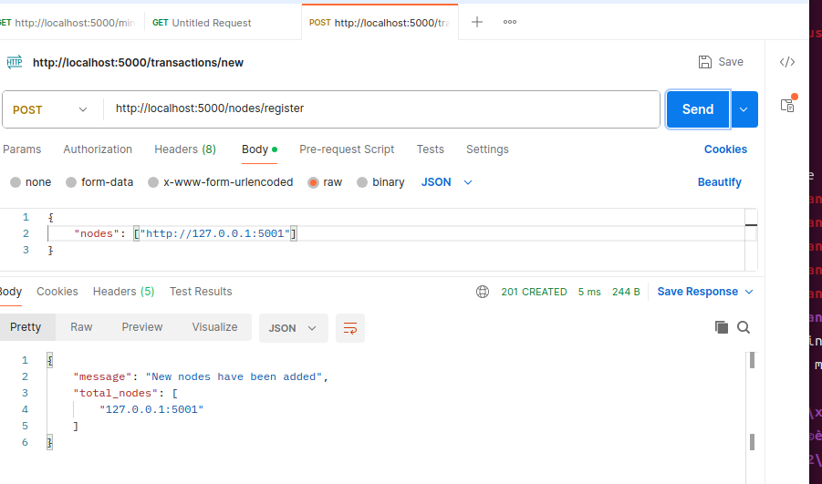
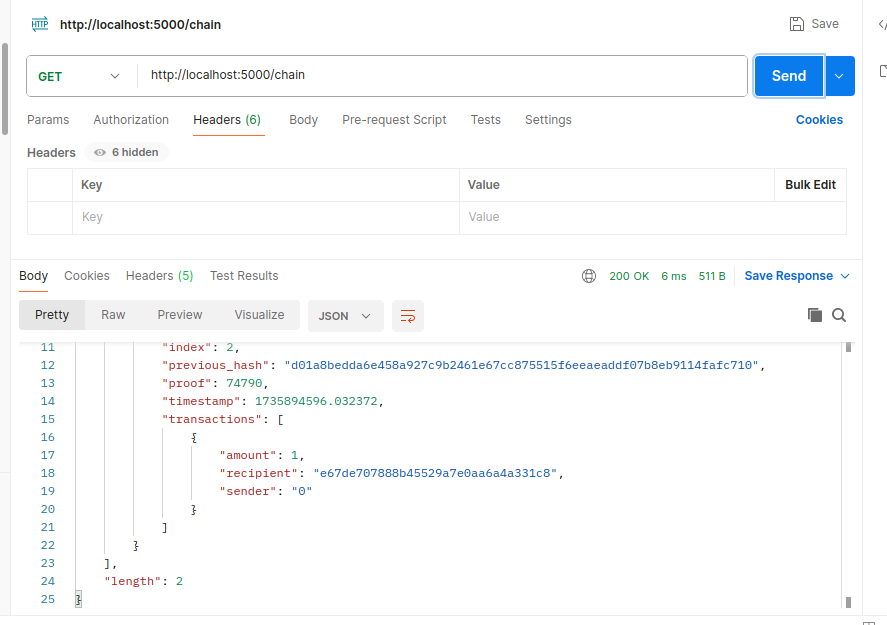
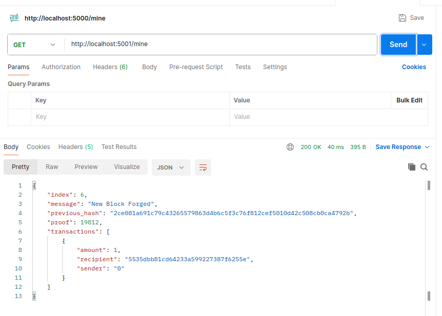
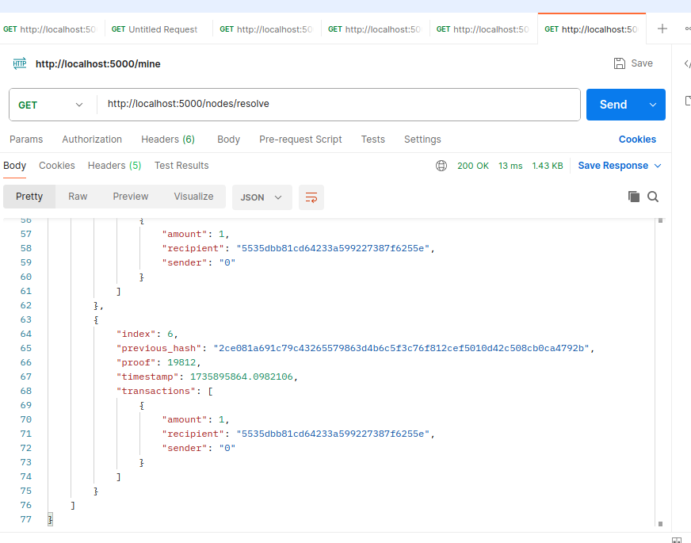

# 区块链

## 一、实验目的
- 1. 了解区块链是个什么东西。
- 2. 搭建一个自己的区块链。
## 二、实验原理
区块链是一种块链式存储、不可篡改、安全可信的去中心化分布式账本，它结合了分布式存储、点对点传输、共识机制、密码学等技术，通过不断增长的数据块链（Blocks）记录交易和信息，确保数据的安全和透明性。区块链包括三个基本要素，即交易（Transaction，一次操作，导致账本状态的一次改变）、区块（Block，记录一段时间内发生的交易和状态结果，是对当前账本状态的一次共识）和链（Chain，由一个个区块按照发生顺序串联而成，是整个状态变化的日志记录）。区块链中每个区块保存规定时间段内的数据记录（即交易），并通过密码学的方式构建一条安全可信的链条，形成一个不可篡改、全员共有的分布式账本。通俗地说，区块链是一个收录所有历史交易的账本，不同节点之间各持一份，节点间通过共识算法确保所有人的账本最终趋于一致。区块链中的每一个区块就是账本的每一页，记录了一个批次记录下来的交易条目。这样一来，所有交易的细节都被记录在一个任何节点都可以看得到的公开账本上，如果想要修改一个已经记录的交易，需要所有持有账本的节点同时修改。同时，由于区块链账本里面的每一页都记录了上一页的一个摘要信息，如果修改了某一页的账本（也就是篡改了某一个区块），其摘要就会跟下一页上记录的摘要不匹配，这时候就要连带修改下一页的内容，这就进一步导致了下一页的摘要与下下页的记录不匹配。如此循环，一个交易的篡改会导致后续所有区块摘要的修改，考虑到还要让所有人承认这些改变，这将是一个工作量巨大到近乎不可能完成的工作。正是从这个角度看，区块链具有不可篡改的特性。
## 三、实验环境
Ubuntu 22.04虚拟机
## 四、实验过程
按照链接说明填充代码。

### 1.创造自己的区块链
##### 运行python3 blockchain.py


##### 在postman中输入新建一个请求，并访问http://localhost:5000/mine


##### 在postman中输入新建一个post请求，同理可以正常运行


返回链，成功创建。

### 2.节点一致性
补充代码。
##### 开启两个进程，其中一个端口设置为5001


##### 将 5001 端口的节点注册到 5000 端口的节点上


##### 返回5000的链，两个块


##### 在5001上挖，挖到六个块


##### 调用resolve接口，发现返回了更长的区块链（6），说明节点一致性处理成功


## 五、思考题

#### 1.写出一个block中index、timestamp（时间）、transactions（交易）、proof（工作量证明）、previous_hash各自的用处。
在区块链的一个区块（block）中，各个字段的用处如下：

---

1. **Index**
- **含义**：区块的编号，用于表示区块在链中的位置。
- **用途**：
  - 帮助确定区块的顺序。
  - 用于引用和检索区块。
  - 便于区块链的完整性验证，确保区块按正确顺序链接。

---

2. **Timestamp**
- **含义**：记录区块生成的时间戳。
- **用途**：
  - 确定交易和区块的时间顺序。
  - 提供时间信息，用于审计和溯源。
  - 与其他区块时间对比，确保系统运行的时间一致性。

---

3. **Transactions**
- **含义**：存储该区块包含的所有交易信息。
- **用途**：
  - 是区块链的核心数据，记录了用户之间的所有交易活动。
  - 提供对交易历史的追溯。
  - 用于验证交易的合法性和完成账本更新。

---

4. **Proof**
- **含义**：存储工作量证明（Proof of Work，PoW）或其他共识算法的验证值。
- **用途**：
  - 用于证明矿工为挖出该区块完成了计算工作。
  - 防止网络中的恶意节点轻易篡改数据。
  - 在 PoW 系统中，作为解决复杂数学问题的结果，用于验证区块的有效性。

---

5. **Previous Hash**
- **含义**：记录前一个区块的哈希值。
- **用途**：
  - 建立区块之间的链接，形成链式结构。
  - 确保数据的完整性和不可篡改性。
  - 如果前一个区块的数据被篡改，其哈希值会发生变化，导致当前区块和后续区块无效。

---

#### 2.这篇文章中的proof_of_work写的有一点问题，请说明它有什么问题，可能导致什么结构，并进行修正。


---

 **错误的核心问题**
在原代码中，工作量证明的计算只依赖于 **前一个块的工作量证明 (`last_proof`)** 和 **当前块的工作量证明 (`proof`)**，没有考虑到 **区块的其他关键信息（如交易内容、时间戳、序号等）**。具体问题如下：

1. **忽略交易内容等字段**：
   - 区块的核心数据是其承载的交易记录和时间戳等，这些字段决定了区块的实际状态。
   - 如果这些数据未纳入哈希计算，攻击者可以在不改变工作量证明的情况下篡改交易内容，生成的哈希值仍然有效。

2. **缺乏区块整体性验证**：
   - 区块链的安全性依赖于区块间的链接性（即前一个区块的哈希值被包含在当前区块中）。
   - 当前实现没有将区块的所有重要信息整合到哈希计算中，导致对区块完整性的保护不够。

---
```python
import hashlib
import time

class Blockchain:
    def __init__(self, difficulty=4):
        self.difficulty = difficulty  # 动态调整的哈希难度

    def proof_of_work(self, last_proof, current_block_data):
        """
        改进后的工作量证明算法：
        - 计算当前区块的工作量证明时，考虑到区块中的交易信息、时间戳和序号等字段。
        - 找到一个 proof，使得 hash(last_proof, proof, block_data) 的前导 zero 数量满足难度要求。
        
        :param last_proof: <int> 前一个区块的工作量证明
        :param current_block_data: <dict> 当前区块的数据，包括交易信息、时间戳、序号等
        :return: <int> 当前区块的工作量证明
        """
        proof = 0
        start_time = time.time()
        while not self.valid_proof(last_proof, proof, current_block_data):
            proof += 1
        end_time = time.time()
        print(f"Proof of Work found: {proof} in {end_time - start_time:.2f} seconds")
        return proof

    def valid_proof(self, last_proof, proof, block_data):
        """
        验证工作量证明：
        - 哈希值由 last_proof、proof 和当前区块数据（block_data）共同决定。
        - 验证哈希值是否满足前导 zero 数量要求。
        
        :param last_proof: <int> 前一个区块的工作量证明
        :param proof: <int> 当前区块的工作量证明
        :param block_data: <dict> 当前区块的数据
        :return: <bool> 哈希值是否有效
        """
        # 将区块数据、last_proof 和 proof 序列化为字符串
        block_string = f"{last_proof}{proof}{block_data['index']}{block_data['timestamp']}{block_data['transactions']}".encode()
        guess_hash = hashlib.sha256(block_string).hexdigest()
        return guess_hash[:self.difficulty] == "0" * self.difficulty

# 示例：初始化区块链并计算工作量证明
blockchain = Blockchain(difficulty=4)  # 设置初始难度为 4
last_proof = 100  # 假设前一个区块的工作量证明为 100
current_block_data = {
    "index": 2,  # 当前区块的序号
    "timestamp": time.time(),  # 当前区块的时间戳
    "transactions": "[{'from': 'Alice', 'to': 'Bob', 'amount': 10}]",  # 交易信息
}
new_proof = blockchain.proof_of_work(last_proof, current_block_data)

```

#### 3.本次实验为模拟实验，请指出一点未提到的与实际情况不同的地方

现实中的区块链系统可能面临各种安全威胁，如51%攻击、女巫攻击等;实际的区块链网络由全球众多节点组成，存在网络延迟、节点故障等复杂情况，这些模拟实验都没有考虑，连最基本的交易验证和签名都没有完成。


#### 4.写出你对区块链的理解或者感受（100字）
完成实验了解区块链之后，发现区块链确实是有点厉害。代码运行在一个不可纂改的网络，就能产生具有货币基本属性的东西，非常神奇。
它通过共识机制确保了数据一致性，消除了对中介机构的依赖，因此我觉得会在金融领域，供应链等方面都有很广阔的应用场景。


## 六、实验困难
在环境配置方面对于python版本在一开始碰壁了。更换版本后就没什么问题。此外，flask库也应该用最新版而非文章要求的版本。