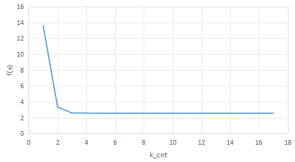
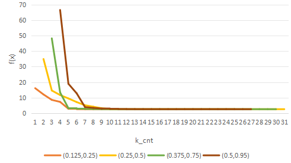
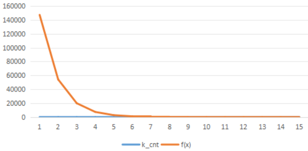

## 实验要求
对于$\mathbb{R}^2$空间非二次规划问题$\min f(x)=e^{x_1+3x_2-0.1}+e^{x_1-3x_2-0.1}+e^{-x_1-0.1}$，分析：
*(1)* 精确直线搜索时，目标函数值随迭代次数改变的情况
*(2)* 回溯直线搜索时，设置不同的$\alpha,\beta$值时，目标函数值随迭代次数改变的情况。注：初始值相同。
*(3)* 使用Newton下降方法，令回溯直线搜索时$\alpha =0.1,\beta = 0.7$,目标函数值随迭代次数改变的情况。
### 精确直线搜索

#### 实现过程
将eps设置为5e-6，并将迭代过程保存到csv文件中。
设置初始点(3,3)。
代码实现见附件精确直线搜索.cpp。

#### 实验结果
求得$x^*=(-0.347,0),f(x^*)=2.559$，符合理论结果。
由生成的csv文件，反映目标函数值随迭代次数变化的情况绘制折线图如下，csv文件见附件。

#### 结果分析
显然迭代次数越多下降越慢，误差越小。

### 回溯直线搜索

#### 实现过程
将eps设置为5e-6，并将迭代过程保存到csv文件中，$\alpha,\beta$手动设置。
设置初始点(3,3)。
代码实现见附件回溯直线搜索.cpp。

#### 实验结果
改变$\alpha , \beta$的值，结果如下：
|  $\alpha$ \  $\beta$     | 0.25 | 0.5 | 0.75 | 0.95| 
|-------|---------|---------|---------|---------|  
| 0.125 | 27 | 37 | 40 | 51 | 
| 0.25 | 39 | 33 | 41 |  42 | 
| 0.375 | 39 | 40 | 32 |  43 | 
|  0.5     | 40  | 36 |38| 29 | 

无论$\alpha , \beta$ 取何值，均可求得理论结果$x^*=(-0.347,0),f(x^*)=2.559$。
观察目标函数值随迭代次数改变的情况，选择对角线上的$\beta$/$\alpha$对绘图，$\alpha$ \  $\beta$ 为0.125/0.25，0.25/0.5，0.375/0.75，0.5/0.95折线图如下(刨除起始过大点)，csv文件见附件。

#### 结果分析
迭代次数最好结果为$(0.125,0.25)$,最差结果为$(0.125,0.95)$
关注到当$\beta$/$\alpha$在2左右时，迭代次数最少,猜测$\beta / \alpha$的取值既不能过大，也不能过小，否则会导致迭代次数增加。

### 使用Newton下降方法

#### 实现过程
将eps设置为5e-6，并将迭代过程保存到csv文件中，$\alpha = 0.1,\beta = 0.7$。
设置初始点(3,3)。
代码实现见附件Newton.cpp。

#### 实验结果
求得$x^*=(-0.347,0),f(x^*)=2.559$，符合理论结果。
迭代次数为15次。
由生成的csv文件，反映目标函数值随迭代次数变化的情况绘制折线图如下，csv文件见附件。

### 结果分析
同参数下，梯度下降方法需要迭代38次，牛顿下降方法显著优于梯度下降方法。