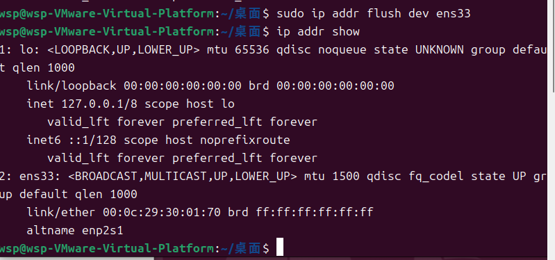
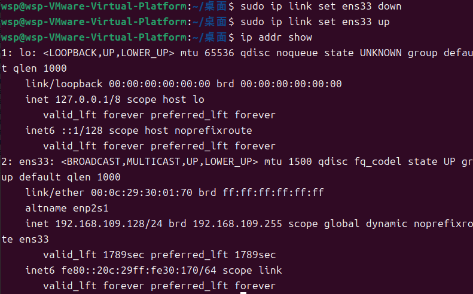
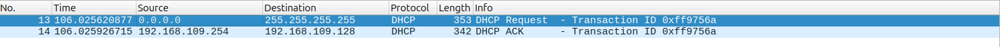
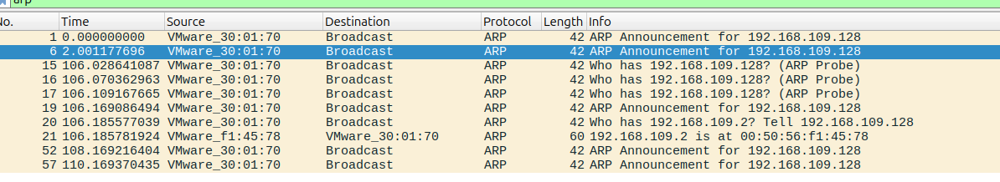
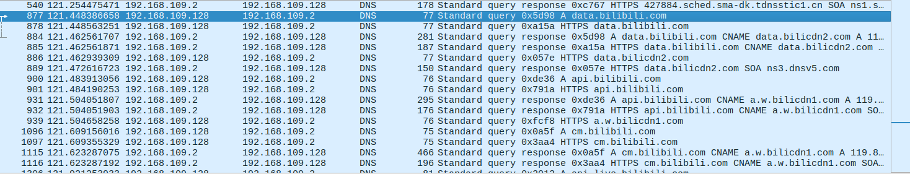
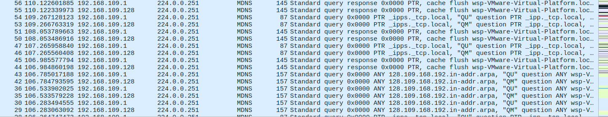
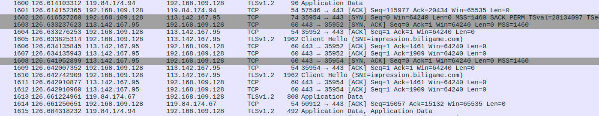
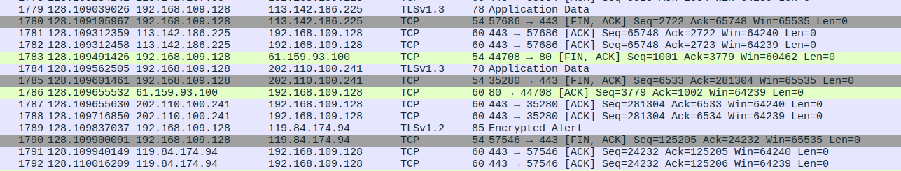
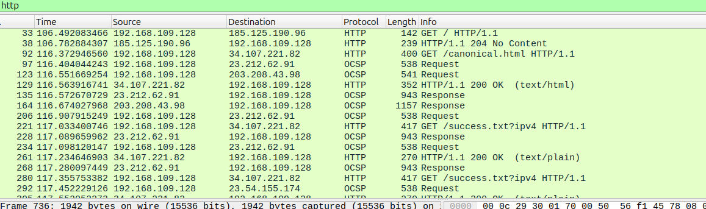

# 实验要求
## Use Wireshark to understand the process of network communication
– Start your device from a clean state, without an IP address
– Run Wireshark to capture packets
– Use your browser to visit a website (e.g.,  www.baidu.com)
– Read the captured packets in sequence
## Requirement
– Capture as more protocol packets as possible, including but not limited to DHCP, ARP, DNS, HTTP, TCP, UDP, STP, …
– A report that describes the detailed communication process, and what you newly understand after this Wireshark lab


# 实验环境
- **操作系统**：VMware运行的Ubuntu24.04虚拟机
- **工具**：
  - Wireshark（用于捕获和分析网络数据包）
  - firefox（用于访问网站）

# 实验步骤

### 1 释放 IP 地址
1. 打开终端，输入以下命令释放 `ens33` 接口的 IP 地址：
   ```bash
   sudo ip addr flush dev ens33
   ```
2. 确认 IP 地址已被释放：
   ```bash
   ip addr show
   ```
{width=50%}

### 2 启动 Wireshark 捕获
1. 打开 Wireshark。
2. 选择网络接口 `ens33`。
3. 点击“Start”开始捕获数据包。

### 3 重启网络接口以重新获取 IP
1. 在终端中输入以下命令重启 `ens33` 接口：
   ```bash
   sudo ip link set ens33 down
   sudo ip link set ens33 up
   ```
2. 确认 IP 地址已获取：
   ```bash
   ip addr show
   ```
{width=50%}

### 4 访问网站
1. 打开浏览器。
2. 访问网站 `www.bilibili.com`。
3. 等待页面加载完成。

### 5 停止捕获并保存数据
返回 Wireshark，点击“Stop”停止捕获。


# 通信流程分析

### 1 DHCP 过程
- **DHCP Discover**：
  - 设备广播发送 DHCP Discover 包，寻找可用的 DHCP 服务器。
- **DHCP Offer**：
  - DHCP 服务器回复 DHCP Offer 包，提供一个可用的 IP 地址。
- **DHCP Request**：
  - 设备发送 DHCP Request 包，请求分配 DHCP Offer 中提供的 IP 地址。
- **DHCP Ack**：
  - DHCP 服务器回复 DHCP Ack 包，确认分配 IP 地址。

{width=80%}
### 2 ARP 过程
- **ARP 请求**：
  - 设备发送 ARP 请求包，解析默认网关的 MAC 地址。
- **ARP 响应**：
  - 默认网关回复 ARP 响应包，提供自己的 MAC 地址。
{width=80%}
### 3 DNS 过程
- **DNS 查询**：
  - 设备发送 DNS 查询包，解析 `www.bilibili.com` 的 IP 地址。
- **DNS 响应**：
  - DNS 服务器回复 DNS 响应包，提供目标域名的 IP 地址。
{width=80%}
### 4 mDNS 过程
- **mDNS 查询**：
  - 设备发送 mDNS 查询包，解析本地网络中的服务名称。
- **mDNS 响应**：
  - 本地设备回复 mDNS 响应包，提供服务名称对应的 IP 地址。
{width=80%}
### 5 IGMPv3 过程
- **IGMPv3 报告**：
  - 设备发送 IGMPv3 报告包，加入多播组。
- **多播流量**：
  - 设备接收多播流量（如视频流或服务发现流量）。
{width=80%}
### 6 TCP 
- **SYN**：
  - 设备发送 SYN 包，请求与目标服务器建立 TCP 连接。
- **SYN-ACK**：
  - 目标服务器回复 SYN-ACK 包，确认连接请求。
- **ACK**：
  - 设备发送 ACK 包，完成三次握手。
{width=80%}
### 7 TLSv1.2/v1.3 握手
- **TLSv1.2 握手**：
  - 设备与服务器通过 2-RTT 握手建立 TLS 连接。
- **TLSv1.3 握手**：
  - 设备与服务器通过 1-RTT 握手建立 TLS 连接。
{width=80%}

### 8 OCSP 过程
- **OCSP 请求**：
  - 设备向 OCSP 服务器发送请求，检查服务器证书的状态。
- **OCSP 响应**：
  - OCSP 服务器回复响应，指示证书的状态。

### 9 HTTP 过程
- **HTTP 请求**：
  - 设备发送 HTTP GET 请求，请求网页内容。
- **HTTP 响应**：
  - 目标服务器回复 HTTP 响应包，包含网页内容。

{width=80%}


## 4. 实验总结
在本次实验中，我成功地观察到了设备从没有 IP 地址到访问网站的通信过程，涉及到了以下协议：
1. **DHCP**：设备如何获取 IP 地址。
2. **ARP**：设备如何解析默认网关的 MAC 地址。
3. **DNS/mDNS**：设备如何解析域名或本地服务名称。
4. **IGMPv3**：设备如何加入多播组。
5. **TCP**：设备如何与目标服务器建立连接。
6. **TLSv1.2/v1.3**：设备如何与目标服务器建立加密连接。
7. **OCSP**：设备如何检查服务器证书的状态。
8. **HTTP**：设备如何请求和接收网页内容。

我在这次wireshark lab后的新认识：

通过本次 Wireshark 实验，我对网络通信协议有了更深入的理解，尽管我已在计算机网络课程中学习过 ARP、DNS、TCP/IP 和 HTTP 等协议。
首先是了解到了一个新的协议，DHCP协议，这是在此之前我未接触过的，了解了设备获取IP地址的通信流程。
通过捕获和分析实际的数据包，我看到了这些协议在真实场景中的交互过程。例如，我观察到了 TCP 三次握手的详细步骤。此外，我还了解了 OCSP 如何通过实时检查证书状态来增强 HTTPS 的安全性。通过使用 Wireshark，我还掌握了数据包过滤和分析的实用技能。