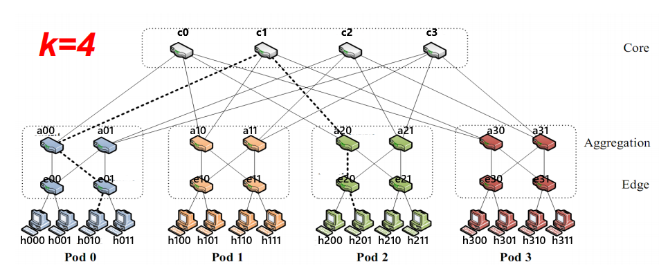
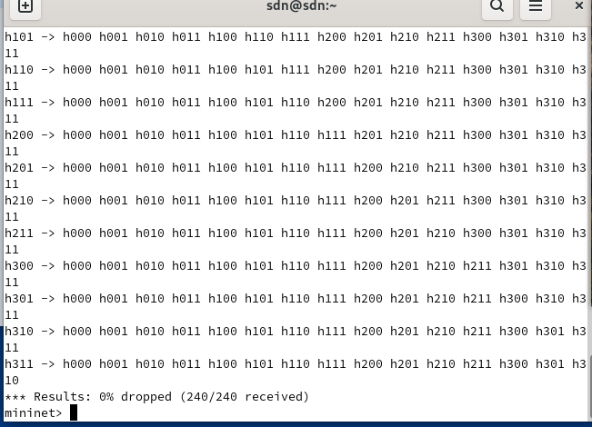
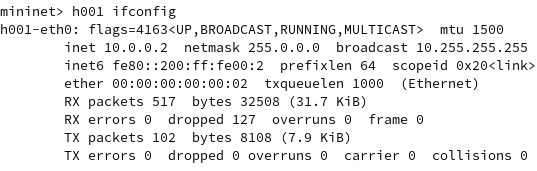
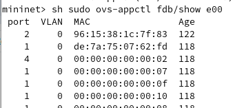
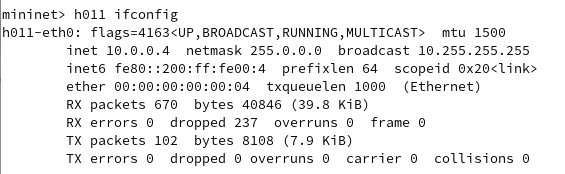
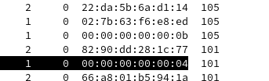
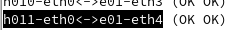
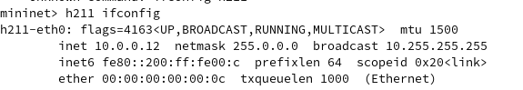
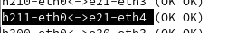

# 实验报告：基于Mininet的Fat-Tree拓扑网络实验

## 一、实验任务
- 使⽤ Mininet 的Python API搭建 k=4 的 fat tree 拓扑；
- 使⽤ pingall 查看各主机之间的连通情况;
- 若主机之间未连通，分析原因并解决（使⽤ wireshark 抓包分析）
- 若主机连通，分析数据包的路径（提示： ovs-appctl fdb/show 查看MAC表）
- 完成实验报告并提交到思源学堂
- 要求不能使⽤控制器

## 二、实验环境
- 操作系统：arch linux
- 软件环境：Mininet , Open vSwitch ，wireshark

## 三、实验步骤

### 1. 拓扑构建
使用Python API构建Fat-Tree拓扑，代码如下：
```python
from mininet.topo import Topo

class FatTreeTopo(Topo):
    def build(self):
        core_s = []
        aggr_s = []
        edge_s = []
        hosts = []

        # c0,c1,c2,c3,dpid末尾为1,核心交换机
        for i in range(4):
            sw = self.addSwitch(f'c{i}',dpid=f'00000000000000{i}1')
            core_s.append(sw)
        
        for pod in range(4):
            # a00,a01,a10,a11,a20,a21,a30,a31,聚合交换机
            pod_aggr_s = []
            for i in range(2):
                sw = self.addSwitch(f'a{pod}{i}',dpid=f'0000000000000{pod}{i}2')
                pod_aggr_s.append(sw)
            aggr_s.append(pod_aggr_s)

            pod_edge_s = []
            # e00,e01,e10,e11,e20,e21,e30,e31,聚合交换机
            for i in range(2):
                sw = self.addSwitch(f'e{pod}{i}',dpid=f'0000000000000{pod}{i}3')
                pod_edge_s.append(sw)
            edge_s.append(pod_edge_s)
 
            #连接汇聚交换机和核心交换机
            for edge_sw in pod_edge_s:
                for aggr_sw in pod_aggr_s:
                    self.addLink(aggr_sw,edge_sw)

            # h000 h001 h010 h011 ... h300 h301 h310 h311
            for i in range(2):
                for j in range(2):
                    ht= self.addHost(f'h{pod}{i}{j}')
                    self.addLink(ht,pod_edge_s[i])
                    hosts.append(ht)
        
        for i in range(4):
            for j in range(2):
                if( j == 0):
                    for k in range (0,2):
                        self.addLink(aggr_s[i][j],core_s[k])
                if( j == 1):
                    for k in range (2,4):
                        self.addLink(aggr_s[i][j],core_s[k])
topos = {'mytopo': FatTreeTopo}

```

{: width="450"}
命令行运行 
```
sudo mn --mac --custom fatTree.py --topo mytopo --controller=none
```
输入nodes，links发现搭建拓扑成功。

### 2. 初始连通性测试
启动拓扑后执行`pingall`命令，发现主机间无法通信。

### 3. 问题分析与解决
**问题1：交换机安全模式限制**
- 现象：主机间无法通信
- 分析：Open vSwitch默认处于安全模式，不自动学习MAC地址
- 解决：关闭交换机的fail-mode模式
```python
py [sw.cmd('ovs-vsctl del-fail-mode %s' % sw.name) for sw in net.switches]
```

**问题2：网络环路问题**
- 现象：启用MAC学习后发现仍无法正常通信
- 分析：尝试抓包，h000 wireshark &,h001 wireshark &,h000 ping h001 -c 3,发现两个host都只能抓到大量高频重复的icmpv6包，尝试筛选arp包，发现未捕获到。查询h000arp表，发现有10.0.0.2 incomplete，说明arp请求包发送成功，但未收到响应。观察k=4fatTree拓扑结构，发现在边缘交换机与聚合交换机两层之间形成了环路，需要启用生成树协议。
- 解决：启用生成树协议(STP)
```python
py [sw.cmd('ovs-vsctl set bridge %s stp_enable=true' % sw.name) for sw in net.switches]
```

### 4. 最终连通性测试
再次pingall，发现成功。
{: width="350"}

## 四、数据包路径分析

### 1. 同一边缘交换机下的通信（h000 → h001）
- **路径**：h000 → e00 → h001
- **分析过程**：
  - 分析h000 ping h001
  - 查询h001mac地址
{: width="350"}
  - 查询e00 mac地址表
{: width="350"}
  - 查询links，得知端口链路状况
{: width="350"}
  - 可知h000ping经由e00转发端口port4到达h001

##### 同一pod连接到同一个边缘交换机的路径是经过相连的边缘交换机

### 2. 同一pod不同边缘交换机的通信（h000 → h011）
- **路径**：h000 → e00 → a00 → e01 → h011
- **分析过程**：
  - 分析h000pingh011
  - 查询h011mac地址
{: width="350"}
  - mac地址为00:00:00:00:00:04
  - 查询e00mac地址表
{: width="350"}
  - 查询links
{: width="350"}
  - 可知转发到了a00，查询a00mac地址表
{: width="350"}
  - 查询links
{: width="350"}
  - 可知转发到了e01，查询e01mac地址表
{: width="350"}
  - 再查询links
{: width="350"}
  - 因此h000ping经由e00到a00到e01到h011

##### 同一pod连接到不同边缘交换机的路径为同一pod的边缘交换机→聚合交换机→边缘交换机

### 3. 不同pod间的通信（h000 → h211）
- **路径**：h000 → e00 → a00 → c0 → a20 → e21 → h211
- **分析过程**：
  - 分析h000pingh211
  - 查询h211mac地址
{: width="350"}
  - 查询e00mac地址表
{: width="350"}
  - 查询links得知转发到a00
{: width="350"}
  - 查询a00mac地址表
{: width="350"}
  - 查询links得知转发到c0
{: width="350"}
  - 查询c0mac地址表
{: width="350"}
  - 查询links得知转发到a20
{: width="350"}
  - 查询a20mac地址表
{: width="350"}
  - 查询links得知转发到e21
{: width="350"}
  - 查询e21mac地址表
{: width="350"}
  - 查询links得知转发到h211
{: width="350"}
  - h000经由e00 a00 c0 a20 e21 ping通h211

##### 不同pod间通信路径为边缘交换机→聚合交换机→核心交换机→聚合交换机→边缘交换机

值得注意的是，可能有存在多余路径的转发路径，例如不同pod间的边缘->聚合->核心->聚合->核心->聚合->边缘，但在实验中并未观察到。

## 五、实验结论

1. Fat-Tree拓扑通过分层结构提供了丰富的路径选择和良好的扩展性，适合数据中心网络应用。

2. 在无控制器环境下，需要特别注意：
   - 关闭交换机的安全模式以允许MAC地址学习
   - 启用生成树协议防止环路引起的广播风暴

3. 通过分析MAC地址表可以清晰地了解数据包的转发路径，验证了Fat-Tree拓扑中不同层次间的通信机制：
   - 同一交换机下的通信直接转发
   - 同一pod不同交换机通过聚合层转发
   - 不同pod间通过核心层转发

4. 实验成功实现了k=4 Fat-Tree拓扑的构建和通信验证。

## 六、实验心得

通过本次实验，我深入理解了Fat-Tree拓扑的结构特点和实际部署中可能遇到的问题。在解决网络不通的过程中，学会了使用Wireshark抓包分析和通过MAC地址表追踪数据包路径的方法。