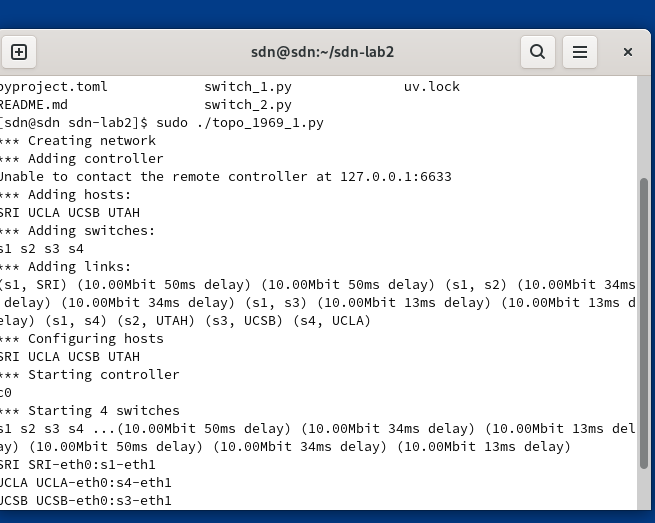
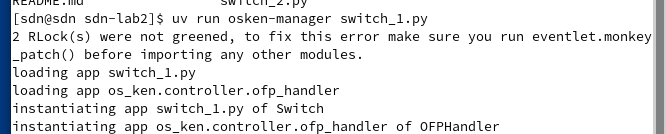
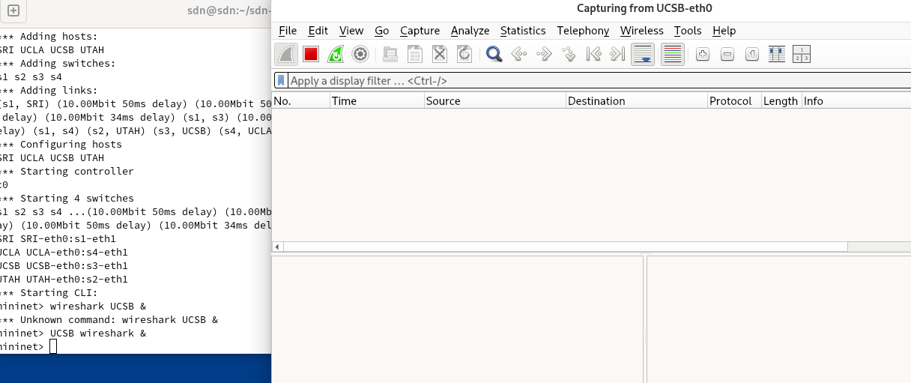
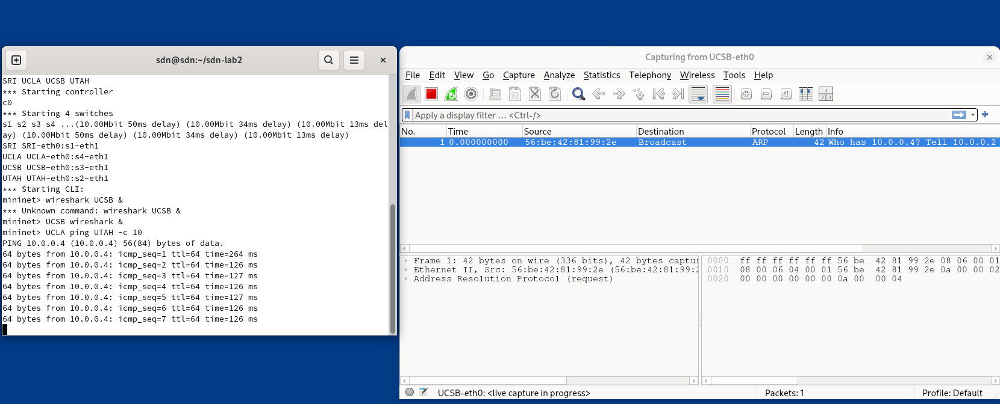
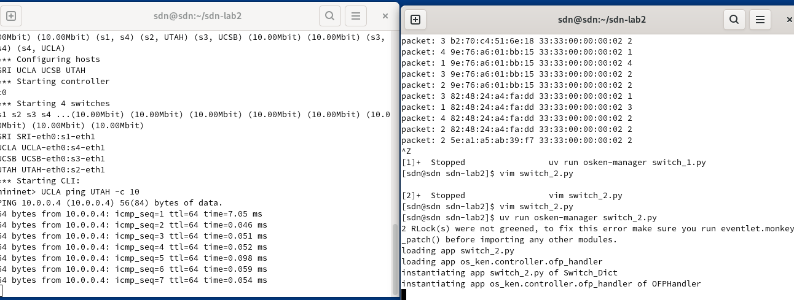
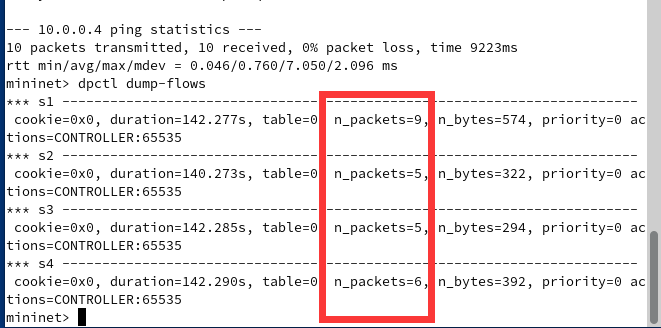
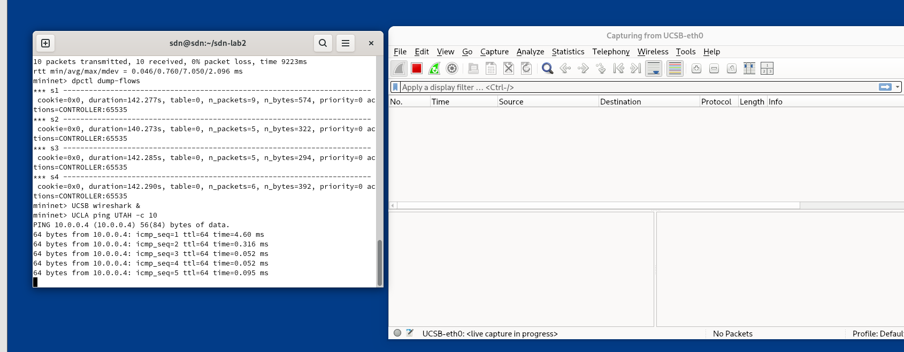

# Lab2:Learning Switch

## 一、实验目标
1. 实现基于MAC地址学习的二层自学习交换机
2. 处理环路广播


## 二、实验环境
实验在VMware运行的Arch Linux虚拟机上进行
| 组件          | 版本/配置                   |
|---------------|---------------------------|
| 控制器        | OSKen           |
| 虚拟化平台    | Mininet            |
| 抓包工具      | Wireshark           |

## 三、任务描述及方案设计

#### a.实验任务一
在简单交换机的基础上实现⼆层⾃学习交换机，避免数据包的洪泛。

##### 方案设计
SDN ⾃学习交换机的⼯作流程可以参考：
1. 控制器为每个交换机维护⼀个 mac-port 映射表。
1. 控制器收到 packet_in 消息后，解析其中携带的数据包。
1. 控制器学习 src_mac - in_port 映射。
1. 控制器查询 dst_mac ，如果未学习，则洪泛数据包；如果已学习，则向指定端⼝转发数
据包( packet_out )，并向交换机下发流表项( flow_mod )，指导交换机转发同类型的数据包。
##### 核心代码展示：(完整代码见报告最后) 
```py
        self.mac_to_port.setdefault(dpid,{})
        self.mac_to_port[dpid][src] = in_port

        if dst in self.mac_to_port[dpid]:
            actions = [parser.OFPActionOutput(self.mac_to_port[dpid][dst])]
            match = parser.OFPMatch(eth_dst = dst)
            self.add_flow(dp,1,match,actions,idle_timeout=20)
        else:
            actions = [parser.OFPActionOutput(ofp.OFPP_FLOOD)]

        # h1 ping h3后，交换机的表学习到了h1的端口
        # 因此h3 -> h1的响应部分，仍然会上传packetIn,学习h3，同时，交换机学习到了h3的端口，并下放h1为目的的流表。
        # 按此逻辑，只有request会泄洪，因为reply虽然会上传packetIn,但控制器已经记录了out_port。

        data = None
        if msg.buffer_id == ofp.OFP_NO_BUFFER:
            data = msg.data

        out = parser.OFPPacketOut(
            datapath = dp,
            buffer_id = msg.buffer_id,
            in_port = in_port,
            actions = actions,
            data=data
        )
        dp.send_msg(out)
```
代码简述：

#### b.实验任务二
请在⾃学习交换机的基础上完善代码，处理环路广播。

##### 方案设计
当序号为 dpid 的交换机从 in_port 第⼀次收到某个 src_mac 主机发出，询问 dst_ip 的⼴播 ARP Request 数据包时，控制器记录⼀个映射 (dpid, src_mac, dst_ip)->in_port 。下⼀次该交换机收到同⼀ (src_mac, dst_ip) 但 in_port 不同的 ARP Request 数据包时直接丢弃，否则洪泛。

##### 核心代码展示:(完整代码见报告最后)
```py
        dropp = False

        header_list = dict((p.protocol_name, p) for p in pkt.protocols if type(p) != str)
        if dst == ETHERNET_MULTICAST and ARP in header_list:
            arp_pkt = pkt.get_protocol(arp.arp) 
            dst_ip = arp_pkt.dst_ip
            arp_key = (dpid,src,dst_ip)
            if arp_key in self.arp_map:
                if self.arp_map[arp_key] != in_port:
                    dropp = True
            self.arp_map[arp_key] = in_port
        
        if not dropp:
            self.mac_to_port.setdefault(dpid,{})
            self.mac_to_port[dpid][src] = in_port

            if dst in self.mac_to_port[dpid]:
                actions = [parser.OFPActionOutput(self.mac_to_port[dpid][dst])]
                match = parser.OFPMatch(eth_dst = dst)
                self.add_flow(dp,1,match,actions,idle_timeout=10)
            else:
                actions = [parser.OFPActionOutput(ofp.OFPP_FLOOD)]

            data = None
            if msg.buffer_id == ofp.OFP_NO_BUFFER:
                data = msg.data

            out = parser.OFPPacketOut(
                datapath = dp,
                buffer_id = msg.buffer_id,
                in_port = in_port,
                actions = actions,
                data=data
            )
            dp.send_msg(out)
        else:
            out = parser.OFPPacketOut(
                datapath=dp,
                buffer_id=msg.buffer_id,
                in_port=in_port,
                actions=[],
                data=None
            )
            dp.send_msg(out)
        
```
代码简述：
交换机发给控制器packet-In消息，控制器若发现是广播ARP request包，就记录dpid(唯一标识某个交换机),源mac,目的IP -> in_port的映射,若发现已记录过了,就标记dropp为真准备丢弃。
若dropp为true,构造一条actions为空的OFPPacketOut发给dp即丢弃该包。
若dropp为false,就进行二层自学习交换机的流程。


## 四、实验过程
启动1969_1拓扑
```
sudo ./topo_1969_1.py
```
{: width="350"}
启动编写好的控制器
```
uv run osken-manager switch_1.py
```
{: width="350"}
抓包UCSB
```
UCSB wireshark &
```
{: width="350"}
```
UCLA ping UTAH -c 10
```
{: width="350"}
发现UCSB只收到了第一次的广播包,说明实现成功。

类似地，启动拓扑2,和编写好的控制器，尝试ping
```
sudo ./topo_1969_2.py
uv run osken-manager switch_2.py
UCLA ping UTAH -c 10
```
发现ping通
{: width="350"}
查看流表项，发现匹配次数大大减少
```
dpctl dump-flows
```
{: width="350"}
并且抓一下UTAH的包，发现没有收到任何包。（因为在测试能否ping通时，已经记录了流表项和mac地址,所以连第一次的广播包也没有收到）
{: width="350"}
## 五、遇到的问题及解决方案
##### 1.缓存问题混淆
起初误以为"不考虑缓存"及发data=None,结果发现搞反，data=None是告知控制器使用缓存的data。修正后保留了缓存处理部分，使得代码更完整。
##### 2.arp ip的获取
起初直接调用arp_pkt = pkt.get_protocol(arp.arp) 
            dst_ip = arp_pkt.dst_ip
发现报错。
错误原因:代码并不知道包是否为arp包，若不是，则出错。因此，将代码移入到检测arp包的条件后即可。

## 六、结论

成功设计了二层自学习交换机，避免了数据包的泛洪，成功实现给出的策略解决了环路广播。


---

**附录**：

switch_1.py
```py
from os_ken.base import app_manager
from os_ken.controller import ofp_event
from os_ken.controller.handler import MAIN_DISPATCHER, CONFIG_DISPATCHER
from os_ken.controller.handler import set_ev_cls
from os_ken.ofproto import ofproto_v1_3
from os_ken.lib.packet import packet
from os_ken.lib.packet import ethernet

class Switch(app_manager.OSKenApp):
    OFP_VERSIONS = [ofproto_v1_3.OFP_VERSION]

    def __init__(self, *args, **kwargs):
        super(Switch, self).__init__(*args, **kwargs)
        # maybe you need a global data structure to save the mapping
        self.mac_to_port = {}

    def add_flow(self, datapath, priority, match, actions, idle_timeout=0, hard_timeout=0):
        dp = datapath
        ofp = dp.ofproto
        parser = dp.ofproto_parser
        inst = [parser.OFPInstructionActions(ofp.OFPIT_APPLY_ACTIONS, actions)]
        mod = parser.OFPFlowMod(
            datapath=dp,
            priority=priority,
            idle_timeout=idle_timeout,
            hard_timeout=hard_timeout,
            match=match,
            instructions=inst
        )
        dp.send_msg(mod)

    @set_ev_cls(ofp_event.EventOFPSwitchFeatures, CONFIG_DISPATCHER)
    def switch_features_handler(self, ev):
        msg = ev.msg
        dp = msg.datapath
        ofp = dp.ofproto
        parser = dp.ofproto_parser
        match = parser.OFPMatch()
        actions = [parser.OFPActionOutput(ofp.OFPP_CONTROLLER, ofp.OFPCML_NO_BUFFER)]
        self.add_flow(dp, 0, match, actions)

    @set_ev_cls(ofp_event.EventOFPPacketIn, MAIN_DISPATCHER)
    def packet_in_handler(self, ev):
        msg = ev.msg
        dp = msg.datapath
        ofp = dp.ofproto
        parser = dp.ofproto_parser
        dpid = dp.id
        in_port = msg.match['in_port']
        pkt = packet.Packet(msg.data)
        eth_pkt = pkt.get_protocol(ethernet.ethernet)
        dst = eth_pkt.dst
        src = eth_pkt.src
        self.logger.info('packet: %s %s %s %s', dpid, src, dst, in_port)
        # You need to code here to avoid the direct flooding

        # dpid1 mac1:port1 mac2:port2 
        self.mac_to_port.setdefault(dpid,{})
        self.mac_to_port[dpid][src] = in_port

        if dst in self.mac_to_port[dpid]:
            actions = [parser.OFPActionOutput(self.mac_to_port[dpid][dst])]
            match = parser.OFPMatch(eth_dst = dst)
            self.add_flow(dp,1,match,actions,idle_timeout=20)
        else:
            actions = [parser.OFPActionOutput(ofp.OFPP_FLOOD)]

        # h1 ping h3后，交换机的表学习到了h1的端口
        # 因此h3 -> h1的响应部分，仍然会上传packetIn,学习h3，同时，交换机学习到了h3的端口，并下放h1为目的的流表。
        # 按此逻辑，只有request会泄洪，因为reply虽然会上传packetIn,但控制器已经记录了out_port。

        data = None
        if msg.buffer_id == ofp.OFP_NO_BUFFER:
            data = msg.data

        out = parser.OFPPacketOut(
            datapath = dp,
            buffer_id = msg.buffer_id,
            in_port = in_port,
            actions = actions,
            data=data
        )
        dp.send_msg(out)

```
switch_2.py
```py
from os_ken.base import app_manager
from os_ken.controller import ofp_event
from os_ken.controller.handler import MAIN_DISPATCHER, CONFIG_DISPATCHER
from os_ken.controller.handler import set_ev_cls
from os_ken.ofproto import ofproto_v1_3
from os_ken.lib.packet import packet
from os_ken.lib.packet import ethernet
from os_ken.lib.packet import arp
from os_ken.lib.packet import ether_types

# 定义常量
ETHERNET = ethernet.ethernet.__name__
ETHERNET_MULTICAST = "ff:ff:ff:ff:ff:ff"
ARP = arp.arp.__name__

class Switch_Dict(app_manager.OSKenApp):
    """支持环路防护的自学习交换机"""
    OFP_VERSIONS = [ofproto_v1_3.OFP_VERSION]

    def __init__(self, *args, **kwargs):
        super(Switch_Dict, self).__init__(*args, **kwargs)
        self.mac_to_port = {}  # MAC地址学习表: dpid -> {mac: port}
        self.arp_map = {}  # ARP请求记录表: (dpid, src_mac, dst_ip) -> in_port

    def add_flow(self, datapath, priority, match, actions, idle_timeout=0, hard_timeout=0):
        """下发流表项到交换机"""
        dp = datapath
        ofp = dp.ofproto
        parser = dp.ofproto_parser
        
        # 构造流表项指令
        inst = [parser.OFPInstructionActions(ofp.OFPIT_APPLY_ACTIONS, actions)]
        
        # 创建FlowMod消息
        mod = parser.OFPFlowMod(
            datapath=dp,
            priority=priority,
            idle_timeout=idle_timeout,
            hard_timeout=hard_timeout,
            match=match,
            instructions=inst
        )
        
        # 发送流表项
        dp.send_msg(mod)

    @set_ev_cls(ofp_event.EventOFPSwitchFeatures, CONFIG_DISPATCHER)
    def switch_features_handler(self, ev):
        """处理交换机连接事件"""
        msg = ev.msg
        dp = msg.datapath
        ofp = dp.ofproto
        parser = dp.ofproto_parser
        
        # 添加默认流表项（table-miss）
        match = parser.OFPMatch()
        actions = [parser.OFPActionOutput(ofp.OFPP_CONTROLLER, ofp.OFPCML_NO_BUFFER)]
        self.add_flow(dp, 0, match, actions)

    @set_ev_cls(ofp_event.EventOFPPacketIn, MAIN_DISPATCHER)
    def packet_in_handler(self, ev):
        """处理Packet-In消息"""
        msg = ev.msg
        dp = msg.datapath
        ofp = dp.ofproto
        parser = dp.ofproto_parser
        
        # 获取交换机ID和入端口
        dpid = dp.id
        in_port = msg.match['in_port']
        
        # 解析数据包
        pkt = packet.Packet(msg.data)
        eth_pkt = pkt.get_protocol(ethernet.ethernet)

        # 过滤LLDP和IPv6数据包
        if eth_pkt.ethertype == ether_types.ETH_TYPE_LLDP:
            return
        if eth_pkt.ethertype == ether_types.ETH_TYPE_IPV6:
            return

        # 获取源/目的MAC地址
        dst = eth_pkt.dst
        src = eth_pkt.src

        dropp = False

        header_list = dict((p.protocol_name, p) for p in pkt.protocols if type(p) != str)
        if dst == ETHERNET_MULTICAST and ARP in header_list:
            arp_pkt = pkt.get_protocol(arp.arp) 
            dst_ip = arp_pkt.dst_ip
            arp_key = (dpid,src,dst_ip)
            if arp_key in self.arp_map:
                if self.arp_map[arp_key] != in_port:
                    dropp = True
            self.arp_map[arp_key] = in_port
        
        if not dropp:
            self.mac_to_port.setdefault(dpid,{})
            self.mac_to_port[dpid][src] = in_port

            if dst in self.mac_to_port[dpid]:
                actions = [parser.OFPActionOutput(self.mac_to_port[dpid][dst])]
                match = parser.OFPMatch(eth_dst = dst)
                self.add_flow(dp,1,match,actions,idle_timeout=10)
            else:
                actions = [parser.OFPActionOutput(ofp.OFPP_FLOOD)]

            data = None
            if msg.buffer_id == ofp.OFP_NO_BUFFER:
                data = msg.data

            out = parser.OFPPacketOut(
                datapath = dp,
                buffer_id = msg.buffer_id,
                in_port = in_port,
                actions = actions,
                data=data
            )
            dp.send_msg(out)
        else:
            out = parser.OFPPacketOut(
                datapath=dp,
                buffer_id=msg.buffer_id,
                in_port=in_port,
                actions=[],
                data=None
            )
            dp.send_msg(out)
        
```

