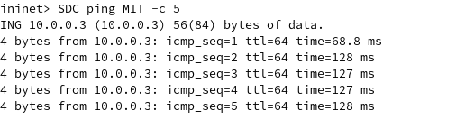
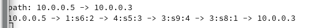
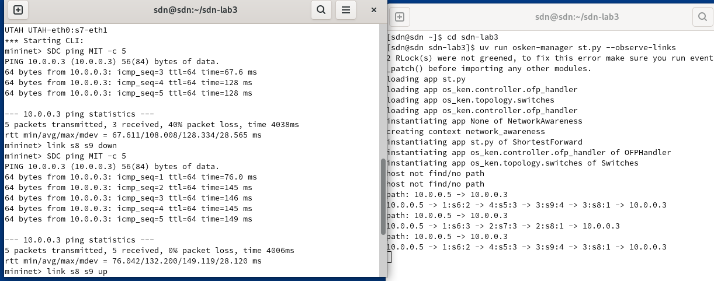
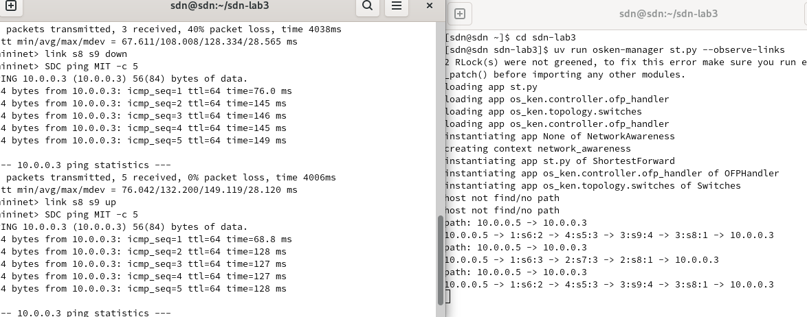

## 一、实验目的
- 学习利⽤ os_ken.topology.api 发现⽹络拓扑。
- 学习利⽤ LLDP 和 Echo 数据包测量链路时延。
- 学习计算基于跳数和基于时延的最短路由。
- 学习设计能够容忍链路故障的路由策略。
- 分析⽹络集中式控制与分布式控制的差异，思考SDN的得与失。


## 二、实验环境
实验在VMware运行的Arch Linux虚拟机上进行
| 组件          | 版本/配置                   |
|---------------|---------------------------|
| 控制器        | OSKen           |
| 虚拟化平台    | Mininet            |


## 三、任务描述|方案设计|结果分析


### 必做任务：最小时延路径

跳数最少的路由不⼀定是最快的路由，链路时延也会对路由的快慢产⽣重要影响。请实时地（周期地）利⽤ LLDP 和 Echo 数据包测量各链路的时延，在⽹络拓扑的基础上构建⼀个有权图，然后基于此图计算最⼩时延路径。具体任务是，找出⼀条从 SDC 到 MIT 时延最短的路径，输出经过的路线及总的时延，利⽤ Ping 包的 RTT 验证你的结果。请在 least_hops.py 的代码框架上，在新的⽂件下新建⼀个控制器（可以命名为 ShortestForward 或类似的名字），并完成任务。

#### 方案设计分析
为了找到最小时延路径，我们首先要能够得知全局拓扑结构，才能够进行拓扑分析；
然后我们要能够得知路径的路径消耗,即测量每跳时延，才能够计算最短时延路径。

#### 1.拓扑感知
通过调用os_ken.topology.api 中的 get_all_host 、 get_all_link 、 get_all_switch 等函数，就
可以获得全局拓扑的信息。
##### 链路发现原理
SDN给交换机发送LLDP数据包；
交换机收到LLDP数据包，看来源，若是控制器，则转发；若不是控制器，则将包转发到控制器（下放流表规则）。
在这个过程中，记录了一个交换机端口到另一个交换机端口的LLDP包便被发送到控制器。
控制器从而可以获得全局拓扑结构。

#### 2.测量链路时延

控制器将带有时间戳的LLDP报文下放给S1，S1转发给S2，S2在上传回控制器，得到C->S1->S2->C的时延。
控制器通过Echo报文可得C->S1,C->S2往返时延。
则有delay = (lldp_delay_s12 + lldp_delay_s21 - echo_delay_s1 -echo_delay_s2) / 2

为此，需要对OSKen进行如下修改
##### a.修改PortData(记录交换机端口信息)，新增delay属性用于记录lldp_delay

```python
class PortData(object):
    def __init__(self, is_down, lldp_data):
        super(PortData, self).__init__()
        self.is_down = is_down
        self.lldp_data = lldp_data
        self.timestamp = None
        self.sent = 0
        self.delay = 0
```


##### b.lldp_packet_in_handler() 将 lldp_delay存入发送 LLDP 包对应的交换机端口

```python
# calc the delay of lldp packet
def lldp_packet_in_handler(self, ev):
# add receive timestamp
    recv_timestamp = time.time()
    if not self.link_discovery:
        return
    msg = ev.msg
    try:
        src_dpid, src_port_no = LLDPPacket.lldp_parse(msg.data)
    except LLDPPacket.LLDPUnknownFormat:
        # This handler can receive all the packets which can be
        # not-LLDP packet. Ignore it silently
    return


    for port, port_data in self.ports.items():
        if src_dpid == port.dpid and src_port_no == port.port_no:
            send_timestamp = port_data.timestamp
        if send_timestamp:
            port_data.delay = recv_timestamp - send_timestamp
```

在PortData类中，还有函数
```python
def lldp_sent(self)
    self.timestamp = time.time()
    self.sent += 1
```

在lldp包发送时，将PortData类的timestamp变量置为发送时的时间戳。
因此，收到lldp包时，将收到的时间戳-发送的时间戳就得到了lldp_delay，存在端口的delay属性。

##### c.获取lldp_delay

为了在需要完成的计算时延的app中获得lldp_delay，需要利用lookup_service_brick获取正在运行的switches实例。

```python
from os_ken.base.app_manager import lookup_service_brick
...
@set_ev_cls(ofp_event.EventOFPPacketIn, MAIN_DISPATCHER)
def packet_in_handler(self, ev):
    msg = ev.msg
    dpid = msg.datapath.id
    try:
        src_dpid, src_port_no = LLDPPacket.lldp_parse(msg.data)
        if self.switches is None:
            self.switches = lookup_service_brick('switches')
            for port in self.switches.ports.keys():
            if src_dpid == port.dpid and src_port_no == port.port_no:
                lldp_delay[(src_dpid, dpid)] =self.switches.ports[port].delay
    except:
        return
```

代码试图解析lldp包并获取源交换机及端口，再获取正在运行的switches实例，查找是否有源交换机，若存在，则以源交换机和目的交换机ID为键，存入self.lldp_delay中。由于lldp包是由控制器周期性的发往交换机，因此可以获得全局的lldp_delay。

##### d.获取echo_delay:
为了计算delay，我们还需要获取echo_delay。为此，我们需要设计一个函数，响应收到echo包事件。

```python
    @set_ev_cls(ofp_event.EventOFPEchoReply, MAIN_DISPATCHER)
    def echo_reply_handler(self, ev):
        msg = ev.msg
        dpid = msg.datapath.id
        try:
            rtt = time.time() - eval(msg.data)
            self.echo_delay[dpid] = rtt
        except:
            return
```

将收到echo包的时间戳-发送echo包的时间戳就得到了echo_delay，将其存在echo_delay中，以dpid为键。

##### e.发送echo包
需要对所有交换机发送echo包，且echo包要记录发送当时的时间戳。

```python
    def _send_all_echo_requests(self):
        for dp in self.switch_info.values():
            parser = dp.ofproto_parser
            timestamp = time.time()
            data = f"{timestamp:.10f}".encode('utf-8')
            dp.send_msg(parser.OFPEchoRequest(dp, data=data))
            hub.sleep(SEND_ECHO_REQUEST_INTERVAL)
```
每发送一个echo_request，就要sleep一段时间。
若一次性发送大量echo_request，数据包可能会堵塞，导致测量时延比真实时延要长，因为时间戳记录的是送入发送队列的时间，而不是发送出去的时间，echo_delay测得过大就可能导致负权边出现。

##### f.计算/更新链路时延

```python
        for src,dst in self.topo_map.edges:
            if self.topo_map[src][dst]['is_host']:
                continue
                    
            try:
                lldp_delay_s12 = self.lldp_delay[(src, dst)]
                lldp_delay_s21 = self.lldp_delay[(dst, src)]
                echo_delay_s1 = self.echo_delay[src]
                echo_delay_s2 = self.echo_delay[dst]
                delay = (lldp_delay_s12 + lldp_delay_s21 - echo_delay_s1 - echo_delay_s2) / 2.0
                if delay < 0:
                    delay = 0
                self.topo_map[src][dst]['delay'] = delay
            except:
                continue
```

##### g.创建周期性发送echo包和计算链路实验的进程

```python
class NetworkAwareness(app_manager.OSKenApp):
    OFP_VERSIONS = [ofproto_v1_3.OFP_VERSION]

    def __init__(self, *args, **kwargs):
        ...

        self.delay_thread = hub.spawn(self._delay_monitor)

    ...

    def _delay_monitor(self):
    while True:
        self.send_all_echo_requests()
        
        self.update_all_delays()

        hub.sleep(GET_DELAY_INTERVAL)
```

#### 3.寻找最小时延路径

代码中已有实现。将默认weight改为delay即可，即可自动排序，在此不赘述。

```python
    def shortest_path(self, src, dst, weight='hop'):
        try:
            paths = list(nx.shortest_simple_paths(self.topo_map, src, dst, weight=weight))
            return paths[0]
        except Exception as e:
            self.logger.info('host not find/no path')
            # print(e)
```

#### 必做任务实验结果




可以看到SDC ping MIT时，选择了最小时延路径6598进行转发，往返时延为127、128ms，理论时延126ms，误差很小，实验成功。
发现第一次ping时延较小，尝试分析。第一次ping时，icmp包并没有按照最小时延路径转发，而是先packet-In到控制器中，再由控制器计算出最小时延路径，直接转发到目的地址。而响应过程则按照最小时延路径转发。因此，第一次ping的时延略大于最小时延的二分之一。


### 选做任务：链路故障容忍

1970年的网络硬件发展尚不成熟，通信链路和交换机端口发生故障的概率较高。请设计 OSKen app ，在任务⼀的基础上实现容忍链路故障的路由选择：每当链路出现故障时，重新选择当前可用路径中时延最低的路径；当链路故障恢复后，也重新选择新的时延最低的路径。请在实验报告里附上你计算的（1）最小时延路径（2）最小时延路径的 RTT （3）链路故障/恢复后发生的路由转移

#### 方案设计分析
必做任务中已经实现了周期性获取delay和拓扑的功能，我们只需要在检测到端口连接发生变化时清空错误流表项就行。这里我们选择直接删除我们自己设计发出的所有流表项，在这个简单lab中，即匹配eth_type为arp或ipv4的，优先级为1的流表项。

##### a.设计delete_flow()函数用来删除流表项

```python
def delete_flow(self, datapath, match):
        dp = datapath
        ofp = dp.ofproto
        parser = dp.ofproto_parser

        mod = parser.OFPFlowMod(
                datapath=dp, 
                command=ofp.OFPFC_DELETE,
                out_port=ofp.OFPP_ANY, 
                out_group=ofp.OFPG_ANY,
                priority=1, 
                match=match)
        dp.send_msg(mod)
```

##### b.设计端口改变时间响应函数

链路状态改变时，端口状态改变事件会触发，此时我们进行处理，将旧流表项删除,在清空记录的macToarp表和防止arp环路表，清空拓扑图。

```python
@set_ev_cls(ofp_event.EventOFPPortStatus, MAIN_DISPATCHER)
    def fault_tolerant_handler(self, ev):
        msg = ev.msg
        dp = msg.datapath
        parser = dp.ofproto_parser

        for switch in get_switch(self):
            datapath = switch.dp
            match_ipv4 = parser.OFPMatch(eth_type = ETH_TYPE_IPV4)
            match_arp = parser.OFPMatch(eth_type = ETH_TYPE_ARP)
            self.delete_flow(datapath, match_ipv4)
            self.delete_flow(datapath, match_arp)            


        self.mac_to_port.clear()
        self.sw.clear()
        self.network_awareness.topo_map.clear()
```

#### 选做任务实验结果




可以看到SDC ping MIT 开始时选择了最小时延路径6598，最小时延理论RTT为126ms,实测RTT为127~128ms。

当link s8 s9 down时，
重新选择最小时延路径678，最小时延理论RTT为144ms，实测RTT为145~146ms。

当link s8 s9 up时，
重新选择最小时延路径6598。

实验成功。


## 四、实验总结

本次实验围绕 SDN 控制器 OSKen 的拓扑感知能力与流表控制机制，深入探讨了如何基于 LLDP 与 Echo 报文测量链路时延，并以此构建有权拓扑图，实现最小时延路径的计算与动态更新。此外，实验还扩展实现了链路故障检测与故障恢复后的路径重路由机制，增强了网络的容错性。


# 附录

st.py
```python
# os_ken-manager shortest_forward.py --observe-links
from os_ken.base import app_manager
from os_ken.controller import ofp_event
from os_ken.controller.handler import CONFIG_DISPATCHER, MAIN_DISPATCHER, DEAD_DISPATCHER, HANDSHAKE_DISPATCHER
from os_ken.controller.handler import set_ev_cls
from os_ken.controller.handler import set_ev_cls
from os_ken.ofproto import ofproto_v1_3
from os_ken.lib.packet import packet
from os_ken.lib.packet import ethernet, arp, ipv4
from os_ken.controller import ofp_event
from os_ken.topology import event
from os_ken.base.app_manager import lookup_service_brick
import sys
from network_awareness import NetworkAwareness
from os_ken.topology.switches import LLDPPacket
import networkx as nx
from os_ken.topology.api import get_host, get_link, get_switch
ETHERNET = ethernet.ethernet.__name__
ETHERNET_MULTICAST = "ff:ff:ff:ff:ff:ff"
ARP = arp.arp.__name__
ETH_TYPE_IPV4 = 0x0800
ETH_TYPE_ARP = 0X0806

class ShortestForward(app_manager.OSKenApp):
    OFP_VERSIONS = [ofproto_v1_3.OFP_VERSION]
    _CONTEXTS = {
        'network_awareness': NetworkAwareness
    }

    def __init__(self, *args, **kwargs):
        super(ShortestForward, self).__init__(*args, **kwargs)
        self.network_awareness = kwargs['network_awareness']
        self.weight = 'delay'
        self.mac_to_port = {}
        self.sw = {}
        self.path=None

    def add_flow(self, datapath, priority, match, actions, idle_timeout=0, hard_timeout=0):
        dp = datapath
        ofp = dp.ofproto
        parser = dp.ofproto_parser

        inst = [parser.OFPInstructionActions(ofp.OFPIT_APPLY_ACTIONS, actions)]
        mod = parser.OFPFlowMod(
            datapath=dp, priority=priority,
            idle_timeout=idle_timeout,
            hard_timeout=hard_timeout,
            match=match, instructions=inst)
        dp.send_msg(mod)

    def delete_flow(self, datapath, match):
        dp = datapath
        ofp = dp.ofproto
        parser = dp.ofproto_parser

        mod = parser.OFPFlowMod(
                datapath=dp, 
                command=ofp.OFPFC_DELETE,
                out_port=ofp.OFPP_ANY, 
                out_group=ofp.OFPG_ANY,
                priority=1, 
                match=match)
        dp.send_msg(mod)

    @set_ev_cls(ofp_event.EventOFPPacketIn, MAIN_DISPATCHER)
    def packet_in_handler(self, ev):
        msg = ev.msg
        dp = msg.datapath
        ofp = dp.ofproto
        parser = dp.ofproto_parser

        dpid = dp.id
        in_port = msg.match['in_port']

        pkt = packet.Packet(msg.data)
        eth_pkt = pkt.get_protocol(ethernet.ethernet)
        arp_pkt = pkt.get_protocol(arp.arp)
        ipv4_pkt = pkt.get_protocol(ipv4.ipv4)

        pkt_type = eth_pkt.ethertype

        # layer 2 self-learning
        dst_mac = eth_pkt.dst
        src_mac = eth_pkt.src

        if isinstance(arp_pkt, arp.arp):
            self.handle_arp(msg, in_port, dst_mac, src_mac, pkt, pkt_type)

        if isinstance(ipv4_pkt, ipv4.ipv4):
            self.handle_ipv4(msg, ipv4_pkt.src, ipv4_pkt.dst, pkt_type)

    def handle_arp(self, msg, in_port, dst, src, pkt, pkt_type):
        #just handle loop here
        #just like your code in exp1 mission2
        dp = msg.datapath
        ofp = dp.ofproto
        parser = dp.ofproto_parser
        dpid = dp.id
        self.mac_to_port.setdefault(dpid, {})

        drop = False
        header_list = dict((p.protocol_name, p) for p in pkt.protocols if type(p) != str)
        if dst == ETHERNET_MULTICAST and ARP in header_list:
            dst_ip = header_list[ARP].dst_ip
            arp_key = (dpid,src,dst_ip)
            if arp_key in self.sw:
                if self.sw[arp_key] != in_port:
                    drop = True
            else:
                self.sw[arp_key] = in_port
        
        if drop:
            out = parser.OFPPacketOut(
                datapath=dp, 
                buffer_id=msg.buffer_id,
                in_port=in_port, 
                actions=[], 
                data=None)
            dp.send_msg(out)
        else:
            self.mac_to_port[dpid][src] = in_port

            if dst in self.mac_to_port[dpid]:
                out_port = self.mac_to_port[dpid][dst]
            else:
                out_port = ofp.OFPP_FLOOD

            actions = [parser.OFPActionOutput(out_port)]

            if out_port != ofp.OFPP_FLOOD:
                match = parser.OFPMatch(in_port=in_port, eth_dst=dst, eth_type=pkt_type)
                self.add_flow(dp, 1, match, actions, hard_timeout=5)
        
            data = None
            if msg.buffer_id == ofp.OFP_NO_BUFFER:
                data = msg.data
        
            out = parser.OFPPacketOut(
                datapath=dp, 
                buffer_id=msg.buffer_id,
                in_port=in_port, 
                actions=actions, 
                data=data)
            dp.send_msg(out)

    def handle_ipv4(self, msg, src_ip, dst_ip, pkt_type):
        parser = msg.datapath.ofproto_parser

        dpid_path = self.network_awareness.shortest_path(src_ip, dst_ip, weight=self.weight)
        if not dpid_path:
            return

        self.path=dpid_path
        # get port path:  h1 -> in_port, s1, out_port -> h2
        port_path = []
        for i in range(1, len(dpid_path) - 1):
            in_port = self.network_awareness.link_info[(dpid_path[i], dpid_path[i - 1])]
            out_port = self.network_awareness.link_info[(dpid_path[i], dpid_path[i + 1])]
            port_path.append((in_port, dpid_path[i], out_port))
        self.show_path(src_ip, dst_ip, port_path)

        # calc path delay


        # send flow mod
        for node in port_path:
            in_port, dpid, out_port = node
            self.send_flow_mod(parser, dpid, pkt_type, src_ip, dst_ip, in_port, out_port)
            self.send_flow_mod(parser, dpid, pkt_type, dst_ip, src_ip, out_port, in_port)

        # send packet_out
        _, dpid, out_port = port_path[-1]
        dp = self.network_awareness.switch_info[dpid]
        actions = [parser.OFPActionOutput(out_port)]
        out = parser.OFPPacketOut(
            datapath=dp, buffer_id=msg.buffer_id, in_port=in_port, actions=actions, data=msg.data)
        dp.send_msg(out)

    def send_flow_mod(self, parser, dpid, pkt_type, src_ip, dst_ip, in_port, out_port):
        dp = self.network_awareness.switch_info[dpid]
        match = parser.OFPMatch(
            in_port=in_port, eth_type=pkt_type, ipv4_src=src_ip, ipv4_dst=dst_ip)
        actions = [parser.OFPActionOutput(out_port)]
        self.add_flow(dp, 1, match, actions, 10, 30)

    def show_path(self, src, dst, port_path):
        self.logger.info('path: {} -> {}'.format(src, dst))
        path = src + ' -> '
        for node in port_path:
            path += '{}:s{}:{}'.format(*node) + ' -> '
        path += dst
        self.logger.info(path)

    @set_ev_cls(ofp_event.EventOFPPortStatus, MAIN_DISPATCHER)
    def fault_tolerant_handler(self, ev):
        msg = ev.msg
        dp = msg.datapath
        parser = dp.ofproto_parser

        for switch in get_switch(self):
            datapath = switch.dp
            match_ipv4 = parser.OFPMatch(eth_type = ETH_TYPE_IPV4)
            match_arp = parser.OFPMatch(eth_type = ETH_TYPE_ARP)
            self.delete_flow(datapath, eth_type=match_ipv4)
            self.delete_flow(datapath, eth_type=match_arp)            


        self.mac_to_port.clear()
        self.sw.clear()
        self.network_awareness.topo_map.clear()
```

network_awareness.py

```python
from os_ken.base import app_manager
from os_ken.base.app_manager import lookup_service_brick
from os_ken.ofproto import ofproto_v1_3
from os_ken.controller.handler import set_ev_cls
from os_ken.controller.handler import MAIN_DISPATCHER, CONFIG_DISPATCHER, DEAD_DISPATCHER
from os_ken.controller import ofp_event
from os_ken.lib.packet import packet
from os_ken.lib.packet import ethernet, arp
from os_ken.lib import hub
from os_ken.topology import event
from os_ken.topology.api import get_host, get_link, get_switch
from os_ken.topology.switches import LLDPPacket

import networkx as nx
import copy
import time


GET_TOPOLOGY_INTERVAL = 2
SEND_ECHO_REQUEST_INTERVAL = .05
GET_DELAY_INTERVAL = 2


class NetworkAwareness(app_manager.OSKenApp):
    OFP_VERSIONS = [ofproto_v1_3.OFP_VERSION]

    def __init__(self, *args, **kwargs):
        super(NetworkAwareness, self).__init__(*args, **kwargs)
        self.switch_info = {}   # dpid: datapath
        self.link_info = {}     # (s1, s2): s1.port
        self.port_link={}       # s1,port:s1,s2
        self.port_info = {}     # dpid: (ports linked hosts)
        self.topo_map = nx.Graph()
        self.echo_delay = {}
        self.lldp_delay = {}

        self.topo_thread = hub.spawn(self._get_topology)
        self.delay_thread = hub.spawn(self._delay_monitor)

        self.switches = None
        self.weight = 'delay'


    def add_flow(self, datapath, priority, match, actions):
        dp = datapath
        ofp = dp.ofproto
        parser = dp.ofproto_parser

        inst = [parser.OFPInstructionActions(ofp.OFPIT_APPLY_ACTIONS, actions)]
        mod = parser.OFPFlowMod(datapath=dp, priority=priority, match=match, instructions=inst)
        dp.send_msg(mod)

    @set_ev_cls(ofp_event.EventOFPSwitchFeatures, CONFIG_DISPATCHER)
    def switch_features_handler(self, ev):
        msg = ev.msg
        dp = msg.datapath
        ofp = dp.ofproto
        parser = dp.ofproto_parser

        match = parser.OFPMatch()
        actions = [parser.OFPActionOutput(ofp.OFPP_CONTROLLER, ofp.OFPCML_NO_BUFFER)]
        self.add_flow(dp, 0, match, actions)

    @set_ev_cls(ofp_event.EventOFPStateChange, [MAIN_DISPATCHER, DEAD_DISPATCHER])
    def state_change_handler(self, ev):
        dp = ev.datapath
        dpid = dp.id

        if ev.state == MAIN_DISPATCHER:
            self.switch_info[dpid] = dp

        if ev.state == DEAD_DISPATCHER:
            del self.switch_info[dpid]

    def _get_topology(self):
        _hosts, _switches, _links = None, None, None
        while True:
            hosts = get_host(self)
            switches = get_switch(self)
            links = get_link(self)

            # update topo_map when topology change
            if [str(x) for x in hosts] == _hosts and [str(x) for x in switches] == _switches and [str(x) for x in links] == _links:
                continue
            _hosts, _switches, _links = [str(x) for x in hosts], [str(x) for x in switches], [str(x) for x in links]

            for switch in switches:
                self.port_info.setdefault(switch.dp.id, set())
                # record all ports
                for port in switch.ports:
                    self.port_info[switch.dp.id].add(port.port_no)

            for host in hosts:
                # take one ipv4 address as host id
                if host.ipv4:
                    self.link_info[(host.port.dpid, host.ipv4[0])] = host.port.port_no
                    self.topo_map.add_edge(host.ipv4[0], host.port.dpid, hop=1, delay=0, is_host=True)
            
            for link in links:
                # delete ports linked switches
                self.port_info[link.src.dpid].discard(link.src.port_no)
                self.port_info[link.dst.dpid].discard(link.dst.port_no)
 
                # s1 -> s2: s1.port, s2 -> s1: s2.port
                self.port_link[(link.src.dpid,link.src.port_no)]=(link.src.dpid, link.dst.dpid)
                self.port_link[(link.dst.dpid,link.dst.port_no)] = (link.dst.dpid, link.src.dpid)

                self.link_info[(link.src.dpid, link.dst.dpid)] = link.src.port_no
                self.link_info[(link.dst.dpid, link.src.dpid)] = link.dst.port_no
                self.topo_map.add_edge(link.src.dpid, link.dst.dpid, hop=1, is_host=False)

            if self.weight == 'hop':
                self.show_topo_map()

            hub.sleep(GET_TOPOLOGY_INTERVAL)

    def shortest_path(self, src, dst, weight='hop'):
        try:
            paths = list(nx.shortest_simple_paths(self.topo_map, src, dst, weight=weight))
            return paths[0]
        except Exception as e:
            self.logger.info('host not find/no path')
            # print(e)

    def show_topo_map(self):
        self.logger.info('topo map:')
        self.logger.info('{:^10s}  ->  {:^10s}'.format('node', 'node'))
        for src, dst in self.topo_map.edges:
            self.logger.info('{:^10s}      {:^10s}'.format(str(src), str(dst)))
        self.logger.info('\n')


    @set_ev_cls(ofp_event.EventOFPPacketIn, MAIN_DISPATCHER)
    def packet_in_handler(self, ev):
        msg = ev.msg
        dpid = msg.datapath.id
        try:
            src_dpid, src_port_no = LLDPPacket.lldp_parse(msg.data)
            if self.switches is None:
                self.switches = lookup_service_brick('switches')
            for port in self.switches.ports.keys():
                if src_dpid == port.dpid and src_port_no == port.port_no:
                    self.lldp_delay[(src_dpid, dpid)] = self.switches.ports[port].delay
        except:
            return

    @set_ev_cls(ofp_event.EventOFPEchoReply, MAIN_DISPATCHER)
    def echo_reply_handler(self, ev):
        msg = ev.msg
        dpid = msg.datapath.id
        try:
            rtt = time.time() - eval(msg.data)
            self.echo_delay[dpid] = rtt
        except:
            return


    def _delay_monitor(self):
        while True:
            self.send_all_echo_requests()
        
            self.update_all_delays()

            hub.sleep(GET_DELAY_INTERVAL)


    def send_all_echo_requests(self):
        for dp in self.switch_info.values():
            parser = dp.ofproto_parser
            timestamp = time.time()
            data = f"{timestamp:.10f}".encode('utf-8')
            dp.send_msg(parser.OFPEchoRequest(dp, data=data))
            hub.sleep(SEND_ECHO_REQUEST_INTERVAL)

    def update_all_delays(self):

            for src,dst in self.topo_map.edges:
                if self.topo_map[src][dst]['is_host']:
                    continue
                    
                try:
                    lldp_delay_s12 = self.lldp_delay[(src, dst)]
                    lldp_delay_s21 = self.lldp_delay[(dst, src)]
                    echo_delay_s1 = self.echo_delay[src]
                    echo_delay_s2 = self.echo_delay[dst]
                    delay = (lldp_delay_s12 + lldp_delay_s21 - echo_delay_s1 - echo_delay_s2) / 2.0
                    if delay < 0:
                        delay = 0
                    self.topo_map[src][dst]['delay'] = delay
                except:
                    continue

```